# Vehicle Sale Order (VSO) - Design

## 1. Architecture Overview

```mermaid
graph TB
    subgraph Adapter Layer
        MC[MobileVsoController]
        MSC[MobileSaleModelController]
        MPC[MptVsoController]
        MPSC[MptSaleModelController]
        SC[ServiceOrderController]
        OC[OpenVsoCallbackController]
    end

    subgraph Application Layer
        OAS[OrderAppService]
        SMAS[SaleModelAppService]
        PCS[PaymentCallbackService]
    end

    subgraph Domain Layer
        subgraph Aggregates
            O[Order Aggregate Root]
            W[Wishlist Aggregate Root]
        end
        subgraph Domain Services
            ODS[OrderDomainService]
            OSM[OrderStateMachine]
            OVS[OrderValidationService]
            OLS[OrderLockService]
            OPDS[OrderPhysicalDeleteService]
            TNS[TimeoutNotifyService]
        end
        subgraph Value Objects
            M[Money]
            CI[CustomerInfo]
            VI[VehicleInfo]
            OI[OrganizationInfo]
        end
        subgraph Events
            PSE[PaymentSuccessDomainEvent]
            PSEL[PaymentSuccessEventListener]
        end
        subgraph Policies
            DOS[DuplicateOrderSpecification]
            OLSpec[OrderLockSpecification]
            OSSpec[OrderSubmitSpecification]
        end
        subgraph Gateways
            PA[PaymentAdapter]
            VSA[VehicleSourceAdapter]
            FA[FinanceAdapter]
            EA[EsignAdapter]
        end
        REPO[25 Repository Interfaces]
    end

    subgraph Infrastructure Layer
        REPOIMPL[Repository Implementations]
        PO[Persistence Objects]
        MAPPER[MyBatis Mappers]
        CONFIG[PaymentChannelConfig / SchedulerConfig]
    end

    subgraph External Services
        MDM[MDM Service - Feign]
        VMD[VMD Service - Feign (Deprecated)]
        DICT[Dictionary Service - Feign]
        ORG[Org Dealership Service - Feign]
        PGW[Payment Gateway - Callback]
        KFK[MDM Kafka Topics]
    end

    MC & MSC & MPC & MPSC & SC & OC --> OAS & WAS & SMAS & PCS
    OAS & WAS --> O & W
    OAS --> ODS & OSM & OVS & OLS
    PCS --> PSE
    PSE --> PSEL
    PSEL --> O
    ODS --> REPO
    REPO --> REPOIMPL
    REPOIMPL --> MAPPER
    OAS --> MDM & DICT & ORG
    KFK --> MDM
    PGW --> OC
```

系统采用 DDD 六边形架构，分为四层：Adapter（适配器/控制器）→ Application（应用服务/编排）→ Domain（领域模型/业务规则）→ Infrastructure（基础设施/持久化）。Order 和 Wishlist 作为两个聚合根，通过领域事件实现跨聚合通信。外部系统通过 Feign 客户端（MDM、字典、组织）和回调接口（支付网关）集成。MDM 主数据通过 Kafka 事件订阅 + 本地投影缓存机制，实现配置器与下单链路的高效读取。

## 2. Tech Stack & Decisions

| Decision | Choice | Alternatives | Rationale |
|----------|--------|--------------|-----------|
| 语言 & 版本 | Java 17 | Java 11, Kotlin | 项目统一标准，LTS 版本 |
| 框架 | Spring Boot + Spring Cloud | Quarkus, Micronaut | 生态成熟，团队熟悉 |
| 服务注册/配置 | Nacos | Consul, Eureka | 阿里云生态统一，支持配置中心 |
| ORM | MyBatis-Plus | JPA/Hibernate, JOOQ | 灵活 SQL 控制，国内生态好 |
| 数据库 | MySQL 8.0+ | PostgreSQL | 团队熟悉，云服务支持好 |
| 数据库迁移 | Flyway | Liquibase | 轻量，SQL-based 迁移 |
| 服务间调用 | OpenFeign | gRPC, RestTemplate | 声明式 HTTP 客户端，与 Spring Cloud 集成好 |
| 并发控制 | Redis 分布式锁 | 数据库乐观锁 | 高性能，支持超时自动释放 |
| 架构模式 | DDD 分层 + CQRS-lite | 传统三层 | 业务复杂度高，需要清晰的领域边界 |
| 状态管理 | 自定义状态机 | Spring Statemachine | 轻量，业务规则内聚在领域层 |
| ID 生成 | Hutool IdUtil (Snowflake) | UUID, DB Sequence | 有序、高性能、分布式友好 |
| 端口 | 10201 | - | 项目约定 |

## 3. Data Model

### 3.1 聚合根与实体

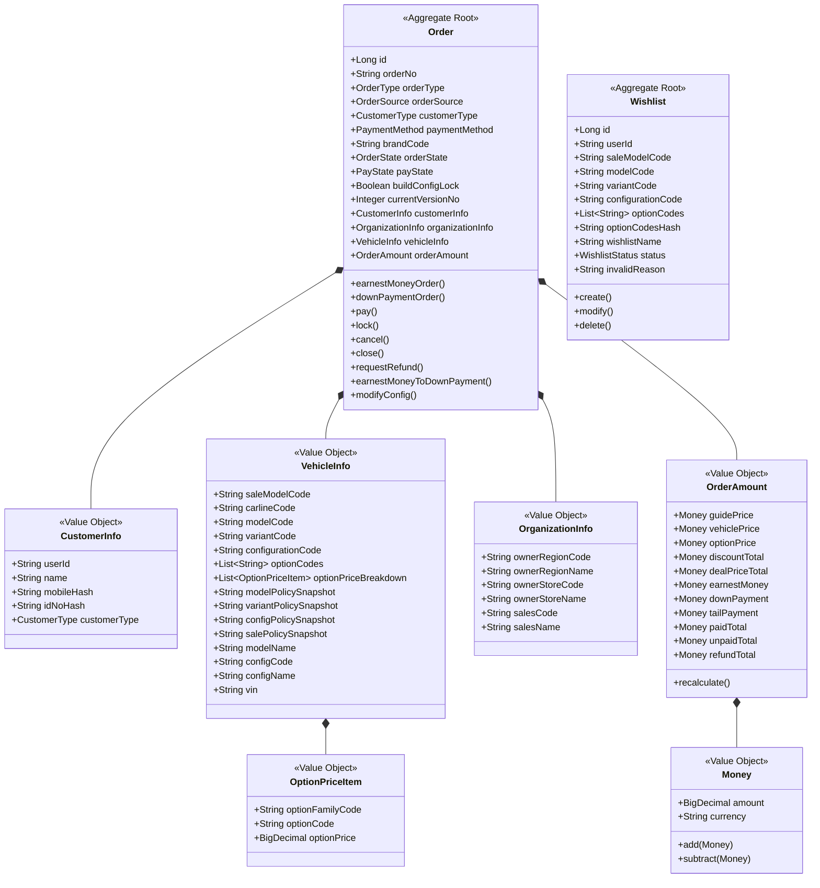
```mermaid
classDiagram
    class Order {
        <<Aggregate Root>>
        +Long id
        +String orderNo
        +OrderType orderType
        +OrderSource orderSource
        +CustomerType customerType
        +PaymentMethod paymentMethod
        +String brandCode
        +OrderState orderState
        +PayState payState
        +Boolean buildConfigLock
        +Integer currentVersionNo
        +CustomerInfo customerInfo
        +OrganizationInfo organizationInfo
        +VehicleInfo vehicleInfo
        +OrderAmount orderAmount
        +earnestMoneyOrder()
        +downPaymentOrder()
        +pay()
        +lock()
        +cancel()
        +close()
        +requestRefund()
        +earnestMoneyToDownPayment()
        +modifyConfig()
    }

    class Wishlist {
        <<Aggregate Root>>
        +Long id
        +String userId
        +String saleModelCode
        +String modelCode
        +String variantCode
        +String configurationCode
        +List~String~ optionCodes
        +String optionCodesHash
        +String wishlistName
        +WishlistStatus status
        +String invalidReason
        +create()
        +modify()
        +delete()
    }

    class Money {
        <<Value Object>>
        +BigDecimal amount
        +String currency
        +add(Money)
        +subtract(Money)
    }

    class CustomerInfo {
        <<Value Object>>
        +String userId
        +String name
        +String mobileHash
        +String idNoHash
        +CustomerType customerType
    }

    class VehicleInfo {
        <<Value Object>>
        +String saleModelCode
        +String carlineCode
        +String modelCode
        +String variantCode
        +String configurationCode
        +List~String~ optionCodes
        +List~OptionPriceItem~ optionPriceBreakdown
        +String modelPolicySnapshot
        +String variantPolicySnapshot
        +String configPolicySnapshot
        +String salePolicySnapshot
        +String modelName
        +String configCode
        +String configName
        +String vin
    }

    class OptionPriceItem {
        <<Value Object>>
        +String optionFamilyCode
        +String optionCode
        +BigDecimal optionPrice
    }

    VehicleInfo *-- OptionPriceItem

    class OrganizationInfo {
        <<Value Object>>
        +String ownerRegionCode
        +String ownerRegionName
        +String ownerStoreCode
        +String ownerStoreName
        +String salesCode
        +String salesName
    }

    class OrderAmount {
        <<Value Object>>
        +Money guidePrice
        +Money vehiclePrice
        +Money optionPrice
        +Money discountTotal
        +Money dealPriceTotal
        +Money earnestMoney
        +Money downPayment
        +Money tailPayment
        +Money paidTotal
        +Money unpaidTotal
        +Money refundTotal
        +recalculate()
    }

    Order *-- CustomerInfo
    Order *-- OrganizationInfo
    Order *-- VehicleInfo
    Order *-- OrderAmount
    OrderAmount *-- Money
```

### 3.2 核心数据库表

| 表名 | 用途 | 关联 US |
|------|------|---------|
| `tb_sale_model` | 销售车型主表（1:1 关联 Carline，含 carlineCode；起售价/意向金/定金下沉至 Variant 策略层） | US-001, US-016 |
| `tb_sale_model_model_policy` | Model 销售策略（saleStatus/区域/渠道/营销元数据，不直接定价；空表=ALL 全开），归属键 (saleModelCode, modelCode) | US-022, US-003, US-004, US-021 |
| `tb_sale_model_variant_policy` | Variant 销售策略（variantPrice/earnestMoneyPrice/downPaymentPrice/saleStatus/区域/渠道/营销元数据；空表=ALL 全开但价格必填），归属键 (saleModelCode, modelCode, variantCode) | US-022, US-001, US-003, US-004, US-007, US-021 |
| `tb_sale_model_config_policy` | Configuration 销售白名单（空表=ALL 全开），归属键 (saleModelCode, modelCode, variantCode, configurationCode) | US-022, US-003, US-004, US-007 |
| `tb_sale_model_option_policy` | OptionCode 销售策略（价格/区域/渠道/上下架；未配置即过滤），归属键 (saleModelCode, modelCode, variantCode, optionCode) | US-022, US-003, US-004, US-007, US-021 |
| `tb_sale_model_option_family_policy` | OptionFamily 营销策略（营销标题/图片/描述/排序），归属键 (saleModelCode, optionFamilyCode) | US-021 |
| `mdm_projection_carline` | MDM Carline 本地投影（含下属 modelCodes[]） | US-023, US-016 |
| `mdm_projection_model` | MDM Model 本地投影（含 carlineCode、下属 variantCodes[]） | US-023, US-021 |
| `mdm_projection_variant` | MDM Variant 本地投影 | US-023, US-021 |
| `mdm_projection_configuration` | MDM Configuration 本地投影 | US-023, US-021 |
| `mdm_projection_option` | MDM OptionCode 本地投影 | US-023, US-021 |
| `tb_purchase_benefits` | 购车权益 | US-001 |
| `vso_order` | 订单主表 | US-003~US-015 |
| `vso_order_party` | 订单参与方 | US-003, US-004 |
| `vso_order_vehicle_snapshot` | 车辆配置快照（版本化，固化 carlineCode/modelCode/variantCode/configurationCode/optionCodes + model/variant/config/option 四层 salePolicySnapshot） | US-003, US-004, US-007 |
| `vso_order_amount` | 订单金额 | US-003~US-006 |
| `vso_order_assignment` | 订单归属/转派 | US-011, US-013 |
| `vso_order_status_dimension` | 多维度状态 | US-009~US-014 |
| `vso_payment` | 支付记录 | US-005, US-018 |
| `vso_refund` | 退款记录 | US-008 |
| `vso_vehicle_assignment` | 配车/车辆绑定 | US-011 |
| `vso_approval` | 审批单 | US-010 |
| `vso_approval_record` | 审批流转记录 | US-010 |
| `vso_contract` | 合同/协议 | - |
| `vso_finance_application` | 金融申请 | - |
| `vso_subsidy_application` | 补贴申请 | - |
| `vso_delivery_appointment` | 交付预约 | US-013 |
| `vso_delivery_record` | 交付记录 | US-013 |
| `vso_callback_log` | 回调日志 | US-018 |
| `vso_order_version` | 订单版本历史 | US-007 |
| `vso_order_timeline` | 业务时间线 | US-007 |
| `vso_supplementary_payment` | 补款记录（改配补款 + 意向金转定金差额） | US-006, US-007 |
| `vso_config_change_refund` | 改配退款记录 | US-007 |
| `vso_config_timeout` | 超时配置 | US-019 |
| `vso_order_shadow_delete` | 物理删除影子审计 | US-015 |

**防刷单唯一索引**（US-003, US-004）：

| 索引名 | 表 | 字段 | 说明 |
|--------|------|------|------|
| `uk_user_unpaid_order` | `vso_order` | `user_id` + `order_state` | 同一用户未完成订单唯一性（应用层校验） |
| `uk_mobile_unpaid_order` | `vso_order` | `mobile_hash` + `order_state` | 同一手机号未完成订单唯一性（应用层校验） |

> 注：MySQL 8.0 不支持条件唯一索引（Partial Index），实际实现采用应用层校验 + 分布式锁保证一致性。上述索引为逻辑设计，物理实现需根据数据库能力调整。

### 3.3 订单状态枚举

```
WISHLIST(100), EARNEST_MONEY_UNPAID(200), EARNEST_MONEY_PAID(210),
DOWN_PAYMENT_UNPAID(300), DOWN_PAYMENT_PAID(310),
PENDING_AUDIT(350), AUDIT_PASSED(360), AUDIT_REJECTED(370),
ARRANGE_PRODUCTION(400), ALLOCATION_VEHICLE(450), APPLY_TRANSPORT(470),
PREPARE_TRANSPORT(500), TRANSPORTING(550), PREPARE_DELIVER(600),
FINAL_PAYMENT_PAID(620), INVOICED(630), DELIVERED(650), ACTIVATED(700),
RETURN_APPLY(800), RETURN_STORAGE(820), RETURN_AUDIT(840), RETURN_COMPLETED(860),
COMPLETED(900), REFUND_APPLY(920), REFUND_COMPLETE(925),
CANCEL(950), EXPIRED(960), CLOSED(970)
```

## 4. Core Flows

### 4.1 订单下单与支付流程

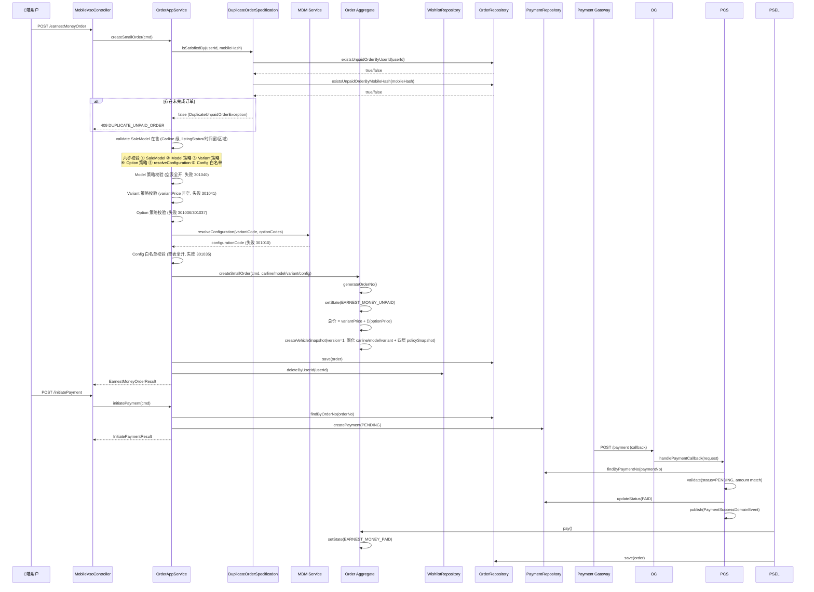
```mermaid
sequenceDiagram
    participant U as C端用户
    participant MC as MobileVsoController
    participant OAS as OrderAppService
    participant DOS as DuplicateOrderSpecification
    participant MDM as MDM Service
    participant O as Order Aggregate
    participant WR as WishlistRepository
    participant OR as OrderRepository
    participant PR as PaymentRepository
    participant PGW as Payment Gateway

    U->>MC: POST /earnestMoneyOrder
    MC->>OAS: createSmallOrder(cmd)
    OAS->>DOS: isSatisfiedBy(userId, mobileHash)
    DOS->>OR: existsUnpaidOrderByUserId(userId)
    OR-->>DOS: true/false
    DOS->>OR: existsUnpaidOrderByMobileHash(mobileHash)
    OR-->>DOS: true/false

    alt 存在未完成订单
        DOS-->>OAS: false (DuplicateUnpaidOrderException)
        OAS-->>MC: 409 DUPLICATE_UNPAID_ORDER
    end

    OAS->>OAS: validate SaleModel 在售 (Carline 级, listingStatus/时间窗/区域)
    Note over OAS: 六步校验 ① SaleModel ② Model 策略 ③ Variant 策略<br/>④ Option 策略 ⑤ resolveConfiguration ⑥ Config 白名单
    OAS->>OAS: Model 策略校验 (空表全开, 失败 301040)
    OAS->>OAS: Variant 策略校验 (variantPrice 非空, 失败 301041)
    OAS->>OAS: Option 策略校验 (失败 301036/301037)
    OAS->>MDM: resolveConfiguration(variantCode, optionCodes)
    MDM-->>OAS: configurationCode (失败 301010)
    OAS->>OAS: Config 白名单校验 (空表全开, 失败 301035)
    OAS->>O: createSmallOrder(cmd, carline/model/variant/config)
    O->>O: generateOrderNo()
    O->>O: setState(EARNEST_MONEY_UNPAID)
    O->>O: 总价 = variantPrice + Σ(optionPrice)
    O->>O: createVehicleSnapshot(version=1, 固化 carline/model/variant + 四层 policySnapshot)
    OAS->>OR: save(order)
    OAS->>WR: deleteByUserId(userId)
    OAS-->>MC: EarnestMoneyOrderResult

    U->>MC: POST /initiatePayment
    MC->>OAS: initiatePayment(cmd)
    OAS->>OR: findByOrderNo(orderNo)
    OAS->>PR: createPayment(PENDING)
    OAS-->>MC: InitiatePaymentResult

    PGW->>OC: POST /payment (callback)
    OC->>PCS: handlePaymentCallback(request)
    PCS->>PR: findByPaymentNo(paymentNo)
    PCS->>PCS: validate(status=PENDING, amount match)
    PCS->>PR: updateStatus(PAID)
    PCS->>PCS: publish(PaymentSuccessDomainEvent)
    PSEL->>O: pay()
    O->>O: setState(EARNEST_MONEY_PAID)
    PSEL->>OR: save(order)
```

### 4.2 订单状态机流转

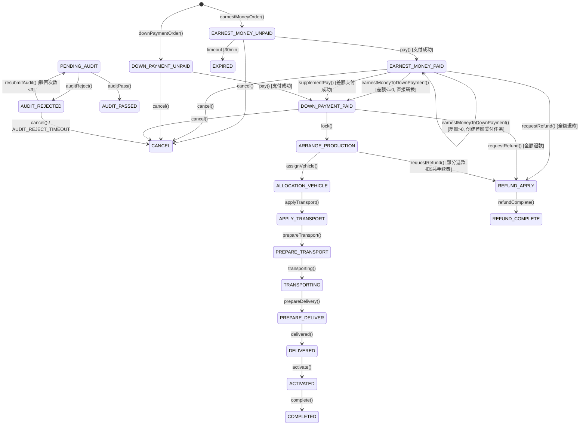
```mermaid
stateDiagram-v2
    [*] --> EARNEST_MONEY_UNPAID: earnestMoneyOrder()
    [*] --> DOWN_PAYMENT_UNPAID: downPaymentOrder()

    EARNEST_MONEY_UNPAID --> EARNEST_MONEY_PAID: pay() [支付成功]
    EARNEST_MONEY_UNPAID --> EXPIRED: timeout [30min]
    EARNEST_MONEY_UNPAID --> CANCEL: cancel()

    EARNEST_MONEY_PAID --> DOWN_PAYMENT_PAID: earnestMoneyToDownPayment() [差额<=0, 直接转换]
    EARNEST_MONEY_PAID --> EARNEST_MONEY_PAID: earnestMoneyToDownPayment() [差额>0, 创建差额支付任务]
    EARNEST_MONEY_PAID --> DOWN_PAYMENT_PAID: supplementPay() [差额支付成功]
    EARNEST_MONEY_PAID --> CANCEL: cancel()
    EARNEST_MONEY_PAID --> REFUND_APPLY: requestRefund() [全额退款]

    DOWN_PAYMENT_UNPAID --> DOWN_PAYMENT_PAID: pay() [支付成功]
    DOWN_PAYMENT_UNPAID --> CANCEL: cancel()

    DOWN_PAYMENT_PAID --> ARRANGE_PRODUCTION: lock()
    DOWN_PAYMENT_PAID --> CANCEL: cancel()
    DOWN_PAYMENT_PAID --> REFUND_APPLY: requestRefund() [全额退款]

    PENDING_AUDIT --> AUDIT_PASSED: auditPass()
    PENDING_AUDIT --> AUDIT_REJECTED: auditReject()
    AUDIT_REJECTED --> PENDING_AUDIT: resubmitAudit() [驳回次数<3]
    AUDIT_REJECTED --> CANCEL: cancel() / AUDIT_REJECT_TIMEOUT

    ARRANGE_PRODUCTION --> REFUND_APPLY: requestRefund() [部分退款,扣5%手续费]

    ARRANGE_PRODUCTION --> ALLOCATION_VEHICLE: assignVehicle()
    ALLOCATION_VEHICLE --> APPLY_TRANSPORT: applyTransport()
    APPLY_TRANSPORT --> PREPARE_TRANSPORT: prepareTransport()
    PREPARE_TRANSPORT --> TRANSPORTING: transporting()
    TRANSPORTING --> PREPARE_DELIVER: prepareDelivery()
    PREPARE_DELIVER --> DELIVERED: delivered()
    DELIVERED --> ACTIVATED: activate()
    ACTIVATED --> COMPLETED: complete()

    REFUND_APPLY --> REFUND_COMPLETE: refundComplete()
```

**意向金转定金状态说明**：
- 差额 <= 0：`EARNEST_MONEY_PAID → DOWN_PAYMENT_PAID`（直接转换，无需额外支付）
- 差额 > 0：`EARNEST_MONEY_PAID → EARNEST_MONEY_PAID`（创建差额支付任务，等待用户支付）→ `EARNEST_MONEY_PAID → DOWN_PAYMENT_PAID`（差额支付成功后转换）
- 差额支付超时（30 分钟）：订单保持 `EARNEST_MONEY_PAID` 状态，差额支付任务自动取消

**退款金额计算规则**（详见 §4.7）：

| 订单状态 | 退款规则 | 手续费 |
|---------|---------|--------|
| EARNEST_MONEY_PAID | 全额退款 | 0 |
| DOWN_PAYMENT_PAID | 全额退款 | 0 |
| ARRANGE_PRODUCTION | 部分退款 | max(已支付金额 × 5%, 500 元) |
| ALLOCATION_VEHICLE 及之后 | 不支持退款 | - |

### 4.3 订单改配流程

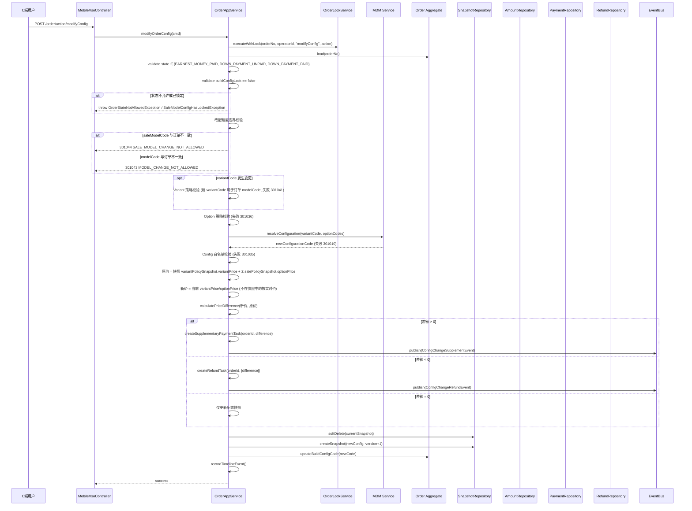
```mermaid
sequenceDiagram
    participant U as C端用户
    participant MC as MobileVsoController
    participant OAS as OrderAppService
    participant OLS as OrderLockService
    participant MDM as MDM Service
    participant O as Order Aggregate
    participant SR as SnapshotRepository
    participant AR as AmountRepository
    participant PR as PaymentRepository
    participant RR as RefundRepository
    participant EB as EventBus

    U->>MC: POST /order/action/modifyConfig
    MC->>OAS: modifyOrderConfig(cmd)
    OAS->>OLS: executeWithLock(orderNo, operatorId, "modifyConfig", action)
    OAS->>O: load(orderNo)
    OAS->>OAS: validate state ∈ {EARNEST_MONEY_PAID, DOWN_PAYMENT_UNPAID, DOWN_PAYMENT_PAID}
    OAS->>OAS: validate buildConfigLock == false

    alt 状态不允许或已锁定
        OAS-->>MC: throw OrderStateNotAllowedException / SaleModelConfigHasLockedException
    end

    OAS->>OAS: 改配粒度边界校验
    alt saleModelCode 与订单不一致
        OAS-->>MC: 301044 SALE_MODEL_CHANGE_NOT_ALLOWED
    else modelCode 与订单不一致
        OAS-->>MC: 301043 MODEL_CHANGE_NOT_ALLOWED
    end

    opt variantCode 发生变更
        OAS->>OAS: Variant 策略校验 (新 variantCode 属于订单 modelCode, 失败 301041)
    end
    OAS->>OAS: Option 策略校验 (失败 301036)
    OAS->>MDM: resolveConfiguration(variantCode, optionCodes)
    MDM-->>OAS: newConfigurationCode (失败 301010)
    OAS->>OAS: Config 白名单校验 (失败 301035)

    OAS->>OAS: 原价 = 快照 variantPolicySnapshot.variantPrice + Σ salePolicySnapshot.optionPrice
    OAS->>OAS: 新价 = 当前 variantPrice/optionPrice (不在快照中的按实时价)
    OAS->>OAS: calculatePriceDifference(新价, 原价)

    alt 差额 > 0
        OAS->>OAS: createSupplementaryPaymentTask(orderId, difference)
        OAS->>EB: publish(ConfigChangeSupplementEvent)
    else 差额 < 0
        OAS->>OAS: createRefundTask(orderId, |difference|)
        OAS->>EB: publish(ConfigChangeRefundEvent)
    else 差额 = 0
        OAS->>OAS: 仅更新配置快照
    end

    OAS->>SR: softDelete(currentSnapshot)
    OAS->>SR: createSnapshot(newConfig, version+1)
    OAS->>O: updateBuildConfigCode(newCode)
    OAS->>OAS: recordTimelineEvent()
    OAS-->>MC: success
```

### 4.4 支付回调处理流程

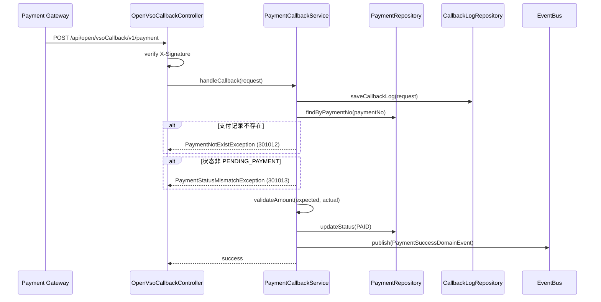
```mermaid
sequenceDiagram
    participant PGW as Payment Gateway
    participant OC as OpenVsoCallbackController
    participant PCS as PaymentCallbackService
    participant PR as PaymentRepository
    participant CLR as CallbackLogRepository
    participant EB as EventBus

    PGW->>OC: POST /api/open/vsoCallback/v1/payment
    OC->>OC: verify X-Signature
    OC->>PCS: handleCallback(request)
    PCS->>CLR: saveCallbackLog(request)
    PCS->>PR: findByPaymentNo(paymentNo)

    alt 支付记录不存在
        PCS-->>OC: PaymentNotExistException (301012)
    end

    alt 状态非 PENDING_PAYMENT
        PCS-->>OC: PaymentStatusMismatchException (301013)
    end

    PCS->>PCS: validateAmount(expected, actual)
    PCS->>PR: updateStatus(PAID)
    PCS->>EB: publish(PaymentSuccessDomainEvent)
    PCS-->>OC: success
```

**签名规范**：

| 维度 | 规范 |
|------|------|
| 签名算法 | HMAC-SHA256 |
| 签名内容 | 按字段字典序排列，用 `&` 连接：`amount={金额}&nonce={随机串}&orderId={订单号}&paySeq={支付流水号}&status={支付状态}&timestamp={Unix秒}` |
| 防重放机制 | `timestamp`：与服务器时间差 < 5 分钟；`nonce`：存 Redis SET，TTL 5 分钟 |
| 响应规范 | 验签失败 → 403（不记录支付流水号）；验签通过 → 200 |

### 4.5 超时任务调度流程（US-019）

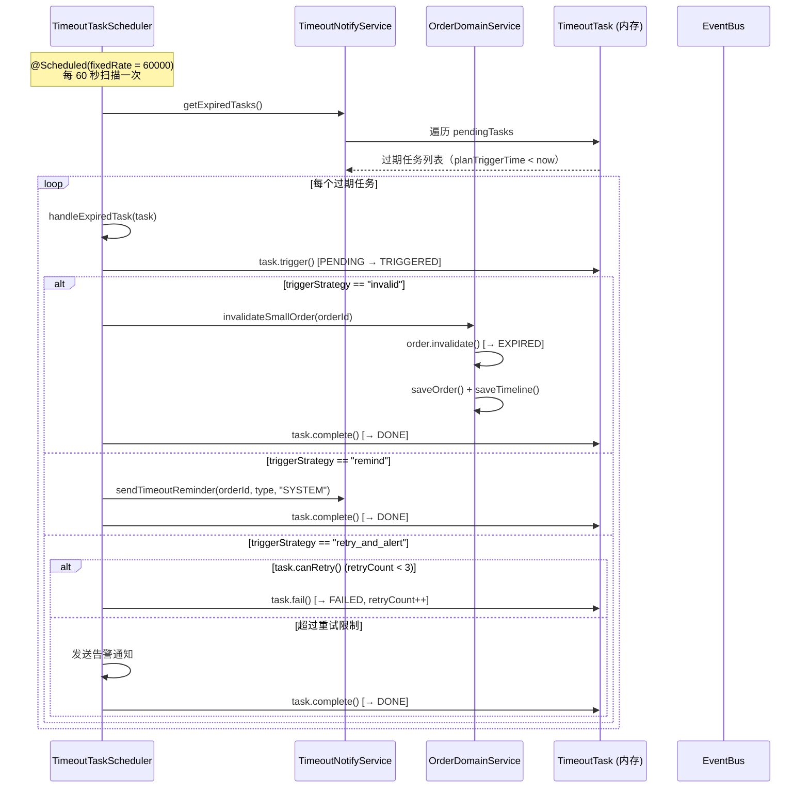
```mermaid
sequenceDiagram
    participant SCH as TimeoutTaskScheduler
    participant TNS as TimeoutNotifyService
    participant ODS as OrderDomainService
    participant DB as TimeoutTask (内存)
    participant EB as EventBus

    Note over SCH: @Scheduled(fixedRate = 60000)<br/>每 60 秒扫描一次

    SCH->>TNS: getExpiredTasks()
    TNS->>DB: 遍历 pendingTasks
    DB-->>TNS: 过期任务列表（planTriggerTime < now）

    loop 每个过期任务
        SCH->>SCH: handleExpiredTask(task)
        SCH->>DB: task.trigger() [PENDING → TRIGGERED]

        alt triggerStrategy == "invalid"
            SCH->>ODS: invalidateSmallOrder(orderId)
            ODS->>ODS: order.invalidate() [→ EXPIRED]
            ODS->>ODS: saveOrder() + saveTimeline()
            SCH->>DB: task.complete() [→ DONE]

        else triggerStrategy == "remind"
            SCH->>TNS: sendTimeoutReminder(orderId, type, "SYSTEM")
            SCH->>DB: task.complete() [→ DONE]

        else triggerStrategy == "retry_and_alert"
            alt task.canRetry() (retryCount < 3)
                SCH->>DB: task.fail() [→ FAILED, retryCount++]
            else 超过重试限制
                SCH->>SCH: 发送告警通知
                SCH->>DB: task.complete() [→ DONE]
            end
        end
    end
```

**关键设计决策**：

| 维度 | 决策 | 理由 |
|------|------|------|
| 调度方式 | Spring `@Scheduled(fixedRate)` 定时扫描 | 简单可靠，无需引入延迟队列中间件 |
| 扫描频率 | 60 秒（1 分钟） | 分钟级精度满足业务需求，避免过于频繁的 DB/内存扫描 |
| 最大延迟 | 1 分钟（扫描周期内） | 可接受的精度范围，30 分钟阈值下误差 <3.3% |
| 超时阈值 | 分钟级配置（`thresholdMinutes`） | 来源 `paymentChannelConfig`，支持动态配置 |
| 任务存储 | 内存 `ConcurrentHashMap`（当前） | 当前单实例可用，多实例需迁移至 Redis/DB |
| **⚠️ 多实例警告** | 内存存储 | **生产部署前必须迁移**：方案A（推荐）Redis 存储 + 分布式锁；方案B 数据库任务表 + 行级锁。迁移完成前禁止多副本部署 |
| 补偿策略 | 最多重试 3 次 + 告警 | `retry_and_alert` 策略，超过限制发告警通知 |
| 任务取消 | 支付成功事件触发取消 | `PaymentSuccessEventListener` 调用 `cancelByOrderIdAndType` |

**超时任务类型**：

| 任务类型 | 阈值 | 触发策略 | 关联订单状态 |
|----------|------|----------|-------------|
| `SMALL_ORDER_PAY_TIMEOUT` | 30 min（可配置） | `invalid` → 自动 EXPIRED | EARNEST_MONEY_UNPAID |
| `FORMAL_ORDER_AUDIT_TIMEOUT` | 1440 min（24h，可配置） | `remind` → 发送提醒 | 待审核 |
| `AUDIT_TIMEOUT` | 1440 min（24h，可配置） | `remind` → 发送提醒 | 待审核 |
| `LOCK_TIMEOUT` | 2880 min（48h，可配置） | `remind` → 发送提醒 | ARRANGE_PRODUCTION |

**任务状态机**：

```
PENDING → TRIGGERED → DONE（正常完成）
PENDING → TRIGGERED → FAILED → TRIGGERED → FAILED → ... → DONE（重试后完成/告警）
PENDING → CANCELLED（支付成功等事件触发取消）
```

### 4.6 意向金转定金差额支付流程（US-006）

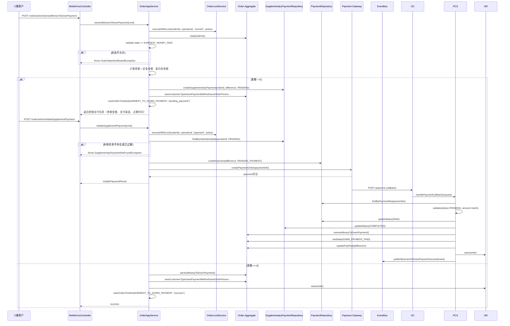
```mermaid
sequenceDiagram
    participant U as C端用户
    participant MC as MobileVsoController
    participant OAS as OrderAppService
    participant OLS as OrderLockService
    participant O as Order Aggregate
    participant SPR as SupplementaryPaymentRepository
    participant PR as PaymentRepository
    participant PGW as Payment Gateway
    participant EB as EventBus

    U->>MC: POST /order/action/earnestMoneyToDownPayment
    MC->>OAS: earnestMoneyToDownPayment(cmd)
    OAS->>OLS: executeWithLock(orderNo, operatorId, "convert", action)
    OAS->>O: load(orderNo)
    OAS->>OAS: validate state == EARNEST_MONEY_PAID

    alt 状态不允许
        OAS-->>MC: throw OrderStateNotAllowedException
    end

    OAS->>OAS: 计算差额 = 定金金额 - 意向金金额

    alt 差额 > 0
        OAS->>SPR: createSupplementaryPayment(orderId, difference, PENDING)
        OAS->>O: saveCustomerType/savePaymentMethod/saveOrderPerson...
        OAS->>OAS: saveOrderTimeline(EARNEST_TO_DOWN_PAYMENT, "pending_payment")
        OAS-->>MC: 返回差额支付信息（差额金额、支付渠道、过期时间）

        U->>MC: POST /order/action/initiateSupplementPayment
        MC->>OAS: initiateSupplementPayment(cmd)
        OAS->>OLS: executeWithLock(orderNo, operatorId, "payment", action)
        OAS->>SPR: findByOrderIdAndStatus(orderId, PENDING)

        alt 补款任务不存在或已过期
            OAS-->>MC: throw SupplementaryPaymentNotFoundException
        end

        OAS->>PR: createPayment(difference, PENDING_PAYMENT)
        OAS->>PGW: createPaymentOrder(paymentInfo)
        PGW-->>OAS: payment凭证
        OAS-->>MC: InitiatePaymentResult

        PGW->>OC: POST /payment (callback)
        OC->>PCS: handlePaymentCallback(request)
        PCS->>PR: findByPaymentNo(paymentNo)
        PCS->>PCS: validate(status=PENDING, amount match)
        PCS->>PR: updateStatus(PAID)
        PCS->>SPR: updateStatus(COMPLETED)
        PCS->>O: earnestMoneyToDownPayment()
        PCS->>O: setState(DOWN_PAYMENT_PAID)
        PCS->>O: updatePaidTotal(difference)
        PCS->>OR: save(order)
        PCS->>EB: publish(EarnestToDownPaymentSuccessEvent)

    else 差额 <= 0
        OAS->>O: earnestMoneyToDownPayment()
        OAS->>O: saveCustomerType/savePaymentMethod/saveOrderPerson...
        OAS->>OR: save(order)
        OAS->>OAS: saveOrderTimeline(EARNEST_TO_DOWN_PAYMENT, "success")
        OAS-->>MC: success
    end
```

**差额支付任务数据结构**（`vso_supplementary_payment` 表，复用改配补款表）：

| 字段 | 类型 | 说明 |
|------|------|------|
| id | BIGINT | 主键 ID |
| supplementary_no | VARCHAR(64) | 补款单号 |
| order_id | VARCHAR(64) | 关联订单 ID |
| supplementary_amount | DECIMAL(18,2) | 补款金额（定金 - 意向金） |
| supplementary_status | VARCHAR(32) | 补款状态（pending / completed / cancelled / expired） |
| supplementary_scene | VARCHAR(32) | 补款场景（config_change / earnest_to_down） |
| config_version_no | INTEGER | 配置版本号（转定金场景可为 null） |
| payment_id | VARCHAR(64) | 关联支付 ID |
| expire_time | TIMESTAMP | 补款过期时间（30 分钟） |
| create_time | TIMESTAMP | 创建时间 |
| update_time | TIMESTAMP | 更新时间 |

**差额支付状态机**：

```
PENDING → COMPLETED（支付成功，触发订单状态转换）
PENDING → CANCELLED（用户取消）
PENDING → EXPIRED（超时自动取消，30 分钟）
PENDING → FAILED（支付失败）
```

**关键设计决策**：

| 维度 | 决策 | 理由 |
|------|------|------|
| 差额计算时机 | 转定金请求时实时计算 | 基于销售车型配置的定金金额与已支付意向金金额差值 |
| 支付超时 | 30 分钟 | 与 US-005 支付超时一致，避免长期挂起 |
| 幂等性 | 订单号作幂等键 | 同一订单重复提交返回上次结果 |
| 复用补款表 | 复用 vso_supplementary_payment | 新增 supplementary_scene 字段区分场景，减少表数量 |
| 失败处理 | 保持原状态不变 | 用户可重新发起，无需额外恢复操作 |

### 4.7 分布式锁并发控制设计（US-020）

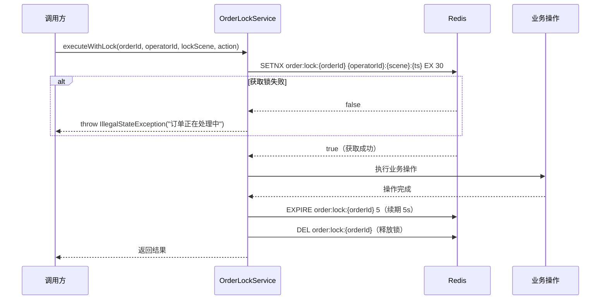
```mermaid
sequenceDiagram
    participant Caller as 调用方
    participant OLS as OrderLockService
    participant Redis as Redis
    participant Action as 业务操作

    Caller->>OLS: executeWithLock(orderId, operatorId, lockScene, action)
    OLS->>Redis: SETNX order:lock:{orderId} {operatorId}:{scene}:{ts} EX 30

    alt 获取锁失败
        Redis-->>OLS: false
        OLS-->>Caller: throw IllegalStateException("订单正在处理中")
    end

    Redis-->>OLS: true（获取成功）
    OLS->>Action: 执行业务操作
    Action-->>OLS: 操作完成

    OLS->>Redis: EXPIRE order:lock:{orderId} 5（续期 5s）
    OLS->>Redis: DEL order:lock:{orderId}（释放锁）
    OLS-->>Caller: 返回结果
```

**锁参数**：

| 参数 | 值 | 说明 |
|------|-----|------|
| 锁键格式 | `order:lock:{orderId}` | 每个订单独立锁 |
| 锁值格式 | `{operatorId}:{lockScene}:{timestamp}` | 标识持锁人和场景 |
| 默认 TTL | 30 秒 | `DEFAULT_EXPIRE_SECONDS = 30` |
| 操作后续期 | 5 秒 | `renewLock(orderId, operatorId, 5)` |
| 获取方式 | `setIfAbsent`（SETNX） | 原子操作，无竞态条件 |
| 释放条件 | 锁值前缀匹配 operatorId | 只有持锁人才能释放 |

**锁场景标识**：

| 场景 | lockScene | 关联操作 |
|------|-----------|----------|
| 支付 | `payment` | US-005 |
| 锁单 | `lockOrder` | US-009 |
| 取消 | `cancel` | US-008 |
| 退款 | `refund` | US-008 |
| 绑车 | `bindVehicle` | US-011 |
| 改配 | `modifyConfig` | US-007 |
| 转定金 | `convert` | US-006 |

**锁安全保障**：
- **互斥性**：同一订单同一时刻只有一个操作持有锁
- **防误释放**：释放前校验锁值前缀是否匹配 operatorId
- **防死锁**：TTL 30s 自动过期，即使异常未释放也不会永久阻塞
- **操作续期**：操作完成后续期 5s 再释放，防止操作接近 TTL 边界时锁提前过期

### 4.8 退款金额计算流程（US-008）

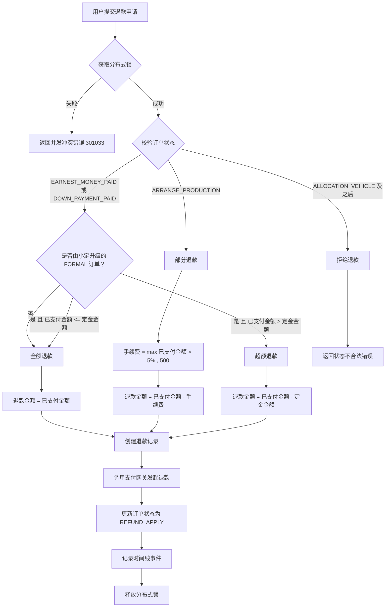
```mermaid
flowchart TD
    A[用户提交退款申请] --> B{获取分布式锁}
    B -->|失败| C[返回并发冲突错误 301033]
    B -->|成功| D{校验订单状态}
    D -->|ALLOCATION_VEHICLE 及之后| G[拒绝退款]
    D -->|ARRANGE_PRODUCTION| F[部分退款]
    D -->|EARNEST_MONEY_PAID 或 DOWN_PAYMENT_PAID| D2{是否由小定升级的 FORMAL 订单？}
    D2 -->|否| E[全额退款]
    D2 -->|是 且 已支付金额 > 定金金额| H[超额退款]
    D2 -->|是 且 已支付金额 <= 定金金额| E

    E --> H2[退款金额 = 已支付金额]
    F --> I[手续费 = max 已支付金额 × 5% , 500]
    I --> J[退款金额 = 已支付金额 - 手续费]
    H --> H3[退款金额 = 已支付金额 - 定金金额]

    H2 --> K[创建退款记录]
    J --> K
    H3 --> K
    G --> L[返回状态不合法错误]

    K --> M[调用支付网关发起退款]
    M --> N[更新订单状态为 REFUND_APPLY]
    N --> O[记录时间线事件]
    O --> P[释放分布式锁]
```

**退款金额计算公式**：

```
退款金额 = 已支付金额 - 手续费

其中：
- 未锁单前（EARNEST_MONEY_PAID、DOWN_PAYMENT_PAID）：
  - 普通 FORMAL 订单：手续费 = 0，退款金额 = 已支付金额
  - 由 SMALL 升级的 FORMAL 订单（已支付金额 > 定金金额）：手续费 = 0，退款金额 = 已支付金额 - 定金金额（超额部分退款，定金不退还）
  - 由 SMALL 升级的 FORMAL 订单（已支付金额 <= 定金金额）：手续费 = 0，退款金额 = 已支付金额（全额退）
- 锁单后（ARRANGE_PRODUCTION）：手续费 = max(已支付金额 × 5%, 500)
- 生产中/已发运（ALLOCATION_VEHICLE 及之后）：不支持退款
```

**退款记录数据结构**（`vso_refund` 表）：

| 字段 | 类型 | 说明 |
|------|------|------|
| refund_id | VARCHAR(64) | 退款业务 ID |
| refund_no | VARCHAR(64) | 退款单号 |
| order_id | VARCHAR(64) | 关联订单 ID |
| payment_id | VARCHAR(64) | 关联支付 ID |
| refund_scene | VARCHAR(32) | 退款场景（full_refund / partial_refund） |
| refund_amount | DECIMAL(18,2) | 退款金额 |
| refund_status | VARCHAR(32) | 退款状态（pending / success / failed） |
| approval_id | VARCHAR(64) | 关联审批 ID（预留） |
| external_refund_no | VARCHAR(64) | 外部退款单号 |
| apply_time | TIMESTAMP | 申请时间 |
| refund_time | TIMESTAMP | 退款完成时间 |
| fail_reason | VARCHAR(255) | 退款失败原因 |

**退款场景枚举**：

| 场景 | refund_scene | 说明 |
|------|--------------|------|
| 全额退款 | `full_refund` | 未锁单前退款，手续费为 0 |
| 部分退款 | `partial_refund` | 锁单后退款，扣除手续费 |
| 超额退款 | `excess_refund` | 由 SMALL 升级的 FORMAL 订单，已支付金额 > 定金金额，退还超额部分，定金不退还 |

**关键设计决策**：

| 维度 | 决策 | 理由 |
|------|------|------|
| 退款审核 | 自动审核 | 系统根据订单状态自动判断，无需人工干预 |
| 手续费计算 | 固定比例 + 最低金额 | 简单明确，避免退款金额过低 |
| 退款发起 | 调用支付网关 | 通过 PaymentAdapter.refund() 接口 |
| 退款回调 | 复用支付回调机制 | 统一处理支付和退款回调 |
| 状态流转 | REFUND_APPLY → REFUND_COMPLETE | 退款申请到退款完成 |

### 4.9 改配补款流程设计（US-007）

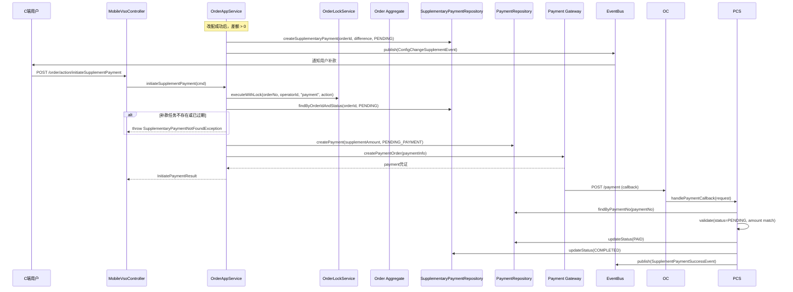
```mermaid
sequenceDiagram
    participant U as C端用户
    participant MC as MobileVsoController
    participant OAS as OrderAppService
    participant OLS as OrderLockService
    participant O as Order Aggregate
    participant SPR as SupplementaryPaymentRepository
    participant PR as PaymentRepository
    participant PGW as Payment Gateway
    participant EB as EventBus

    Note over OAS: 改配成功后，差额 > 0

    OAS->>SPR: createSupplementaryPayment(orderId, difference, PENDING)
    OAS->>EB: publish(ConfigChangeSupplementEvent)

    EB->>U: 通知用户补款

    U->>MC: POST /order/action/initiateSupplementPayment
    MC->>OAS: initiateSupplementPayment(cmd)
    OAS->>OLS: executeWithLock(orderNo, operatorId, "payment", action)
    OAS->>SPR: findByOrderIdAndStatus(orderId, PENDING)

    alt 补款任务不存在或已过期
        OAS-->>MC: throw SupplementaryPaymentNotFoundException
    end

    OAS->>PR: createPayment(supplementAmount, PENDING_PAYMENT)
    OAS->>PGW: createPaymentOrder(paymentInfo)
    PGW-->>OAS: payment凭证
    OAS-->>MC: InitiatePaymentResult

    PGW->>OC: POST /payment (callback)
    OC->>PCS: handlePaymentCallback(request)
    PCS->>PR: findByPaymentNo(paymentNo)
    PCS->>PCS: validate(status=PENDING, amount match)
    PCS->>PR: updateStatus(PAID)
    PCS->>SPR: updateStatus(COMPLETED)
    PCS->>EB: publish(SupplementPaymentSuccessEvent)
```

**补款任务数据结构**（`vso_supplementary_payment` 表）：

| 字段 | 类型 | 说明 |
|------|------|------|
| id | BIGINT | 主键 ID |
| supplementary_no | VARCHAR(64) | 补款单号 |
| order_id | VARCHAR(64) | 关联订单 ID |
| supplementary_amount | DECIMAL(18,2) | 补款金额 |
| supplementary_status | VARCHAR(32) | 补款状态（pending / completed / cancelled / expired） |
| config_version_no | INTEGER | 触发补款的配置版本号 |
| payment_id | VARCHAR(64) | 关联支付 ID |
| expire_time | TIMESTAMP | 补款过期时间（30 分钟） |
| create_time | TIMESTAMP | 创建时间 |
| update_time | TIMESTAMP | 更新时间 |

**补款状态机**：

```
PENDING → COMPLETED（支付成功）
PENDING → CANCELLED（用户取消）
PENDING → EXPIRED（超时自动取消，30 分钟）
```

**关键设计决策**：

| 维度 | 决策 | 理由 |
|------|------|------|
| 补款时效 | 30 分钟 | 与 US-005 支付超时一致，避免长期挂起 |
| 超时处理 | 自动取消 | 超时后补款任务失效，需重新改配 |
| 幂等性 | 订单号+配置版本号 | 防止重复创建补款任务 |
| 支付方式 | 复用支付网关 | 统一支付入口，复用现有支付流程 |

### 4.10 改配退款流程设计（US-007）

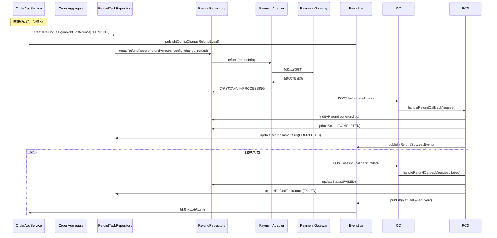
```mermaid
sequenceDiagram
    participant OAS as OrderAppService
    participant O as Order Aggregate
    participant RFR as RefundTaskRepository
    participant RR as RefundRepository
    participant PA as PaymentAdapter
    participant PGW as Payment Gateway
    participant EB as EventBus

    Note over OAS: 改配成功后，差额 < 0

    OAS->>RFR: createRefundTask(orderId, |difference|, PENDING)
    OAS->>EB: publish(ConfigChangeRefundEvent)

    RFR->>RR: createRefundRecord(refundAmount, config_change_refund)
    RR->>PA: refund(refundInfo)
    PA->>PGW: 发起退款请求
    PGW-->>PA: 退款受理成功
    PA-->>RR: 更新退款状态为 PROCESSING

    PGW->>OC: POST /refund (callback)
    OC->>PCS: handleRefundCallback(request)
    PCS->>RR: findByRefundNo(refundNo)
    PCS->>RR: updateStatus(COMPLETED)
    PCS->>RFR: updateRefundTaskStatus(COMPLETED)
    PCS->>EB: publish(RefundSuccessEvent)

    alt 退款失败
        PGW->>OC: POST /refund (callback, failed)
        OC->>PCS: handleRefundCallback(request, failed)
        PCS->>RR: updateStatus(FAILED)
        PCS->>RFR: updateRefundTaskStatus(FAILED)
        PCS->>EB: publish(RefundFailedEvent)
        EB->>OAS: 触发人工审核流程
    end
```

**退款任务数据结构**（`vso_config_change_refund` 表）：

| 字段 | 类型 | 说明 |
|------|------|------|
| id | BIGINT | 主键 ID |
| refund_task_no | VARCHAR(64) | 退款任务单号 |
| order_id | VARCHAR(64) | 关联订单 ID |
| refund_amount | DECIMAL(18,2) | 退款金额 |
| refund_status | VARCHAR(32) | 退款状态（pending / processing / completed / failed） |
| config_version_no | INTEGER | 触发退款的配置版本号 |
| refund_id | VARCHAR(64) | 关联退款记录 ID |
| fail_reason | VARCHAR(255) | 退款失败原因 |
| manual_audit_status | VARCHAR(32) | 人工审核状态（pending / approved / rejected） |
| create_time | TIMESTAMP | 创建时间 |
| update_time | TIMESTAMP | 更新时间 |

**退款状态机**：

```
PENDING → PROCESSING → COMPLETED（退款成功）
PENDING → PROCESSING → FAILED（退款失败，触发人工审核）
FAILED → APPROVED（人工审核通过，重新发起退款）
FAILED → REJECTED（人工审核驳回）
```

**关键设计决策**：

| 维度 | 决策 | 理由 |
|------|------|------|
| 退款发起 | 自动发起 | 改配成功后立即调用退款接口 |
| 失败处理 | 触发人工审核 | 退款失败需人工介入确认 |
| 退款场景 | config_change_refund | 新增退款场景，区别于订单取消退款 |
| 审核流程 | 复用审批模块 | 与 US-010 审核流程保持一致 |

### 4.11 防刷单/黄牛设计（US-003, US-004）

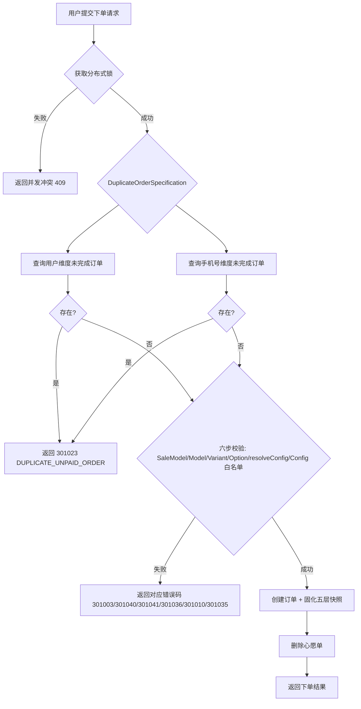
```mermaid
flowchart TD
    A[用户提交下单请求] --> B{获取分布式锁}
    B -->|失败| C[返回并发冲突 409]
    B -->|成功| D{DuplicateOrderSpecification}
    D --> E[查询用户维度未完成订单]
    D --> F[查询手机号维度未完成订单]
    E --> G{存在?}
    F --> H{存在?}
    G -->|是| I[返回 301023 DUPLICATE_UNPAID_ORDER]
    H -->|是| I
    G -->|否| J{六步校验: SaleModel/Model/Variant/Option/resolveConfig/Config 白名单}
    H -->|否| J
    J -->|失败| K[返回对应错误码 301003/301040/301041/301036/301010/301035]
    J -->|成功| L[创建订单 + 固化五层快照]
    L --> M[删除心愿单]
    M --> N[返回下单结果]
```

**校验规则**：

| 维度 | 校验逻辑 | 查询条件 |
|------|----------|----------|
| 用户维度 | 同一 userId 未完成订单数 = 0 | `SELECT COUNT(*) FROM vso_order WHERE user_id = ? AND order_state IN (200, 300)` |
| 手机号维度 | 同一 mobileHash 未完成订单数 = 0 | `SELECT COUNT(*) FROM vso_order WHERE mobile_hash = ? AND order_state IN (200, 300)` |

**未完成状态定义**：
- `EARNEST_MONEY_UNPAID(200)` — 小定待支付
- `DOWN_PAYMENT_UNPAID(300)` — 大定待支付

**实现组件**：

| 组件 | 职责 | 位置 |
|------|------|------|
| `DuplicateOrderSpecification` | 领域规约，封装防刷单校验逻辑 | Domain Layer |
| `OrderRepository.existsUnpaidByUserId()` | 查询用户维度未完成订单 | Infrastructure Layer |
| `OrderRepository.existsUnpaidByMobileHash()` | 查询手机号维度未完成订单 | Infrastructure Layer |

**关键设计决策**：

| 维度 | 决策 | 理由 |
|------|------|------|
| 校验时机 | 下单前（创建订单前） | 尽早拦截，减少无效数据库写入 |
| 校验方式 | 规约模式（Specification） | 领域逻辑内聚，可复用、可测试 |
| 手机号存储 | 存储 mobileHash（哈希值） | 隐私保护，避免明文存储敏感信息 |
| 状态范围 | 仅校验未支付状态 | 已支付订单不影响再次下单 |
| 数据库约束 | 应用层校验 + 部分索引 | 应用层灵活校验，DB 层兜底防并发 |

**数据库索引**（防并发兜底）：

```sql
-- 用户维度：同一用户同一时间最多一个未完成订单
CREATE UNIQUE INDEX uk_user_unpaid_order ON vso_order (user_id, order_state)
WHERE order_state IN (200, 300);

-- 手机号维度：同一手机号同一时间最多一个未完成订单
CREATE UNIQUE INDEX uk_mobile_unpaid_order ON vso_order (mobile_hash, order_state)
WHERE order_state IN (200, 300);
```

> 注：MySQL 8.0 不支持条件唯一索引（Partial Index），实际实现采用应用层校验 + 唯一索引组合（user_id + order_state）或应用层分布式锁保证一致性。

### 4.12 心愿单业务规则校验设计（US-002）

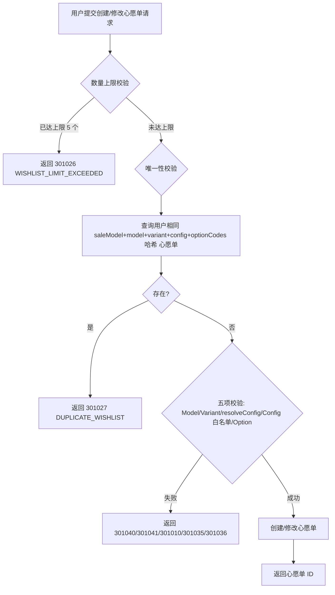
```mermaid
flowchart TD
    A[用户提交创建/修改心愿单请求] --> B{数量上限校验}
    B -->|已达上限 5 个| C[返回 301026 WISHLIST_LIMIT_EXCEEDED]
    B -->|未达上限| D{唯一性校验}
    D --> E[查询用户相同 saleModel+model+variant+config+optionCodes 哈希 心愿单]
    E --> F{存在?}
    F -->|是| G[返回 301027 DUPLICATE_WISHLIST]
    F -->|否| H{五项校验: Model/Variant/resolveConfig/Config 白名单/Option}
    H -->|失败| I[返回 301040/301041/301010/301035/301036]
    H -->|成功| J[创建/修改心愿单]
    J --> K[返回心愿单 ID]
```

**校验规则**：

| 维度 | 校验逻辑 | 查询条件 |
|------|----------|----------|
| 数量上限 | 用户有效心愿单数 < 5 | `SELECT COUNT(*) FROM vso_wishlist WHERE user_id = ? AND status = 'active'` |
| 配置唯一性 | 同一 `(saleModelCode, modelCode, variantCode, configurationCode, optionCodesHash)` 有效心愿单数 = 0（排除当前心愿单） | `SELECT COUNT(*) FROM vso_wishlist WHERE user_id = ? AND sale_model_code = ? AND model_code = ? AND variant_code = ? AND configuration_code = ? AND option_codes_hash = ? AND status = 'active' AND wishlist_id != ?` |

**有效状态定义**：
- `status = 'active'` — 有效心愿单（未删除）

**实现组件**：

| 组件 | 职责 | 位置 |
|------|------|------|
| `WishlistAppService` | 应用服务，封装校验逻辑 | Application Layer |
| `WishlistRepository.countByUserId()` | 查询用户有效心愿单数量 | Infrastructure Layer |
| `WishlistRepository.existsByUserIdAndBuildConfigCode()` | 查询用户相同配置心愿单 | Infrastructure Layer |

**关键设计决策**：

| 维度 | 决策 | 理由 |
|------|------|------|
| 数量上限 | 5 个 | 汽车为大额商品，用户选择有限；避免数据冗余 |
| 校验时机 | 创建/修改前 | 尽早拦截，减少无效数据库写入 |
| 校验方式 | 应用层校验 | 灵活、可扩展 |
| 修改场景唯一性校验 | 排除当前心愿单 | 允许用户修改为已存在的配置（前提是当前心愿单本身就是该配置） |
| 数据库约束 | 应用层校验 + 唯一索引 | 应用层灵活校验，DB 层兜底防并发 |

**数据库索引**（防并发兜底）：

```sql
-- 用户+配置维度：同一用户同一配置最多一个有效心愿单
CREATE UNIQUE INDEX uk_user_config_wishlist ON vso_wishlist (user_id, sale_model_code, model_code, variant_code, configuration_code, option_codes_hash)
WHERE status = 'active';
```

> 注：MySQL 8.0 不支持条件唯一索引（Partial Index），实际实现采用应用层校验 + 普通唯一索引或应用层分布式锁保证一致性。

### 4.13 配车流程设计（US-011）


```mermaid
flowchart TD
    subgraph 配车绑定
        A[运营提交配车请求] --> B{获取分布式锁}
        B -->|失败| C[返回并发冲突错误]
        B -->|成功| D{订单状态校验}
        D -->|非 ARRANGE_PRODUCTION| E[返回状态不合法错误]
        D -->|ARRANGE_PRODUCTION| F{VIN 来源校验}
        F -->|VIN 不存在/不可用| G[返回 VIN 无效错误 301031]
        F -->|校验通过| H{VIN 冲突检测}
        H -->|已被占用| I[返回 VIN 冲突错误 301030]
        H -->|可用| J[绑定 VIN]
        J --> K[更新订单状态为 ALLOCATION_VEHICLE]
        K --> L[创建配车记录]
        L --> M[设置占用过期时间]
        M --> N[调用库存服务更新车辆状态]
        N --> O[记录时间线事件]
        O --> P[释放分布式锁]
    end

    subgraph 换绑VIN
        Q[运营提交换绑请求] --> R{获取分布式锁}
        R -->|失败| S[返回并发冲突错误]
        R -->|成功| T{订单状态校验}
        T -->|非 ALLOCATION_VEHICLE| U[返回状态不合法错误]
        T -->|ALLOCATION_VEHICLE| V{新 VIN 校验}
        V -->|VIN 不存在/不可用| W[返回 VIN 无效错误]
        V -->|校验通过| X{新 VIN 冲突检测}
        X -->|已被占用| Y[返回 VIN 冲突错误，旧 VIN 保持绑定]
        X -->|可用| Z[解绑旧 VIN]
        Z --> AA[绑定新 VIN]
        AA --> AB[更新占用过期时间]
        AB --> AC[调用库存服务更新车辆状态]
        AC --> AD[记录时间线事件]
        AD --> AE[释放分布式锁]
    end

    subgraph VIN超时释放
        AF[定时任务扫描超时 VIN] --> AG{扫描条件}
        AG -->|occupy_expire_time < NOW| AH{获取分布式锁}
        AH -->|失败| AF
        AH -->|成功| AI[更新配车状态为 EXPIRED]
        AI --> AJ[订单状态回退至 ARRANGE_PRODUCTION]
        AJ --> AK[调用库存服务释放车辆]
        AK --> AL[记录时间线事件]
        AL --> AM[发送通知给订单归属运营]
        AM --> AN[释放分布式锁]
    end

    subgraph 订单取消释放VIN
        AO[订单取消/退款完成] --> AP{订单是否绑定 VIN}
        AP -->|是| AQ[更新配车状态为 RELEASED]
        AQ --> AR[记录释放时间]
        AR --> AS[调用库存服务释放车辆]
        AS --> AT[记录时间线事件]
        AP -->|否| AU[无操作]
    end

    subgraph 主动解绑
        AV[运营提交解绑请求] --> AW{获取分布式锁}
        AW -->|失败| AX[返回并发冲突错误]
        AW -->|成功| AY{订单状态校验}
        AY -->|非 ALLOCATION_VEHICLE| AZ[返回状态不合法错误]
        AY -->|ALLOCATION_VEHICLE| BA[更新配车状态为 UNBOUND]
        BA --> BB[记录解绑原因]
        BB --> BC[订单状态回退至 ARRANGE_PRODUCTION]
        BC --> BD[调用库存服务释放车辆]
        BD --> BE[记录时间线事件]
        BE --> BF[释放分布式锁]
    end
```

**配车状态机**：

```
ASSIGNED（已分配）→ BOUND（已绑定）→ RELEASED（已释放）
                                    ↘ EXPIRED（已过期）
                                    ↘ UNBOUND（已解绑）
```

| 状态 | 说明 | 触发条件 |
|------|------|----------|
| ASSIGNED | 已分配 | 配车成功，VIN 已绑定 |
| BOUND | 已绑定 | 订单进入发运流程（APPLY_TRANSPORT） |
| RELEASED | 已释放 | 订单取消或退款完成 |
| EXPIRED | 已过期 | VIN 占用超时自动释放 |
| UNBOUND | 已解绑 | 运营主动解绑 |

**VIN 唯一性保障**：

| 层级 | 机制 | 说明 |
|------|------|------|
| 应用层 | 分布式锁 | 防止并发请求同时分配同一 VIN |
| 数据库层 | 唯一索引 | `uk_vin_assign (vin) WHERE assign_status IN ('ASSIGNED', 'BOUND')` |
| 库存服务 | 车辆状态校验 | 配车前校验车辆状态为 IN_STOCK 或 ALLOCATED |

**配车记录数据结构**（`vso_vehicle_assignment` 表）：

| 字段 | 类型 | 说明 |
|------|------|------|
| vehicle_assignment_id | VARCHAR(64) | 配车业务 ID |
| order_id | VARCHAR(64) | 订单业务 ID |
| assignment_type | VARCHAR(32) | 动作类型（ASSIGN/REASSIGN/UNBIND/RELEASE/EXPIRE） |
| vehicle_source_type | VARCHAR(32) | 车源类型 |
| vin | VARCHAR(32) | VIN |
| vehicle_id | VARCHAR(64) | 车辆业务 ID |
| assign_status | VARCHAR(32) | 配车状态（ASSIGNED/BOUND/RELEASED/EXPIRED/UNBOUND） |
| manual_assign_flag | TINYINT | 是否人工指定 |
| manual_assign_reason | VARCHAR(255) | 人工指定原因 |
| unbind_reason | VARCHAR(255) | 解绑原因 |
| occupy_expire_time | TIMESTAMP | 占用到期时间 |
| assign_time | TIMESTAMP | 配车时间 |
| bind_time | TIMESTAMP | 绑车时间（进入发运流程时更新） |
| release_time | TIMESTAMP | 释放车源时间 |

**VIN 占用有效期配置**（`vso_config_vehicle_occupancy` 表）：

| 字段 | 类型 | 说明 |
|------|------|------|
| config_id | VARCHAR(64) | 配置 ID |
| occupancy_hours | INT | 占用有效期（小时），默认 72 |
| enabled | TINYINT | 是否启用 |

**关键设计决策**：

| 维度 | 决策 | 理由 |
|------|------|------|
| VIN 唯一性 | 分布式锁 + 数据库唯一索引 + 库存服务校验三重保障 | 确保同一 VIN 不会被多次分配 |
| 占用过期 | 定时任务扫描 + 自动释放 | 防止 VIN 长期被无效订单占用 |
| 换绑策略 | 先解绑后绑定，失败保持原状 | 保证数据一致性 |
| 订单取消处理 | 自动释放 VIN | 订单取消后释放资源供其他订单使用 |
| 库存服务集成 | 配车前校验 + 配车后更新状态 | 与车辆库存系统保持数据一致 |
| 并发控制 | 分布式锁 TTL 30s | 防止死锁，保证操作原子性 |

**错误码定义**：

| 错误码 | 说明 |
|--------|------|
| 301030 | VIN 冲突，已被其他订单占用 |
| 301031 | VIN 无效，不存在或状态不可用 |

### 4.14 审核驳回可恢复路径设计（US-010）

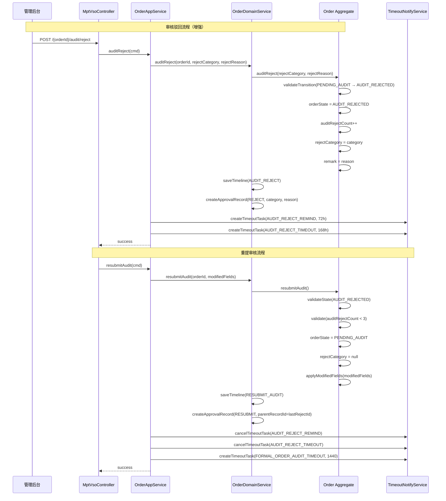
```mermaid
sequenceDiagram
    participant MPT as 管理后台
    participant Ctrl as MptVsoController
    participant OAS as OrderAppService
    participant ODS as OrderDomainService
    participant O as Order Aggregate
    participant TNS as TimeoutNotifyService

    Note over MPT,O: 审核驳回流程（增强）

    MPT->>Ctrl: POST /{orderId}/audit/reject
    Ctrl->>OAS: auditReject(cmd)
    OAS->>ODS: auditReject(orderId, rejectCategory, rejectReason)
    ODS->>O: auditReject(rejectCategory, rejectReason)
    O->>O: validateTransition(PENDING_AUDIT → AUDIT_REJECTED)
    O->>O: orderState = AUDIT_REJECTED
    O->>O: auditRejectCount++
    O->>O: rejectCategory = category
    O->>O: remark = reason
    ODS->>ODS: saveTimeline(AUDIT_REJECT)
    ODS->>ODS: createApprovalRecord(REJECT, category, reason)
    OAS->>TNS: createTimeoutTask(AUDIT_REJECT_REMIND, 72h)
    OAS->>TNS: createTimeoutTask(AUDIT_REJECT_TIMEOUT, 168h)
    OAS-->>Ctrl: success

    Note over Ctrl,TNS: 重提审核流程

    Ctrl->>OAS: resubmitAudit(cmd)
    OAS->>ODS: resubmitAudit(orderId, modifiedFields)
    ODS->>O: resubmitAudit()
    O->>O: validateState(AUDIT_REJECTED)
    O->>O: validate(auditRejectCount < 3)
    O->>O: orderState = PENDING_AUDIT
    O->>O: rejectCategory = null
    O->>O: applyModifiedFields(modifiedFields)
    ODS->>ODS: saveTimeline(RESUBMIT_AUDIT)
    ODS->>ODS: createApprovalRecord(RESUBMIT, parentRecordId=lastRejectId)
    OAS->>TNS: cancelTimeoutTask(AUDIT_REJECT_REMIND)
    OAS->>TNS: cancelTimeoutTask(AUDIT_REJECT_TIMEOUT)
    OAS->>TNS: createTimeoutTask(FORMAL_ORDER_AUDIT_TIMEOUT, 1440)
    OAS-->>Ctrl: success
```

**驳回原因枚举** `AuditRejectReason`：

| 枚举值 | 含义 |
|--------|------|
| INCOMPLETE_INFO | 资料不全 |
| INCORRECT_INFO | 信息有误 |
| RISK_BLOCK | 风险拦截 |
| DUPLICATE_ORDER | 重复订单 |
| OTHER | 其他 |

**Order 聚合根新增字段**：

| 字段 | 类型 | 说明 |
|------|------|------|
| auditRejectCount | Integer | 累计被驳回次数，默认 0，驳回时 +1，重提时校验上限 |
| rejectCategory | String | 最近一次驳回原因分类枚举值，重提时清空 |

**`vso_approval_record` 表扩展字段**：

| 字段 | 类型 | 说明 |
|------|------|------|
| action_type | VARCHAR(32) | 操作类型（APPROVE / REJECT / RESUBMIT） |
| reject_category | VARCHAR(32) | 驳回原因分类枚举值，仅 REJECT 时有值 |
| reject_reason | TEXT | 驳回原因详情，仅 REJECT 时有值 |
| operator_id | VARCHAR(64) | 操作人 ID |
| parent_record_id | BIGINT | 关联上一条记录 ID，RESUBMIT 时指向上次 REJECT 记录 |

**超时策略**：

| 阶段 | 阈值 | 策略 | 任务编码 |
|------|------|------|----------|
| 驳回后提醒 | 72 小时 | remind | AUDIT_REJECT_REMIND |
| 驳回后超时关闭 | 168 小时（7天） | auto_close | AUDIT_REJECT_TIMEOUT |

**驳回超时自动关闭流程**：

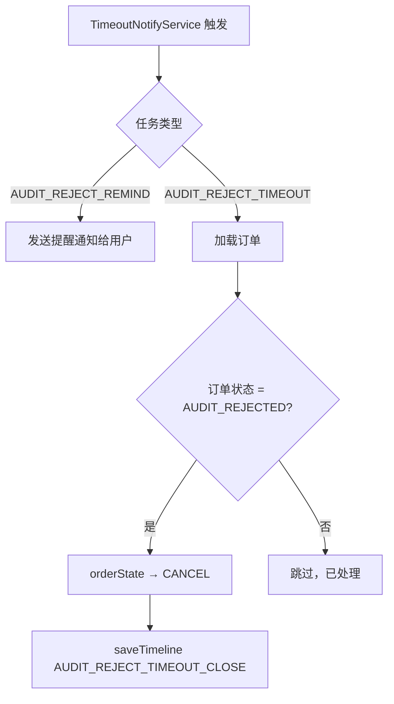
```mermaid
flowchart TD
    A[TimeoutNotifyService 触发] --> B{任务类型}
    B -->|AUDIT_REJECT_REMIND| C[发送提醒通知给用户]
    B -->|AUDIT_REJECT_TIMEOUT| D[加载订单]
    D --> E{订单状态 = AUDIT_REJECTED?}
    E -->|是| F[orderState → CANCEL]
    E -->|否| G[跳过，已处理]
    F --> H[saveTimeline AUDIT_REJECT_TIMEOUT_CLOSE]
```

**关键设计决策**：

| 维度 | 决策 | 理由 |
|------|------|------|
| 恢复方式 | 用户修正后重提 | 符合'驳回即修正'的业务语义，行业标准做法 |
| 重提上限 | 3 次 | 足够 2 轮修正 + 1 轮保留，避免无限重提审核绕过 |
| 驳回原因 | 结构化枚举 + 自由文本 | 便于驳回原因统计分析，同时保留详情 |
| 超时策略 | 72h 提醒 + 168h 自动关闭 | 与已有 TimeoutNotifyService 机制一致，避免订单长期挂起 |
| 审批记录 | 扩展 vso_approval_record | 复用已有审批表，RESUBMIT 记录关联上次 REJECT 记录 |

**状态机新增转移**：

```
AUDIT_REJECTED(370) → PENDING_AUDIT(350)   // 用户修正后重提
AUDIT_REJECTED(370) → CANCEL(950)          // 用户主动取消 / 超时自动关闭
```

**错误码定义**：

| 错误码 | 说明 |
|--------|------|
| 301028 | 审核重提次数超限（最多 3 次） |
| 301029 | 审核驳回原因必填（分类和详情均不可为空） |

### 4.15 发运交付倒计时补偿机制（US-012/US-013）

**背景**：US-012（发运）和 US-013（交付）的状态推进完全依赖外部服务回调（物流/交付系统）。若外部服务推送失败或延迟，订单将永远卡在某个中间状态。本机制通过倒计时任务对外部回调进行补偿性监控。

**倒计时任务类型**：

| 任务类型 | 触发时机 | 期望下一个状态 | 阈值 | 触发策略 |
|----------|----------|----------------|------|----------|
| `PREPARE_TRANSPORT_TIMEOUT` | 状态流转为 PREPARE_TRANSPORT | TRANSPORTING | 24h | `remind` → 告警 |
| `TRANSPORTING_TIMEOUT` | 状态流转为 TRANSPORTING | PREPARE_DELIVER | 48h | `remind` → 告警 |
| `PREPARE_DELIVER_TIMEOUT` | 状态流转为 PREPARE_DELIVER | DELIVERED | 24h | `remind` → 告警 |
| `DELIVERED_TIMEOUT` | 状态流转为 DELIVERED | ACTIVATED | 72h | `remind` → 告警 |

**流程说明**：

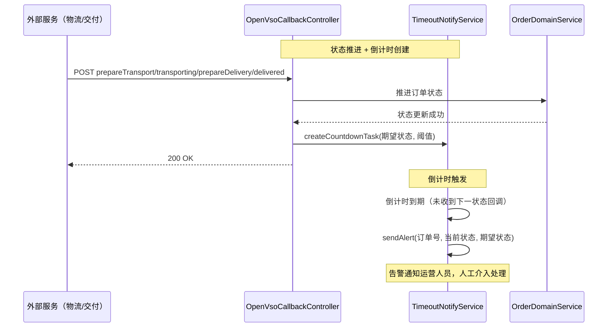
```mermaid
sequenceDiagram
    participant SVC as 外部服务（物流/交付）
    participant OC as OpenVsoCallbackController
    participant TNS as TimeoutNotifyService
    participant ODS as OrderDomainService

    Note over OC,TNS: 状态推进 + 倒计时创建
    SVC->>OC: POST prepareTransport/transporting/prepareDelivery/delivered
    OC->>ODS: 推进订单状态
    ODS-->>OC: 状态更新成功
    OC->>TNS: createCountdownTask(期望状态, 阈值)
    OC-->>SVC: 200 OK

    Note over TNS: 倒计时触发
    TNS->>TNS: 倒计时到期（未收到下一状态回调）
    TNS->>TNS: sendAlert(订单号, 当前状态, 期望状态)
    Note over TNS: 告警通知运营人员，人工介入处理
```

**任务取消**：

| 任务类型 | 取消时机 |
|----------|----------|
| `PREPARE_TRANSPORT_TIMEOUT` | 收到 `transporting` 回调 |
| `TRANSPORTING_TIMEOUT` | 收到 `prepareDelivery` 回调 |
| `PREPARE_DELIVER_TIMEOUT` | 收到 `delivered` 回调 |
| `DELIVERED_TIMEOUT` | 收到 `activate` 回调 |

**关键设计决策**：

| 维度 | 决策 | 理由 |
|------|------|------|
| 补偿策略 | 仅告警，不自动状态回退 | 避免外部服务延迟导致的误回退，保留人工介入窗口 |
| 倒计时阈值 | 24h/48h/72h 分级 | 根据业务阶段合理分配时间，越接近交付越宽松 |
| 任务存储 | 复用 US-019 超时任务机制 | 统一管理，定时扫描触发 |

### 4.16 选配器数据组装与实时报价流程（US-021）

**背景**：CR-011 将选配器由"单 Variant 的 selectableFamilies"重构为"车系 → Model → Variant"三段式逐层选择；Model/Variant 两层叠加销售策略过滤与营销元数据，价格下沉至 Variant 层。报价校验顺序与下单六步对齐（去防刷单步）。CR-014 将数据来源由 MDM 投影改为 VSO 销售策略表自包含，variant/config/option 三层策略表补充 model_code 字段，选配器返回结构顶层由 carlineCode/carlineName 改为 saleModelCode/modelName。

**配置器数据组装流程（三段式）**：

```mermaid
sequenceDiagram
    participant U as C端用户
    participant MC as MobileSaleModelController
    participant SMAS as SaleModelAppService
    participant MREPO as ModelPolicyRepository
    participant VREPO as VariantPolicyRepository
    participant OREPO as OptionPolicyRepository
    participant OFREPO as OptionFamilyPolicyRepository

    U->>MC: GET /configurator/{saleModelCode}?regionCode=xxx
    MC->>SMAS: getConfigurator(saleModelCode, regionCode)
    SMAS->>SMAS: validate SaleModel (active, time window)

    SMAS->>MREPO: findBySaleModelCode(saleModelCode)
    MREPO-->>SMAS: modelPolicies[]
    SMAS->>SMAS: 过滤可售 Model (saleStatus=active; 空表=ALL 全开)

    SMAS->>VREPO: findBySaleModelCode(saleModelCode)
    VREPO-->>SMAS: allVariantPolicies[]
    SMAS->>SMAS: 按 modelCode 分组，过滤可售 Variant (saleStatus=active, variantPrice 非空, 区域命中)

    SMAS->>OREPO: findBySaleModelCode(saleModelCode)
    OREPO-->>SMAS: allOptionPolicies[]
    SMAS->>SMAS: 按 modelCode+variantCode 分组，按 optionFamilyCode 聚合

    SMAS->>OFREPO: findBySaleModelCode(saleModelCode)
    OFREPO-->>SMAS: allOptionFamilyPolicies[]
    SMAS->>SMAS: 关联 Family 营销元数据

    SMAS-->>MC: { saleModelCode, modelName, models[ {modelCode, ..., variants[ {variantCode, variantPrice, ..., selectableFamilies[]} ]} ] }
    MC-->>U: 三段式选配器结构（零 MDM 投影依赖）
```

**实时报价流程（六步）**：

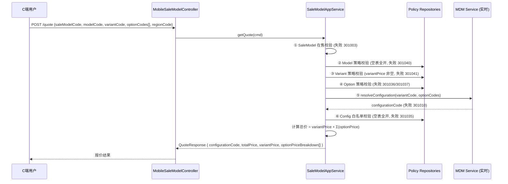
```mermaid
sequenceDiagram
    participant U as C端用户
    participant MC as MobileSaleModelController
    participant SMAS as SaleModelAppService
    participant POL as Policy Repositories
    participant MDM as MDM Service (实时)

    U->>MC: POST /quote {saleModelCode, modelCode, variantCode, optionCodes[], regionCode}
    MC->>SMAS: getQuote(cmd)

    SMAS->>SMAS: ① SaleModel 在售校验 (失败 301003)
    SMAS->>POL: ② Model 策略校验 (空表全开, 失败 301040)
    SMAS->>POL: ③ Variant 策略校验 (variantPrice 非空, 失败 301041)
    SMAS->>POL: ④ Option 策略校验 (失败 301036/301037)
    SMAS->>MDM: ⑤ resolveConfiguration(variantCode, optionCodes)
    MDM-->>SMAS: configurationCode (失败 301010)
    SMAS->>POL: ⑥ Config 白名单校验 (空表全开, 失败 301035)

    SMAS->>SMAS: 计算总价 = variantPrice + Σ(optionPrice)
    SMAS-->>MC: QuoteResponse { configurationCode, totalPrice, variantPrice, optionPriceBreakdown[] }
    MC-->>U: 报价结果
```

**MDM 超时兜底策略**：

| 场景 | 策略 | 说明 |
|------|------|------|
| 选配器只读展示（三段式数据组装） | VSO 策略表自包含，不依赖 MDM | 无需降级，数据完全来自 VSO 表 |
| 实时报价（下单前） | 不允许降级（MDM resolveConfiguration） | 返回服务暂不可用提示，避免脏数据下单 |

**关键设计决策**：

| 维度 | 决策 | 理由 |
|------|------|------|
| 三段式结构 | saleModel → models[] → variants[] | 与 SaleModel 1:1 Carline 粒度对齐，逐层选择 |
| 数据来源 | VSO 销售策略表自包含，不依赖 MDM 投影 | MDM 投影仅用于管理端同步辅助参考，手机端数据完全自包含 |
| Model/Variant 空表语义 | ALL 全开 | 降低运营初始配置成本，逐步精细化 |
| 展示名称 | 统一使用营销名称（marketing_name/marketing_title） | 不冗余 MDM 名称，管理端可自定义覆盖 |
| 价格归属 | variantPrice/earnestMoneyPrice/downPaymentPrice 落 Variant 层 | SaleModel 不再直接定价，起售价为派生值 |
| 报价计价 | variantPrice + Σ(optionPrice) | basePrice 废弃，价格来源唯一化 |
| 未配置策略的 option | 直接过滤不展示 | 价格必须显式配置才能上架 |
| model_code 字段 | variant/config/option 三层策略表均加 model_code | VSO 表体系自包含完整树形结构，无需关联 MDM 投影遍历 Model→Variant→Option |

### 4.17 销售策略管理流程（US-022）

**背景**：CR-011 将销售策略由 Configuration / Option 两层扩展为 Model / Variant / Configuration / Option 四层，语义一致。新增 Model 层（不直接定价）与 Variant 层（承载 variantPrice/earnestMoneyPrice/downPaymentPrice）；Config/Option 归属键扩展为 (saleModelCode, variantCode, ...) 以跨 Variant 隔离。

**四层归属与空表语义**：

| 层级 | 表 | 归属键 | 空表语义 | 价格 |
|------|------|--------|----------|------|
| Model | `tb_sale_model_model_policy` | (saleModelCode, modelCode) | ALL 全开 | 不定价 |
| Variant | `tb_sale_model_variant_policy` | (saleModelCode, modelCode, variantCode) | ALL 全开（价格仍必填） | variantPrice/earnestMoneyPrice/downPaymentPrice |
| Configuration | `tb_sale_model_config_policy` | (saleModelCode, modelCode, variantCode, configurationCode) | ALL 全开 | 无（指导价来自 MDM 投影） |
| Option | `tb_sale_model_option_policy` | (saleModelCode, modelCode, variantCode, optionCode) | 未配置即过滤 | optionPrice |

**Model / Variant 层校验流程**：

```mermaid
flowchart TD
    A[下单/改配/选配器校验 Model 或 Variant] --> B{该层策略表对 SaleModel 有记录?}
    B -->|无任何记录| C[ALL 全开]
    B -->|有记录| D{该 modelCode/variantCode 在表中且 saleStatus=active?}
    D -->|否| E[不可售: Model→301040 / Variant→301041]
    D -->|是| F{Variant 层: variantPrice 非空 且 区域/渠道/时间窗命中?}
    F -->|否| E
    F -->|是| G[可售]
    C --> H{Variant 层兜底: variantPrice 非空?}
    H -->|否| E
    H -->|是| G
```

**Configuration 白名单语义**：

```mermaid
flowchart TD
    A[下单/改配/选配器校验 Configuration] --> B{tb_sale_model_config_policy 有记录?}
    B -->|无任何记录| C[ALL 全开: 该 Variant 下全部 Configuration 可售]
    B -->|有记录| D{该 configurationCode 在表中?}
    D -->|否| E[不可售]
    D -->|是| F{status = active?}
    F -->|是| G[可售]
    F -->|否| H[不可售]
```

**OptionCode 销售策略校验流程**：

```mermaid
flowchart TD
    A[下单/改配/选配器校验 OptionCode] --> B{tb_sale_model_option_policy 有记录?}
    B -->|无记录| C[过滤: 未配置策略的 option 不展示]
    B -->|有记录| D{saleStatus}
    D -->|off_shelf| E[不可售]
    D -->|coming_soon| F[不可售, 但可展示为"即将上市"]
    D -->|active| G{optionPrice != null?}
    G -->|否| E
    G -->|是| H{availableRegions 命中?}
    H -->|否| I[OPTION_REGION_RESTRICTED]
    H -->|是| J{channels 命中?}
    J -->|否| I
    J -->|是| K[可售]
```

**BundleWith/MutexWith 矛盾校验**：

```mermaid
flowchart TD
    A[运营保存 OptionCode 策略] --> B{bundleWith 和 mutexWith 是否矛盾?}
    B -->|A.bundleWith=B 且 A.mutexWith=B| C[返回参数错误, 禁止保存]
    B -->|无矛盾| D[保存成功]
```

**关键设计决策**：

| 维度 | 决策 | 理由 |
|------|------|------|
| Model/Variant 空表语义 | ALL 全开 | 与 Configuration 白名单一致，降低运营初始配置成本 |
| Option 空表语义 | 未配置即过滤 | 价格必须显式配置才能展示售卖 |
| 价格必填 | variantPrice / optionPrice 非空才能上架 | MDM 无价格，VSO 是唯一价格来源 |
| 必选层兜底警告 | Model/Variant/必选 family 下架致该层无 active 子项时弹强警告，不强制阻止 | 四层一致，保留运营灵活性但提示风险 |
| 矛盾校验 | bundleWith/mutexWith 保存前校验 | 避免运行时逻辑混乱 |
| 批量导入 | Model/Variant/Config/Option 四类各自 CSV（≤500 行，全量校验通过才落库，<5s） | 四层一致的导入能力 |

### 4.18 MDM 主数据本地投影流程（US-023）

**背景**：CR-011 将投影对象由 3 类扩展为 5 类，新增 Carline 与 Model，并含归属关系链 Carline→Model[]→Variant[]；强制同步范围由单 Variant 扩展为整条 Carline 链路。

**同步范围**（整条 Carline 链路）：
- **Carline**：同步该 carlineCode 的 Carline 元数据及下属 modelCodes[]
- **Model**：同步该 Carline 下全部 Model 元数据（含 carlineCode、下属 variantCodes[]）
- **Variant**：同步各 Model 下的 Variant 数据（含标配 options）
- **Configuration**：同步各 variantCode 下的所有 Configuration
- **OptionCode**：只同步各 variantCode 关联的 OptionCode，来源包括：
  1. Variant 的 `standardOptions`（标配选项）
  2. 该 variantCode 下所有 Configuration 的 `optionCodes`（可选选项）
  3. 两者去重后，只同步这些 OptionCode（不同步全量 OptionCode）
- **OptionFamily**：只同步关联的 OptionFamily（从 OptionCode 的 `optionFamilyCode` 提取）

**初始化流程**：

```mermaid
sequenceDiagram
    participant VSO as VSO Application
    participant MDM as MDM Service
    participant DB as 本地投影表
    participant Redis as Redis Cache

    Note over VSO: VSO 启动时
    VSO->>MDM: 查询所有 active SaleModel 关联的 carlineCode
    MDM-->>VSO: carlineCodes[]

    loop 每个 carlineCode
        VSO->>MDM: getCarlineDetail(carlineCode)
        MDM-->>VSO: carline + models[]
        loop 每个 model / variant
            VSO->>MDM: getVariantDetail(variantCode)
            MDM-->>VSO: variant + 标配 options
            VSO->>MDM: getConfigurationList(variantCode)
            MDM-->>VSO: configurations[]
            VSO->>MDM: getOptionTree(variantCode)
            MDM-->>VSO: optionFamilies[] + options[]
        end
        VSO->>DB: upsert 投影数据 (carline/model/variant/config/option)
        VSO->>Redis: 写入缓存 (TTL 10min)
    end
```

**Kafka 订阅更新流程**：

```mermaid
sequenceDiagram
    participant KFK as Kafka (mdm.product.*.changed)
    participant LIS as MdmProjectionEventListener
    participant DB as 本地投影表
    participant Redis as Redis Cache

    KFK->>LIS: 收到变更事件 (carline/model/variant/configuration/option)
    LIS->>LIS: 解析事件类型和变更对象

    alt carline 变更
        LIS->>DB: 更新 mdm_projection_carline
        LIS->>Redis: 失效相关缓存
    else model 变更
        LIS->>DB: 更新 mdm_projection_model
        LIS->>Redis: 失效相关缓存
    else variant 变更
        LIS->>DB: 更新 mdm_projection_variant
        LIS->>Redis: 失效相关缓存
    else configuration 变更
        LIS->>DB: 更新 mdm_projection_configuration
        LIS->>Redis: 失效相关缓存
    else option 变更
        LIS->>DB: 更新 mdm_projection_option
        LIS->>Redis: 失效相关缓存
    end

    Note over LIS: 30s 内完成更新
```

**读路径与一致性兜底**：

```mermaid
flowchart TD
    A[选配器/下单/改配链路读 MDM 数据] --> B{本地投影有数据?}
    B -->|有| C[返回投影数据]
    B -->|无| D[实时回源 MDM]
    D --> E{MDM 返回成功?}
    E -->|是| F[写入投影 + 缓存]
    F --> G[返回数据]
    E -->|否| H{MDM 超时/不可用?}
    H -->|是| I[记录告警日志]
    I --> J[返回 MDM_PROJECTION_STALE 301039]
    H -->|否| K[返回错误]
```

**投影数据结构**：

| 投影表 | 主键 | 核心字段 |
|--------|------|----------|
| `mdm_projection_carline` | carline_code | carline_name, model_codes(JSON) |
| `mdm_projection_model` | model_code | model_name, carline_code, variant_codes(JSON) |
| `mdm_projection_variant` | variant_code | variant_name, model_code, model_name, standard_options(JSON) |
| `mdm_projection_configuration` | configuration_code | variant_code, option_codes(JSON), guide_price |
| `mdm_projection_option` | option_code | option_family_code, option_name, mutex_with(JSON), bundle_with(JSON) |

**投影更新路径**（仅以下三条路径可写）：

| 路径 | 触发方式 | 说明 |
|------|----------|------|
| Kafka 事件 | 自动 | mdm.product.carline/model/variant/configuration/option.changed |
| 初始化任务 | VSO 启动 | 全量拉取 active SaleModel 关联的整条 Carline 链路数据 |
| 强制同步 | 运营触发 | US-016/US-022 的同步接口，按 carlineCode 整条链路重拉，忽略本地缓存 |

**关键设计决策**：

| 维度 | 决策 | 理由 |
|------|------|------|
| 投影可写路径 | 仅三条（Kafka/初始化/强制同步） | 防止数据不一致 |
| 缓存 TTL | 10 分钟 | 平衡性能与数据新鲜度 |
| MDM 超时处理 | 记录告警 + 返回 301039 | 不用脏数据兜底，由运营或重试解决 |
| 投影范围 | Carline + Model + Variant + Configuration + OptionCode | 覆盖三段式选配器和下单链路全部 MDM 数据需求 |

### 4.19 删除销售车型级联标记失效流程（US-016）

**背景**：删除销售车型时，需要同时处理该 saleModelCode 关联的四层销售策略（Model/Variant/Configuration/Option）。采用级联标记失效（off_shelf）而非物理删除，保留历史订单快照的可追溯性。

**级联标记失效流程**：

```mermaid
sequenceDiagram
    participant MPT as 管理后台
    participant Ctrl as MptSaleModelController
    participant SMAS as SaleModelAppService
    participant ODS as OrderDomainService
    participant DB as 数据库

    MPT->>Ctrl: DELETE /api/mpt/saleModel/v1/{id}
    Ctrl->>SMAS: deleteSaleModel(id)
    SMAS->>SMAS: 加载销售车型
    SMAS->>ODS: 查询关联活跃订单

    alt 存在关联活跃订单
        ODS-->>SMAS: 存在活跃订单
        SMAS-->>Ctrl: 抛出约束冲突异常
        Ctrl-->>MPT: 409 错误
    end

    SMAS->>DB: 开启事务
    SMAS->>DB: 逻辑删除 tb_sale_model (is_deleted=1)
    SMAS->>DB: 级联更新 tb_sale_model_model_policy SET sale_status='off_shelf' WHERE sale_model_code=?
    SMAS->>DB: 级联更新 tb_sale_model_variant_policy SET sale_status='off_shelf' WHERE sale_model_code=?
    SMAS->>DB: 级联更新 tb_sale_model_config_policy SET status='off_shelf' WHERE sale_model_code=?
    SMAS->>DB: 级联更新 tb_sale_model_option_policy SET sale_status='off_shelf' WHERE sale_model_code=?
    SMAS->>DB: 提交事务
    SMAS-->>Ctrl: 删除成功
    Ctrl-->>MPT: 200 OK
```

**级联操作范围**：

| 表 | 操作 | 条件 |
|------|------|------|
| `tb_sale_model` | 逻辑删除（is_deleted=1） | 主记录 |
| `tb_sale_model_model_policy` | sale_status → off_shelf | WHERE sale_model_code = ? |
| `tb_sale_model_variant_policy` | sale_status → off_shelf | WHERE sale_model_code = ? |
| `tb_sale_model_config_policy` | status → off_shelf | WHERE sale_model_code = ? |
| `tb_sale_model_option_policy` | sale_status → off_shelf | WHERE sale_model_code = ? |

**关键设计决策**：

| 维度 | 决策 | 理由 |
|------|------|------|
| 级联方式 | 标记失效（off_shelf）而非物理删除 | 保留历史订单快照的可追溯性，支持误删恢复 |
| 事务边界 | 同一事务内完成 | 保证数据一致性，避免部分成功 |
| 历史快照 | 不受影响 | 订单快照（vso_order_vehicle_snapshot）为独立数据，删除销售车型不影响历史记录 |
| 恢复机制 | 运营可重新创建销售车型并重新配置策略 | 简化设计，避免复杂的状态恢复逻辑 |

### 5.1 Mobile Sale Model APIs

**GET** `/api/mobile/saleModel/v1`
- Query: `regionCode` (可选，区域过滤)
- Response: `List<SaleModelCardVo>` — 销售车型卡片列表（含 saleModelCode、name、icon、carlineCode、carlineName、startingPrice、earnestMoneyPrice、marketingCopy、images、sortWeight）
- 说明：卡片粒度为 Carline 级；仅返回 listingStatus=active、时间窗有效、区域命中且存在可售 Variant 的车型；startingPrice = min 当前可售 Variant 的 variantPrice，earnestMoneyPrice 取最低值（派生于 `tb_sale_model_variant_policy`）

**GET** `/api/mobile/saleModel/v1/{saleModelCode}`
- Response: `SaleModelCardVo` — 销售车型卡片详情

**GET** `/api/mobile/saleModel/v1/{saleModelCode}/configurator`
- Query: `regionCode` (必填)
- Response: `ConfiguratorResponse` — 三段式选配器数据 `{ saleModelCode, modelName, models[ { modelCode, modelName, marketingImage?, marketingCopy?, sortWeight, variants[ { variantCode, variantName, marketingImage?, marketingCopy?, sortWeight, variantPrice, earnestMoneyPrice, downPaymentPrice, selectableFamilies[ { optionFamilyCode, optionFamilyName, marketingImage?, marketingDesc?, sortWeight, options[ { optionCode, optionName, saleStatus, price, image?, marketingCopy?, bundleWith[], mutexWith[] } ] } ] } ] } ] }`
- 说明：数据全部来自 VSO 销售策略表自包含（不依赖 MDM 投影）；Model/Variant 两层叠加销售策略过滤（空表 ALL 全开），移除无可售 Variant 的 Model；Option 按 optionFamilyCode 分组组装 selectableFamilies；展示名称统一使用营销名称；model_code 字段使 VSO 表体系自包含完整树形结构

**POST** `/api/mobile/saleModel/v1/quote`
- Request: `{ saleModelCode, modelCode, variantCode, optionCodes[], regionCode }`
- Response: `{ configurationCode, totalPrice, variantPrice, optionPriceBreakdown[] }` — 实时报价结果
- 说明：六步校验（SaleModel→Model→Variant→Option→resolveConfiguration→Config 白名单），总价 = variantPrice + Σ(optionPrice)

**GET** `/api/mobile/saleModel/v1/regions`
- Response: `List<RegionVo>` — 可选上牌地区列表（字典服务缓存）

### 5.2 Mobile Order APIs

**POST** `/api/mobile/vso/v1/action/earnestMoneyOrder`
- Request: `{ saleModelCode, modelCode, variantCode, optionCodes[], customerInfo, paymentChannel, regionCode }`
- Response: `{ orderNo, earnestMoneyAmount, paymentChannels[], expireTime }`
- 说明：六步校验（SaleModel 在售 → Model 策略 → Variant 策略 → OptionCode 策略 → MDM resolveConfiguration → Configuration 白名单）；意向金额取命中 Variant 策略行

**POST** `/api/mobile/vso/v1/action/downPaymentOrder`
- Request: `{ saleModelCode, modelCode, variantCode, optionCodes[], customerInfo, paymentChannel, regionCode }`
- Response: `{ orderNo, downPaymentAmount, paymentChannels[], expireTime }`
- 说明：同意向金下单的六步校验；定金额取命中 Variant 策略行

**POST** `/api/mobile/vso/v1/action/initiatePayment`
- Request: `{ orderNo, paymentChannel }`
- Response: `{ paymentNo, paymentChannel, paymentAmount }`

**POST** `/api/mobile/vso/v1/order/action/cancel`
- Request: `{ orderNo }`
- Response: void

**POST** `/api/mobile/vso/v1/order/action/requestRefund`
- Request: `{ orderNo }`
- Response: void

**POST** `/api/mobile/vso/v1/order/action/earnestMoneyToDownPayment`
- Request: `{ orderNo, customerType?, paymentMethod?, orderPersonType?, orderPersonName?, orderPersonIdType?, orderPersonIdNum?, purchasePlan?, licenseCityCode?, orderStoreCode?, deliveryStoreCode? }`
- Response: `{ orderNo, orderType, orderState, supplementaryPayment?: { supplementaryNo, amount, paymentChannels[], expireTime } }`
- 说明：差额>0 时返回 supplementaryPayment 信息，差额<=0 时直接完成转换

**POST** `/api/mobile/vso/v1/order/action/initiateSupplementPayment`
- Request: `{ orderNo, supplementaryNo, paymentChannel }`
- Response: `{ paymentNo, paymentChannel, paymentAmount }`
- 说明：差额支付发起，复用改配补款接口

**POST** `/api/mobile/vso/v1/order/action/lock`
- Request: `{ orderNo }`
- Response: void

**POST** `/api/mobile/vso/v1/order/action/modifyConfig`
- Request: `{ orderNo, variantCode?, optionCodes[] }`
- Response: void
- 说明：saleModelCode 与 modelCode 不可变（跨 SaleModel→301044、跨 Model→301043）；允许同 Model 下 variantCode 变更（变更时跑 Variant 策略校验），价格基于快照 variantPolicySnapshot/salePolicySnapshot 计算

**GET** `/api/mobile/vso/v1/order/{orderNo}`
- Response: `OrderResponseVo` — 订单详情

### 5.3 MPT Order APIs

**GET** `/api/mpt/vso/v1/list`
- Query: `{ orderNo, orderState, customerName, phone, page, size }`
- Response: `PageResult<VehicleSaleOrderMpt>`

**POST** `/api/mpt/vso/v1/action/assignVehicle`
- Header: `X-Operator-Id`
- Request: `{ orderNo, vin }`
- Response: void

**POST** `/api/mpt/vso/v1/action/reassignVehicle`
- Header: `X-Operator-Id`
- Request: `{ orderNo, newVin }`
- Response: void
- 说明：换绑 VIN，先解绑旧 VIN 后绑定新 VIN

**POST** `/api/mpt/vso/v1/action/unbindVehicle`
- Header: `X-Operator-Id`
- Request: `{ orderNo, unbindReason }`
- Response: void
- 说明：主动解绑 VIN，订单状态回退至 ARRANGE_PRODUCTION

**GET** `/api/mpt/vso/v1/vehicleAssignment/list`
- Query: `{ orderNo, assignStatus, page, size }`
- Response: `PageResult<VehicleAssignmentVo>`
- 说明：查询配车记录列表

**GET** `/api/mpt/vso/v1/vehicleAssignment/{orderNo}`
- Response: `VehicleAssignmentVo`
- 说明：查询订单当前配车信息

**POST** `/api/mpt/vso/v1/action/assignDeliveryPerson`
- Request: `{ orderNo, deliveryPersonId, deliveryPersonName }`
- Response: void

**POST** `/api/mpt/vso/v1/action/applyTransport`
- Request: `{ orderNo, transportInfo }`
- Response: void

**POST** `/api/mpt/vso/v1/{orderId}/audit/pass`
- Header: `X-Operator-Id`
- Response: void

**POST** `/api/mpt/vso/v1/{orderId}/audit/reject`
- Header: `X-Operator-Id`
- Param: `rejectCategory` (枚举，必填，INCOMPLETE_INFO/INCORRECT_INFO/RISK_BLOCK/DUPLICATE_ORDER/OTHER)
- Param: `rejectReason` (String，必填，驳回详情)
- Response: void

**POST** `/api/mpt/vso/v1/{orderId}/audit/resubmit`
- Header: `X-Operator-Id`
- Request: `{ modifiedFields }` (可选修正字段)
- Response: void
- 说明：用户修正信息后重新提交审核，驳回次数 < 3 时允许

**POST** `/api/mpt/vso/v1/{orderId}/lock`
- Header: `X-Operator-Id`
- Response: void

**POST** `/api/mpt/vso/v1/{orderId}/close`
- Header: `X-Operator-Id`
- Param: `reason`
- Response: void

**DELETE** `/api/mpt/vso/v1/physical/{orderId}`
- Request: `DeleteOrderRequestVo`
- Response: `PhysicalDeleteResponseVo`

### 5.3.1 MPT Sale Model APIs (CR-011 修订)

**POST** `/api/mpt/saleModel/v1`
- Request: `{ saleModelCode, name, carlineCode, effectiveFrom, icon?, images?, marketingCopy?, sortWeight?, availableRegions?, channels?, effectiveTo? }`
- Response: `{ id }`
- 说明：创建销售车型，1:1 关联 Carline，carlineCode 必须在 MDM 投影中存在；价格（起售价/意向金/定金）下沉至 Variant 策略层，不在此入参

**PUT** `/api/mpt/saleModel/v1/{id}`
- Request: `{ name?, carlineCode?, effectiveFrom?, effectiveTo?, icon?, images?, marketingCopy?, sortWeight?, availableRegions?, channels?, listingStatus? }`
- Response: void
- 说明：carlineCode 修改前需校验"无未完成订单+无活跃心愿单"，否则返回 SALE_MODEL_CARLINE_LOCKED (301042)

**DELETE** `/api/mpt/saleModel/v1/{id}`
- Response: void
- 说明：存在关联活跃订单时拒绝删除；删除成功时在同一事务内级联将该 saleModelCode 关联的四层销售策略标记为失效（off_shelf）：Model 销售策略（`tb_sale_model_model_policy`）、Variant 销售策略（`tb_sale_model_variant_policy`）、Configuration 销售白名单（`tb_sale_model_config_policy`）、OptionCode 销售策略（`tb_sale_model_option_policy`）；级联操作不影响历史订单快照数据

**GET** `/api/mpt/saleModel/v1/list`
- Query: `{ saleModelCode?, name?, carlineCode?, listingStatus?, startTime?, endTime?, page, size }`
- Response: `PageResult<SaleModelMptVo>`
- 说明：按 sortWeight 升序 + createTime 倒序，单页最大 100

**GET** `/api/mpt/saleModel/v1/code/{saleModelCode}`
- Response: `SaleModelMptVo` — 销售车型详情
- 说明：根据 saleModelCode 查询销售车型详情

**POST** `/api/mpt/saleModel/v1/{saleModelCode}/syncMdm`
- Response: `{ carlineUpdated, modelAdded, modelUpdated, variantAdded, variantUpdated, configurationAdded, configurationUpdated, optionAdded, optionUpdated, optionDeleted }`
- 说明：强制刷新该 carlineCode 整条链路（Carline/Model/Variant/Configuration/Option）的本地 MDM 投影，忽略本地缓存

### 5.3.2 MPT Sales Policy APIs (CR-011 扩展为四层)

> **CR-011 归属键说明**：以下 Configuration / Option 策略端点的归属键由 `(saleModelCode, ...)` 扩展为 `(saleModelCode, variantCode, ...)`，故均新增**必填** query 参数 `variantCode` 以实现跨 Variant 隔离。

**Model 销售策略**

**GET** `/api/mpt/saleModel/v1/{saleModelCode}/modelPolicy`
- Response: `List<ModelPolicyVo>` — 该 carlineCode 下全部 Model 列表，标注是否已配置策略及 saleStatus

**GET** `/api/mpt/saleModel/v1/{saleModelCode}/modelPolicy/{modelCode}`
- Response: `ModelPolicyVo` — 单个 Model 策略详情
- 说明：若该 modelCode 未配置策略，返回 404

**POST** `/api/mpt/saleModel/v1/{saleModelCode}/modelPolicy`
- Request: `{ modelCode, saleStatus, availableRegions?, channels?, marketingName?, marketingImage?, marketingCopy?, sortWeight?, effectiveFrom?, effectiveTo? }`
- Response: `{ id }`
- 说明：modelCode 必须属于 SaleModel.carlineCode 下 MDM 合法 Model；Model 层不直接定价；下架致该层无 active 时弹强警告

**POST** `/api/mpt/saleModel/v1/{saleModelCode}/modelPolicy/import`
- Request: CSV file (最多 500 行)
- Response: `{ totalRows, successRows, failedRows, errors[] }`

**Variant 销售策略**

**GET** `/api/mpt/saleModel/v1/{saleModelCode}/variantPolicy`
- Query: `{ modelCode? }`
- Response: `List<VariantPolicyVo>` — 指定 Model 下全部 Variant 列表，标注是否已配置策略及价格/saleStatus

**GET** `/api/mpt/saleModel/v1/{saleModelCode}/variantPolicy/{variantCode}`
- Response: `VariantPolicyVo` — 单个 Variant 策略详情
- 说明：若该 variantCode 未配置策略，返回 404

**POST** `/api/mpt/saleModel/v1/{saleModelCode}/variantPolicy`
- Request: `{ variantCode, saleStatus, availableRegions?, channels?, variantPrice, earnestMoneyPrice, downPaymentPrice, marketingName?, marketingImage?, marketingCopy?, sortWeight?, effectiveFrom?, effectiveTo? }`
- Response: `{ id }`
- 说明：variantCode 必须属于已加入策略的某 modelCode；variantPrice 为空且 saleStatus=active 拒绝保存；下架致所属 Model 无 active Variant 时弹强警告

**POST** `/api/mpt/saleModel/v1/{saleModelCode}/variantPolicy/import`
- Request: CSV file (最多 500 行)
- Response: `{ totalRows, successRows, failedRows, errors[] }`

**Configuration 白名单 / OptionCode 销售策略**

**GET** `/api/mpt/saleModel/v1/{saleModelCode}/configPolicy`
- Query: `variantCode` (必填)
- Response: `List<ConfigPolicyVo>` — Configuration 白名单列表

**GET** `/api/mpt/saleModel/v1/{saleModelCode}/configPolicy/available` (CR-013 新增)
- Response: `List<ConfigPolicyAvailableVo>` — MDM 投影中该 variantCode 下的全部 Configuration 列表，标注是否在白名单
- 数据来源：`mdm_projection_configuration` 表 LEFT JOIN `vso_sale_model_config_policy` 表
- 返回字段：
  - `configurationCode`: Configuration 编码
  - `variantCode`: 所属 Variant 编码
  - `optionCodes`: 包含的 OptionCode 列表
  - `guidePrice`: 指导价
  - `inWhitelist`: 是否在白名单中（boolean）
  - `policyStatus`: 白名单状态（active/off_shelf，不在白名单时为 null）
- 说明：用于销售策略页展示可选 Configuration 列表，运营可从中选择添加到白名单
- SLA: <500ms

**POST** `/api/mpt/saleModel/v1/{saleModelCode}/configPolicy`
- Request: `{ configurationCodes[], status? }`
- Response: `{ created, affectedOrderCount }`
- 说明：批量添加 Configuration 到白名单，status 默认 active

**DELETE** `/api/mpt/saleModel/v1/{saleModelCode}/configPolicy/{configurationCode}`
- Response: `{ affectedOrderCount }`
- 说明：删除/下架 Configuration，不阻止操作但返回影响订单数

**POST** `/api/mpt/saleModel/v1/{saleModelCode}/configPolicy/import`
- Request: CSV file (最多 500 行)
- Response: `{ totalRows, successRows, failedRows, errors[] }`
- 说明：批量导入白名单，全量校验通过才落库

**GET** `/api/mpt/saleModel/v1/{saleModelCode}/optionPolicy`
- Query: `{ optionFamilyCode?, saleStatus?, page, size }`
- Response: `PageResult<OptionPolicyVo>` — OptionCode 销售策略列表

**GET** `/api/mpt/saleModel/v1/{saleModelCode}/optionPolicy/available` (CR-014 新增)
- Response: `List<OptionFamilyAvailableVo>` — MDM 投影中该 variantCode 下的全部 OptionCode 列表（按 OptionFamily 分组），标注是否已有销售策略
- 数据来源：`mdm_projection_option` 表 + `mdm_projection_option_family` 表 + `vso_sale_model_option_policy` 表
- 返回结构：
  - `optionFamilyCode`: 选项族编码
  - `optionFamilyName`: 选项族名称
  - `options[]`: 该族下的 OptionCode 列表
    - `optionCode`: 选项编码
    - `optionName`: 选项名称
    - `inPolicy`: 是否已有销售策略（boolean）
    - `saleStatus`: 销售状态（active/off_shelf/coming_soon，无策略时为 null）
    - `optionPrice`: 价格（无策略时为 null）
- 说明：用于销售策略页展示可选 OptionCode 列表，运营可从中选择配置销售策略
- SLA: <500ms

**POST** `/api/mpt/saleModel/v1/{saleModelCode}/optionPolicy`
- Request: `{ optionCode, saleStatus, availableRegions?, channels?, optionPrice, bundleWith?, mutexWith?, marketingTitle?, marketingImage?, sortWeight?, effectiveFrom?, effectiveTo? }`
- Response: `{ id }`
- 说明：optionPrice 非空才能上架，bundleWith/mutexWith 矛盾校验

**PUT** `/api/mpt/saleModel/v1/{saleModelCode}/optionPolicy/{id}`
- Request: `{ saleStatus?, availableRegions?, channels?, optionPrice?, bundleWith?, mutexWith?, marketingTitle?, marketingImage?, sortWeight?, effectiveFrom?, effectiveTo? }`
- Response: void
- 说明：必选 family 最后一个 active option 下架时弹出强警告

**POST** `/api/mpt/saleModel/v1/{saleModelCode}/optionPolicy/import`
- Request: CSV file (最多 500 行)
- Response: `{ totalRows, successRows, failedRows, errors[] }`
- 说明：批量导入销售策略

### 5.4 Service-to-Service APIs

**POST** `/api/service/order/v1/order/action/prepareTransport`
- Request: `{ orderNo, transportNo }`

**POST** `/api/service/order/v1/order/action/transporting`
- Request: `{ orderNo, transportNo }`

**POST** `/api/service/order/v1/order/action/prepareDelivery`
- Request: `{ orderNo }`

**POST** `/api/service/order/v1/order/action/delivered`
- Request: `{ orderNo, deliveryTime }`

**POST** `/api/service/order/v1/order/action/activate`
- Request: `{ orderNo, activateTime }`

### 5.5 Open Callback APIs

**POST** `/api/open/vsoCallback/v1/payment`
- Header: `X-Signature` — 签名校验
- Request: `PaymentCallbackRequest`
- Response: void

### 5.6 响应时间 SLA

| API 类别 | 接口 | SLA | 说明 |
|----------|------|-----|------|
| 车型查询 | 列表/详情 | <300ms | 走缓存，无外部调用 |
| 车型查询 | 选配器数据组装 | <800ms | 含 MDM 投影读取 + 销售策略过滤 |
| 车型查询 | 实时报价 | <500ms | 含 MDM resolveConfiguration + 策略校验 |
| 车型查询 | 上牌地区 | <200ms | 字典服务缓存 |
| 心愿单 | CRUD | <500ms | 含 MDM resolveConfiguration 校验 |
| 下单 | 小定/大定 | <1s | 含六步校验 + 分布式锁 |
| 支付 | 发起支付 | <2s | 含分布式锁获取 |
| 支付 | 回调处理 | <2s | 含签名验证 + 状态流转 |
| 订单操作 | 改配 | <2s | 含边界校验 + Variant/Option 策略校验 + 快照创建 |
| 订单操作 | 锁单/取消/退款/转定金 | <1s | 本地状态流转（差额<=0 时） |
| 订单操作 | 审核驳回/重提审核 | <1s | 本地状态流转+审批记录创建 |
| 订单操作 | 转定金（含差额支付） | <2s | 含差额支付任务创建（差额>0 时） |
| 支付 | 差额支付发起 | <2s | 含分布式锁获取 |
| 订单操作 | 物理删除 | <5s | 级联删除多表 |
| 订单查询 | 列表 | <1s | 分页查询 |
| 订单查询 | 详情 | <500ms | 单订单全量数据 |
| 销售策略 | CRUD | <1s | 本地 DB 操作 |
| 销售策略 | 批量导入 | <5s | 500 行内，含全量校验 |
| MDM 投影 | 强制同步 | <5s | 全量重拉指定 carlineCode 整条链路 |

### 5.7 Error Codes

| Code | Name | Description | HTTP Status |
|------|------|-------------|-------------|
| 301001 | SALE_MODEL_CONFIG_TYPE_CODE_NOT_EXIST | 销售车型配置类型代码不存在 | 400 |
| 301002 | CONFIGURATION_CODE_NOT_EXIST | 配置编码不存在（CR-010 重命名自 BUILD_CONFIG_CODE_NOT_EXIST） | 400 |
| 301003 | SALE_MODEL_NOT_EXIST | 销售车型不存在 | 404 |
| 301004 | ORDER_NOT_EXIST | 订单不存在 | 404 |
| 301005 | ORDER_ILLEGAL_DELETE | 订单非法删除（状态不允许） | 403 |
| 301006 | ORDER_STATE_NOT_ALLOWED | 订单当前状态不支持此操作 | 409 |
| 301007 | ACCOUNT_NOT_EXIST | 账户不存在 | 404 |
| 301008 | CONFIGURATION_HAS_LOCKED | 订单配置已锁定，不可修改（CR-010 重命名自 SALE_MODEL_CONFIG_HAS_LOCKED） | 409 |
| 301009 | WISHLIST_NOT_EXIST | 心愿单不存在 | 404 |
| 301010 | CONFIGURATION_NOT_MATCHED | OptionCode 组合无法匹配到合法 Configuration（CR-010 重命名自 BUILD_CONFIG_NOT_MATCHED）；CR-011 起所引用的 variantCode 来自下单入参而非 SaleModel 直接绑定 | 400 |
| 301011 | PAYMENT_CHANNEL_NOT_AVAILABLE | 支付渠道不可用 | 400 |
| 301012 | PAYMENT_NOT_EXIST | 支付单不存在 | 404 |
| 301013 | PAYMENT_STATUS_MISMATCH | 支付单状态不匹配 | 409 |
| 301014 | BRAND_CODE_NOT_EXIST | 品牌编码不存在 | 400 |
| 301015 | CONCURRENT_CONFLICT | 并发冲突（通用，分布式锁获取失败） | 409 |
| 301017 | SIGNATURE_INVALID | 回调签名校验失败（timestamp/nonce 校验失败） | 403 |
| 301018 | SUPPLEMENTARY_PAYMENT_NOT_FOUND | 差额支付任务不存在或已失效 | 404 |
| 301019 | SUPPLEMENTARY_PAYMENT_EXPIRED | 差额支付任务已过期（超过 30 分钟） | 409 |
| 301020 | SUPPLEMENTARY_PAYMENT_FAILED | 差额支付失败 | 409 |
| 301021 | CUSTOMER_TYPE_INVALID | 客户类型不合法，仅支持 personal | 400 |
| 301022 | PAYMENT_METHOD_INVALID | 支付方式不合法，仅支持 full_payment、loan | 400 |
| 301023 | CONFIG_CHANGE_REFUND_NOT_EXIST | 改配退款记录不存在 | 404 |
| 301024 | CONFIG_CHANGE_REFUND_FAILED | 改配退款失败 | 409 |
| 301025 | DUPLICATE_UNPAID_ORDER | 同一用户或手机号存在未完成订单，禁止重复下单 | 409 |
| 301026 | WISHLIST_LIMIT_EXCEEDED | 心愿单已达上限（5个），禁止继续创建 | 409 |
| 301027 | DUPLICATE_WISHLIST | 同一用户已存在相同配置的心愿单，禁止重复创建 | 409 |
| 301028 | AUDIT_RESUBMIT_LIMIT_EXCEEDED | 审核重提次数超限（最多 3 次） | 409 |
| 301029 | AUDIT_REJECT_REASON_REQUIRED | 审核驳回原因必填（分类和详情均不可为空） | 400 |
| 301030 | VIN_CONFLICT | VIN 冲突，已被其他订单占用 | 409 |
| 301031 | VIN_INVALID | VIN 无效，不存在或状态不可用 | 400 |
| 301032 | PAYMENT_CONFLICT | 支付操作并发冲突（分布式锁获取失败） | 409 |
| 301033 | LOCK_CONFLICT | 锁单/退款/改配/关单操作并发冲突 | 409 |
| 301034 | BIND_CONFLICT | 配车/换绑/解绑操作并发冲突 | 409 |
| 301035 | CONFIGURATION_NOT_FOR_SALE | Configuration 可生产但未列入销售白名单 | 409 |
| 301036 | OPTION_NOT_FOR_SALE | OptionCode 在销售策略中处于 off_shelf 状态或未配置价格 | 409 |
| 301037 | OPTION_REGION_RESTRICTED | OptionCode 当前用户区域不可售 | 409 |
| 301038 | SALE_MODEL_VARIANT_LOCKED | 用于 Variant 销售策略层锁定校验（活跃订单/心愿单已引用该 Variant，不可下架或删除）；CR-011 起 SaleModel 的 carlineCode 锁定改用 301042 | 409 |
| 301039 | MDM_PROJECTION_STALE | MDM 本地投影过期或不一致，需触发强制同步 | 503 |
| 301040 | MODEL_NOT_FOR_SALE | Model 在销售策略中处于 off_shelf 或未配置 | 409 |
| 301041 | VARIANT_NOT_FOR_SALE | Variant 在销售策略中处于 off_shelf、未配置价格或区域/渠道未命中 | 409 |
| 301042 | SALE_MODEL_CARLINE_LOCKED | SaleModel 已有活跃订单或心愿单，不可修改 carlineCode | 409 |
| 301043 | MODEL_CHANGE_NOT_ALLOWED | 改配不允许跨 Model（动力切换）变更 | 409 |
| 301044 | SALE_MODEL_CHANGE_NOT_ALLOWED | 改配不允许跨 SaleModel 变更 | 409 |

## 6. Coverage Mapping

| US-ID | Design Section | Note |
|-------|----------------|------|
| US-001 | §3.2(tb_sale_model, tb_sale_model_variant_policy, tb_purchase_benefits), §5.1 | Carline 级卡片浏览，startingPrice/earnestMoneyPrice 派生于 Variant 策略，区域/时间窗/上下架过滤 |
| US-002 | §3.1(Wishlist+modelCode/variantCode), §3.2(心愿单唯一索引), §4.12, §5.2(wishlist APIs) | 心愿单 CRUD，入参增 modelCode/variantCode，五项校验（含 Model/Variant 在售） |
| US-003 | §3.1(Order), §3.2(防刷单唯一索引), §4.1, §4.11, §5.2(earnestMoneyOrder) | 小定下单，含六步校验（SaleModel→Model→Variant→Option→resolveConfiguration→Config 白名单），快照固化五层 |
| US-004 | §3.1(Order), §3.2(防刷单唯一索引), §4.1, §4.11, §5.2(downPaymentOrder) | 大定下单，同意向金六步校验，快照固化五层 |
| US-005 | §4.1, §4.4, §5.2(initiatePayment), §5.5 | 支付发起+回调，领域事件驱动 |
| US-006 | §4.2, §4.6, §5.2(earnestMoneyToDownPayment) | 状态机 EARNEST_MONEY_PAID→DOWN_PAYMENT_PAID，差额支付流程 |
| US-007 | §4.3, §4.9, §4.10, §3.2(vso_order_vehicle_snapshot, vso_supplementary_payment, vso_config_change_refund), §5.2(modifyConfig) | 改配，入参增 variantCode?，跨 Model/SaleModel 禁止（301043/301044），价格基于快照 variantPolicySnapshot/salePolicySnapshot 计算 |
| US-008 | §4.2, §4.8, §5.2(cancel/requestRefund) | 取消/退款状态流转，退款金额计算（含超额退款），含 VIN 释放逻辑 |
| US-009 | §4.2, §5.2(lock), §5.3(lock) | 锁单，buildConfigLock=true |
| US-010 | §5.3(audit/pass, audit/reject, audit/resubmit), §4.14 | 审核通过/驳回/重提，驳回可恢复路径 |
| US-011 | §3.2(vso_vehicle_assignment, vso_config_vehicle_occupancy), §4.13, §5.3(assignVehicle/reassignVehicle/unbindVehicle), §5.7(301030/301031) | 配车绑定/换绑/解绑 VIN，含超时释放、订单取消释放、库存服务集成 |
| US-012 | §4.2, §4.15, §5.3(applyTransport), §5.4 | 发运状态流转，含倒计时补偿机制 |
| US-013 | §4.2, §4.15, §5.3(assignDeliveryPerson), §5.4 | 交付流程，含倒计时补偿机制 |
| US-014 | §4.2, §5.3(close) | 关闭订单 |
| US-015 | §3.2(vso_order_shadow_delete), §5.3(physical delete) | 物理删除+影子审计 |
| US-016 | §3.2(tb_sale_model), §4.19(删除级联标记失效), §5.3.1(saleModel CRUD/syncMdm) | MPT 销售车型管理，1:1 关联 Carline，carlineCode 锁定（301042），整条 Carline 链路 MDM 同步，删除时级联标记四层销售策略失效 |
| US-017 | §5.3(list/detail queries) | MPT 订单查询 |
| US-018 | §4.4(签名规范), §5.5, §3.2(vso_callback_log) | 支付回调处理，含 HMAC-SHA256 + timestamp/nonce 验签 |
| US-019 | §3.2(vso_config_timeout), §4.5(多实例警告), Domain(TimeoutNotifyService) | 超时调度，含多实例部署警告 |
| US-020 | Domain(OrderLockService), §4.3 | 分布式锁并发控制 |
| US-021 | §4.16(三段式选配器+六步报价), §5.1(configurator/quote APIs) | 选配器三段式 saleModel→models→variants，数据来自 VSO 策略表自包含（零 MDM 依赖），Model/Variant 策略过滤，报价六步对齐下单 |
| US-022 | §4.17(四层销售策略管理流程), §5.3.2(model/variant/config/option Policy APIs) | Model/Variant/Configuration/Option 四层策略 CRUD/批量导入/必选层警告，归属键含 variantCode |
| US-023 | §4.18(MDM 投影流程), §3.2(mdm_projection_* 表) | MDM 本地投影五类对象（Carline/Model/Variant/Configuration/Option），Kafka 订阅含 carline/model+初始化+强制同步 |

## 7. Impact Analysis

| 模块 | 影响范围 | 说明 |
|------|----------|------|
| MDM Service | 强依赖 | resolveConfiguration、Variant/Configuration/OptionCode 主数据获取，本地投影订阅 |
| MDM Kafka Topics | 强依赖 | mdm.product.carline/model/variant/configuration/option.changed 事件订阅 |
| VMD Service | 弱依赖 (Deprecated) | CR-010 后逐步废弃，仅保留兼容 |
| Dictionary Service | 弱依赖 | 省市区域数据，可降级 |
| Org Dealership Service | 弱依赖 | 门店信息，可降级 |
| Payment Gateway | 强依赖 | 支付发起与回调，影响核心下单流程 |
| Redis | 强依赖 | 分布式锁 + MDM 投影缓存，影响并发控制和性能 |
| MySQL | 强依赖 | 全部数据持久化（含 MDM 投影表） |
| Nacos | 强依赖 | 服务注册发现与配置中心 |
| Kafka | 强依赖 | MDM 主数据变更事件订阅 |

## 8. Open Questions

| # | 问题 | 状态 |
|---|------|------|
| 1 | EsignAdapter、FinanceAdapter 接口已定义但未实现，合同签署和金融流程何时接入？ | 待定 |
| 2 | 退款流程的具体金额计算规则（部分退款 vs 全额退款）未在代码中明确 | 已解决 → §4.8 |
| 3 | 订单超时任务的调度频率和补偿机制细节 | 已解决 → §4.5 |
| 4 | 物理删除的权限校验具体实现（当前仅预留权限标识） | 待定 |
| 5 | 多维度状态表(vso_order_status_dimension)与主状态的同步策略 | 待定 |

## 9. Changelog

| Date | Change ID | Type | Description |
|------|-----------|------|-------------|
| 2026-05-23 | CR-001    | Added | 基于现有代码逆向生成初始设计文档 |
| 2026-05-23 | CR-002    | Added | 新增 §4.5 超时任务调度流程、§4.6 分布式锁并发控制设计、§5.6 响应时间 SLA；补充 4 个错误码（301014~301017）；关闭 Open Question #3 |
| 2026-05-23 | CR-003    | Fixed | 代码实现与设计对齐：分布式锁场景统一、超时任务 Redis 持久化、N+1 查询修复、状态机校验接入 |
| 2026-05-25 | CR-004    | Added | 新增 §4.7 退款金额计算流程：按订单状态分层退款规则（未锁单前全额退款、锁单后扣 5% 手续费、生产中/已发运不退款）、退款记录数据结构、退款场景枚举；更新状态机图添加退款注释；关闭 Open Question #2 |
| 2026-05-25 | CR-005    | Added | 新增 §4.9 改配补款流程设计、§4.10 改配退款流程设计：改配成功后实时结算差额，差额>0 创建补款任务（30 分钟超时自动取消），差额<0 自动发起退款（失败触发人工审核）；新增 vso_supplementary_payment、vso_config_change_refund 两张表；更新 §4.3 改配流程增加价格重算逻辑；更新 §6 Coverage Mapping |
| 2026-05-25 | CR-006    | Added | 新增 §4.6 意向金转定金差额支付流程：差额>0 时创建差额支付任务（复用 vso_supplementary_payment 表，新增 supplementary_scene 字段区分场景），用户完成差额支付后触发订单状态转换；差额<=0 时直接转换；更新 §4.2 状态机图增加差额支付分支；更新 §5.2 API 定义补充转定金请求参数和差额支付接口；新增 5 个错误码（301018~301022）；更新 §5.6 SLA 补充差额支付接口；更新 §6 Coverage Mapping 补充 US-006 设计章节引用 |
| 2026-05-25 | CR-007    | Added | US-003/US-004 防刷单设计：新增 §4.11 防刷单/黄牛设计（DuplicateOrderSpecification 规约模式、用户/手机号维度校验、校验流程图）；更新 §4.1 下单流程增加 DuplicateOrderSpecification 校验步骤；更新 §3.2 补充防刷单唯一索引说明；新增错误码 301025 DUPLICATE_UNPAID_ORDER；更新 §6 Coverage Mapping 补充 US-003/US-004 防刷单设计引用 |
| 2026-05-25 | CR-008    | Added | US-002 心愿单数量上限与唯一性约束：新增 §4.12 心愿单业务规则校验设计（数量上限 5 个、buildConfigCode 维度唯一性校验）；更新 §3.2 补充心愿单唯一索引说明；新增错误码 301026 WISHLIST_LIMIT_EXCEEDED、301027 DUPLICATE_WISHLIST；更新 §6 Coverage Mapping 补充 US-002 设计章节引用 |
| 2026-05-25 | CR-009    | Added | US-011 配车业务规则补全：新增 §4.13 配车流程设计（配车绑定、换绑 VIN、VIN 超时释放、订单取消释放 VIN、主动解绑、配车状态机、VIN 唯一性保障）；新增 4 个 MPT API（reassignVehicle、unbindVehicle、vehicleAssignment/list、vehicleAssignment/{orderNo}）；新增 vso_config_vehicle_occupancy 配置表；新增错误码 301030 VIN_CONFLICT、301031 VIN_INVALID；更新 §6 Coverage Mapping 补充 US-008/US-011 设计章节引用；更新 requirements.md US-011 补全 Acceptance Criteria |
| 2026-05-25 | CR-010    | Added | US-010 审核驳回可恢复路径：新增 §4.14 审核驳回可恢复路径设计（重提审核规则、驳回原因枚举、超时策略、审批记录扩展）；更新 §4.2 状态机图增加 AUDIT_REJECTED→PENDING_AUDIT/CANCEL 转移；更新 §5.3 API 定义增加 rejectCategory 参数和 audit/resubmit 接口；更新 §5.7 错误码增加 301028/301029；更新 §6 Coverage Mapping；更新 requirements.md US-010 补全 Acceptance Criteria |
| 2026-05-25 | CR-011    | Fixed | 需求问题修复与设计同步：①错误码优化：301015 CONCURRENT_CONFLICT 描述更新，301016 VIN_ALREADY_ASSIGNED 删除（合并至 301030），新增 301032 PAYMENT_CONFLICT、301033 LOCK_CONFLICT、301034 BIND_CONFLICT；②VIN 占用有效期默认值修正为 72 小时（§4.13）；③US-008 §4.8 补充超额退款场景（由 SMALL 升级的 FORMAL 订单，已支付金额 > 定金金额时退超额部分）；④US-012/US-013 新增 §4.15 倒计时补偿机制设计（PREPARE_TRANSPORT→24h、TRANSPORTING→48h、PREPARE_DELIVER→24h、DELIVERED→72h 告警）；⑤US-018 §4.4 补充支付回调签名规范（HMAC-SHA256 + timestamp ±5min + nonce Redis SET TTL 5min）；⑥US-019 §4.5 增加多实例部署警告（生产前必须迁移至 Redis/DB）；更新 §6 Coverage Mapping；同步更新 requirements.md CR-009 |
| 2026-05-29 | CR-012    | Changed/Added | 销售车型 MDM 对齐重构：① §1 架构图新增 MDM Service/Kafka 依赖，VMD 标记 Deprecated；② §3 数据模型：Wishlist 聚合根 buildConfigCode→configurationCode+optionCodes，VehicleInfo 新增 configurationCode/optionCodes/optionPriceBreakdown/salePolicySnapshot 字段，新增 tb_sale_model_config_policy/tb_sale_model_option_policy/mdm_projection_* 表；③ §4 新增 §4.16 选配器流程（配置器数据组装+实时报价）、§4.17 销售策略管理流程（Configuration 白名单+OptionCode 策略+矛盾校验）、§4.18 MDM 投影流程（初始化+Kafka 订阅+读路径+一致性兜底）；④ §5 API 更新：Mobile APIs 入参改 optionCodes[]/regionCode，新增选配器/报价 API，新增 MPT 销售策略管理 APIs；⑤ §5.7 错误码：301002/301008/301010 重命名，新增 301035~301039；⑥ §6 Coverage Mapping 新增 US-021/US-022/US-023；⑦ §7 Impact Analysis 新增 MDM/Kafka 强依赖，VMD 降级为弱依赖 |
| 2026-06-01 | CR-013    | Changed/Added | 销售车型粒度上提至 Carline 重构（对齐 requirements.md CR-011）：① §3.1 数据模型 Wishlist 新增 modelCode/variantCode，VehicleInfo 新增 carlineCode + modelPolicySnapshot/variantPolicySnapshot/configPolicySnapshot 五层快照字段；② §3.2 tb_sale_model 改 1:1 Carline，新增 tb_sale_model_model_policy/tb_sale_model_variant_policy 与 mdm_projection_carline/model 表，Config/Option 策略归属键扩为 (saleModelCode, variantCode, ...)，快照固化五层；③ §4.1 下单流程改为六步校验+五层快照固化（替换遗留 VMD buildConfig 调用为 MDM）；④ §4.3 改配新增跨 Model/SaleModel 边界校验与 variantCode 变更；⑤ §4.16 选配器重写为三段式 carline→models→variants + 报价六步；⑥ §4.17 销售策略扩展为 Model/Variant/Configuration/Option 四层 + 空表语义；⑦ §4.18 MDM 投影扩为五类对象 + carline/model Kafka 主题；⑧ §5.1/§5.2/§5.3.1/§5.3.2 API 同步（卡片 carlineCode/startingPrice、三段式选配器、下单/报价/改配入参增 modelCode/variantCode、SaleModel 改 carlineCode、新增 Model/Variant 策略 API）；⑨ §5.7 新增错误码 301040~301044，301038 描述更新（Variant 锁定）、301010 说明 variantCode 来自入参；⑩ §6 Coverage Mapping 与 §7 Impact Analysis 同步更新 |
| 2026-06-01 | CR-014    | Added | §5.3.2 新增 Model/Variant 策略详情查询接口：GET `/{saleModelCode}/modelPolicy/{modelCode}` 获取单个 Model 策略详情，GET `/{saleModelCode}/variantPolicy/{variantCode}` 获取单个 Variant 策略详情；未配置策略时返回 404 |
| 2026-06-01 | CR-015    | Added | §4.19 新增删除销售车型级联标记失效流程：删除销售车型时在同一事务内级联将 Model/Variant/Configuration/Option 四层销售策略标记为失效（off_shelf），保留历史订单快照可追溯性；更新 §5.3.1 DELETE API 说明；更新 §6 Coverage Mapping 补充 US-016 设计章节引用；同步更新 requirements.md US-016 补充级联标记失效业务规则 |
| 2026-06-02 | CR-016    | Changed | 选配器重构为 VSO 策略表自包含：① §3.2 variant/config/option 三层策略表归属键扩展为含 model_code，新增 tb_sale_model_option_family_policy 表；② §4.16 选配器数据来源由 MDM 投影改为 VSO 销售策略表自包含（零 MDM 依赖），序列图更新；③ §4.17 四层归属表归属键同步更新；④ §5.1 ConfiguratorResponse 顶层由 carlineCode/carlineName 改为 saleModelCode/modelName，内部类 ModelItem/VariantItem/SelectableFamily/OptionItem 全部启用，展示名称统一使用营销名称；⑤ 选配器只读展示不再依赖 MDM 投影（MDM 仅用于管理端同步辅助参考和报价时 resolveConfiguration） |
