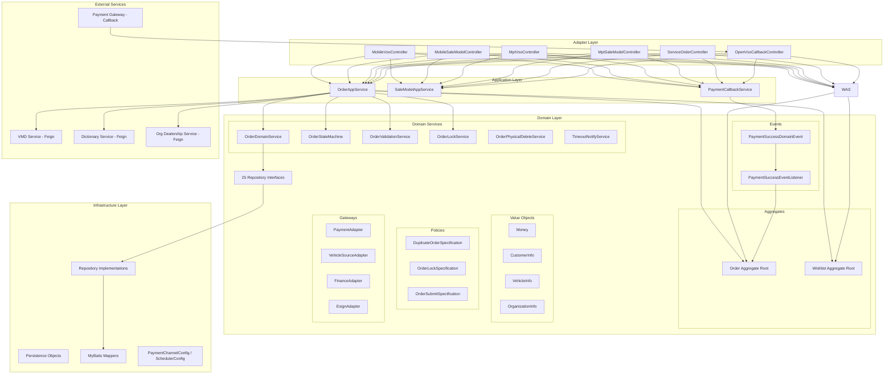
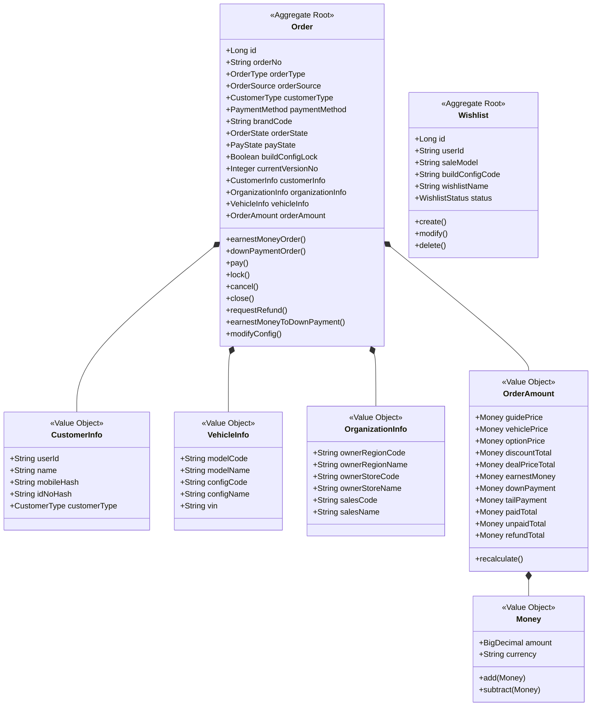
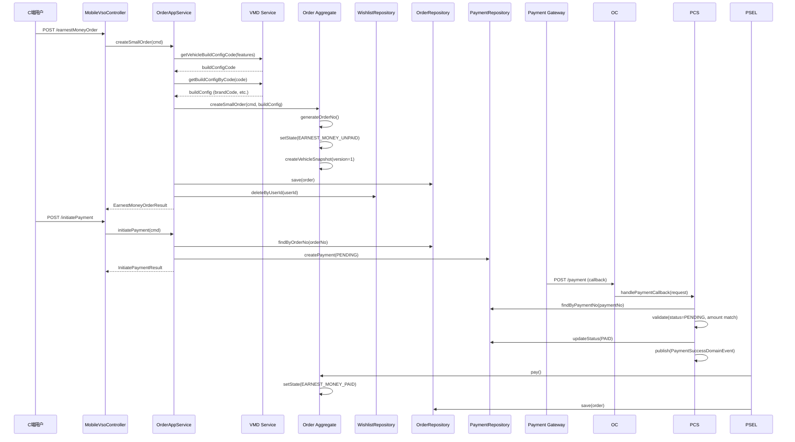
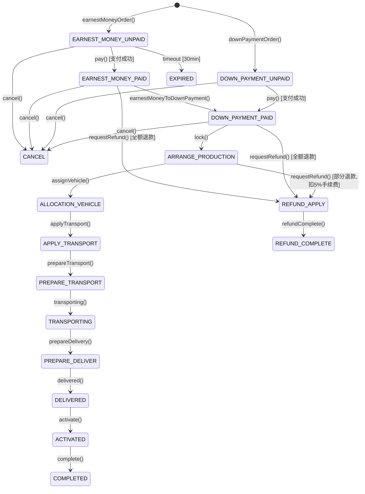
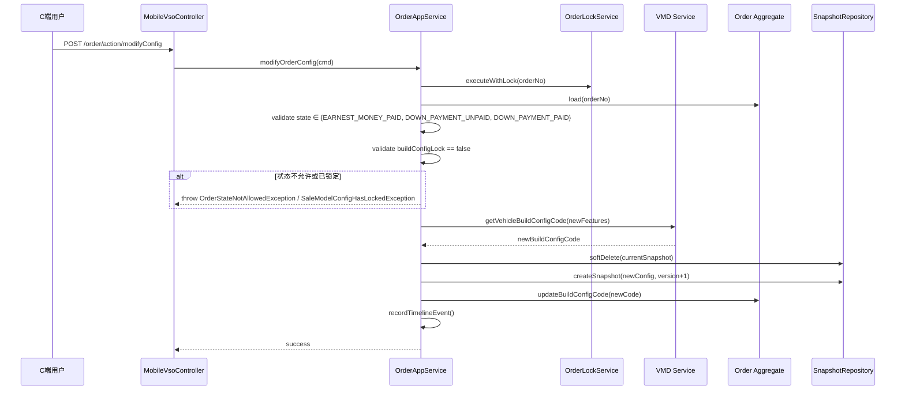
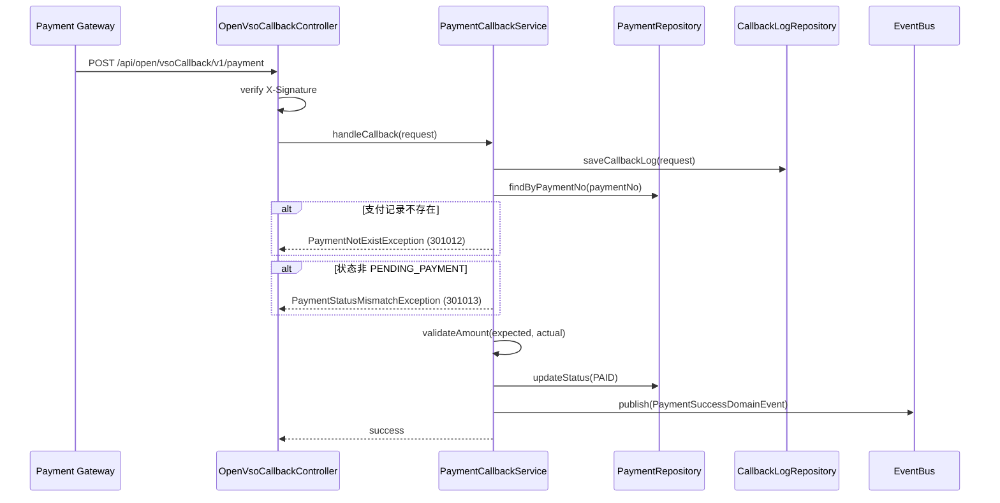
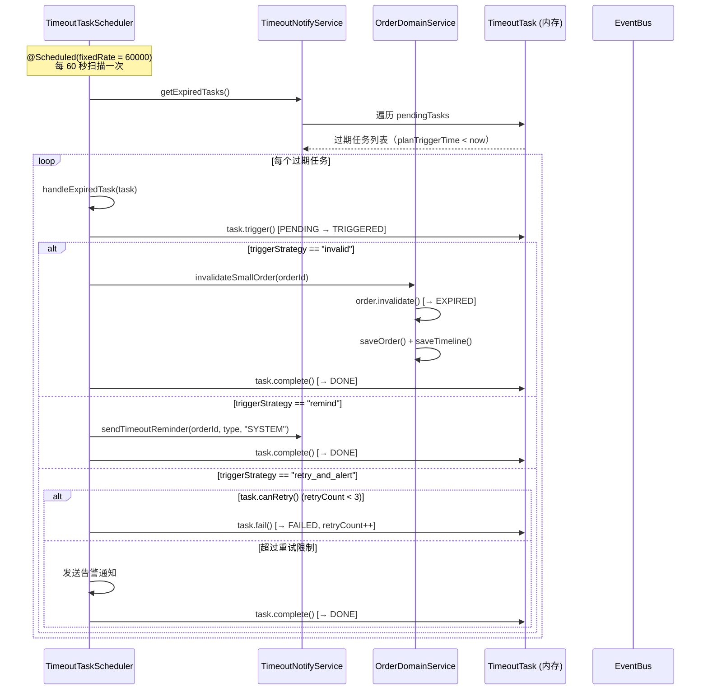
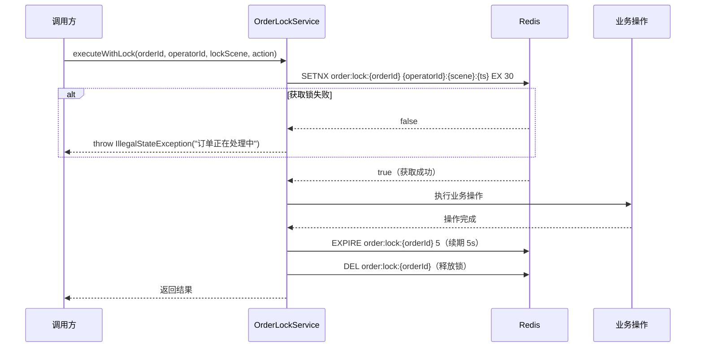
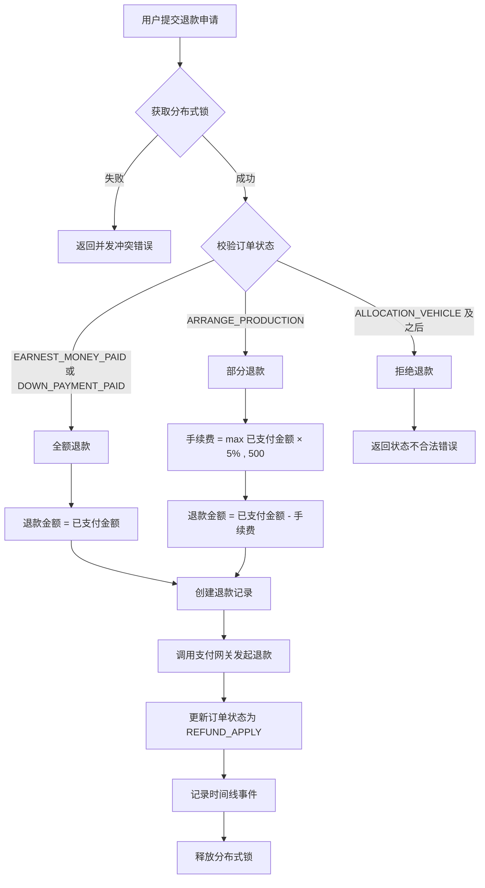

# Vehicle Sale Order (VSO) - Design

## 1. Architecture Overview



系统采用 DDD 六边形架构，分为四层：Adapter（适配器/控制器）→ Application（应用服务/编排）→ Domain（领域模型/业务规则）→ Infrastructure（基础设施/持久化）。Order 和 Wishlist 作为两个聚合根，通过领域事件实现跨聚合通信。外部系统通过 Feign 客户端（VMD、字典、组织）和回调接口（支付网关）集成。

## 2. Tech Stack & Decisions

| Decision | Choice | Alternatives | Rationale |
|----------|--------|--------------|-----------|
| 语言 & 版本 | Java 17 | Java 11, Kotlin | 项目统一标准，LTS 版本 |
| 框架 | Spring Boot + Spring Cloud | Quarkus, Micronaut | 生态成熟，团队熟悉 |
| 服务注册/配置 | Nacos | Consul, Eureka | 阿里云生态统一，支持配置中心 |
| ORM | MyBatis-Plus | JPA/Hibernate, JOOQ | 灵活 SQL 控制，国内生态好 |
| 数据库 | MySQL 8.0+ | PostgreSQL | 团队熟悉，云服务支持好 |
| 数据库迁移 | Flyway | Liquibase | 轻量，SQL-based 迁移 |
| 服务间调用 | OpenFeign | gRPC, RestTemplate | 声明式 HTTP 客户端，与 Spring Cloud 集成好 |
| 并发控制 | Redis 分布式锁 | 数据库乐观锁 | 高性能，支持超时自动释放 |
| 架构模式 | DDD 分层 + CQRS-lite | 传统三层 | 业务复杂度高，需要清晰的领域边界 |
| 状态管理 | 自定义状态机 | Spring Statemachine | 轻量，业务规则内聚在领域层 |
| ID 生成 | Hutool IdUtil (Snowflake) | UUID, DB Sequence | 有序、高性能、分布式友好 |
| 端口 | 10201 | - | 项目约定 |

## 3. Data Model

### 3.1 聚合根与实体



### 3.2 核心数据库表

| 表名 | 用途 | 关联 US |
|------|------|---------|
| `tb_sale_model` | 销售车型主表 | US-001, US-016 |
| `tb_sale_model_config` | 销售车型配置项 | US-001, US-016 |
| `tb_purchase_benefits` | 购车权益 | US-001 |
| `vso_order` | 订单主表 | US-003~US-015 |
| `vso_order_party` | 订单参与方 | US-003, US-004 |
| `vso_order_vehicle_snapshot` | 车辆配置快照（版本化） | US-003, US-004, US-007 |
| `vso_order_amount` | 订单金额 | US-003~US-006 |
| `vso_order_assignment` | 订单归属/转派 | US-011, US-013 |
| `vso_order_status_dimension` | 多维度状态 | US-009~US-014 |
| `vso_payment` | 支付记录 | US-005, US-018 |
| `vso_refund` | 退款记录 | US-008 |
| `vso_vehicle_assignment` | 配车/车辆绑定 | US-011 |
| `vso_approval` | 审批单 | US-010 |
| `vso_approval_record` | 审批流转记录 | US-010 |
| `vso_contract` | 合同/协议 | - |
| `vso_finance_application` | 金融申请 | - |
| `vso_subsidy_application` | 补贴申请 | - |
| `vso_delivery_appointment` | 交付预约 | US-013 |
| `vso_delivery_record` | 交付记录 | US-013 |
| `vso_callback_log` | 回调日志 | US-018 |
| `vso_order_version` | 订单版本历史 | US-007 |
| `vso_order_timeline` | 业务时间线 | US-007 |
| `vso_config_timeout` | 超时配置 | US-019 |
| `vso_order_shadow_delete` | 物理删除影子审计 | US-015 |

### 3.3 订单状态枚举

```
WISHLIST(100), EARNEST_MONEY_UNPAID(200), EARNEST_MONEY_PAID(210),
DOWN_PAYMENT_UNPAID(300), DOWN_PAYMENT_PAID(310),
PENDING_AUDIT(350), AUDIT_PASSED(360), AUDIT_REJECTED(370),
ARRANGE_PRODUCTION(400), ALLOCATION_VEHICLE(450), APPLY_TRANSPORT(470),
PREPARE_TRANSPORT(500), TRANSPORTING(550), PREPARE_DELIVER(600),
FINAL_PAYMENT_PAID(620), INVOICED(630), DELIVERED(650), ACTIVATED(700),
RETURN_APPLY(800), RETURN_STORAGE(820), RETURN_AUDIT(840), RETURN_COMPLETED(860),
COMPLETED(900), REFUND_APPLY(920), REFUND_COMPLETE(925),
CANCEL(950), EXPIRED(960), CLOSED(970)
```

## 4. Core Flows

### 4.1 订单下单与支付流程



### 4.2 订单状态机流转



**退款金额计算规则**（详见 §4.7）：

| 订单状态 | 退款规则 | 手续费 |
|---------|---------|--------|
| EARNEST_MONEY_PAID | 全额退款 | 0 |
| DOWN_PAYMENT_PAID | 全额退款 | 0 |
| ARRANGE_PRODUCTION | 部分退款 | max(已支付金额 × 5%, 500 元) |
| ALLOCATION_VEHICLE 及之后 | 不支持退款 | - |

### 4.3 订单改配流程



### 4.4 支付回调处理流程



### 4.5 超时任务调度流程（US-019）



**关键设计决策**：

| 维度 | 决策 | 理由 |
|------|------|------|
| 调度方式 | Spring `@Scheduled(fixedRate)` 定时扫描 | 简单可靠，无需引入延迟队列中间件 |
| 扫描频率 | 60 秒（1 分钟） | 分钟级精度满足业务需求，避免过于频繁的 DB/内存扫描 |
| 最大延迟 | 1 分钟（扫描周期内） | 可接受的精度范围，30 分钟阈值下误差 <3.3% |
| 超时阈值 | 分钟级配置（`thresholdMinutes`） | 来源 `paymentChannelConfig`，支持动态配置 |
| 任务存储 | 内存 `ConcurrentHashMap`（当前） | 当前单实例可用，多实例需迁移至 Redis/DB |
| 补偿策略 | 最多重试 3 次 + 告警 | `retry_and_alert` 策略，超过限制发告警通知 |
| 任务取消 | 支付成功事件触发取消 | `PaymentSuccessEventListener` 调用 `cancelByOrderIdAndType` |

**超时任务类型**：

| 任务类型 | 阈值 | 触发策略 | 关联订单状态 |
|----------|------|----------|-------------|
| `SMALL_ORDER_PAY_TIMEOUT` | 30 min（可配置） | `invalid` → 自动 EXPIRED | EARNEST_MONEY_UNPAID |
| `FORMAL_ORDER_AUDIT_TIMEOUT` | 1440 min（24h，可配置） | `remind` → 发送提醒 | 待审核 |
| `AUDIT_TIMEOUT` | 1440 min（24h，可配置） | `remind` → 发送提醒 | 待审核 |
| `LOCK_TIMEOUT` | 2880 min（48h，可配置） | `remind` → 发送提醒 | ARRANGE_PRODUCTION |

**任务状态机**：

```
PENDING → TRIGGERED → DONE（正常完成）
PENDING → TRIGGERED → FAILED → TRIGGERED → FAILED → ... → DONE（重试后完成/告警）
PENDING → CANCELLED（支付成功等事件触发取消）
```

### 4.6 分布式锁并发控制设计（US-020）



**锁参数**：

| 参数 | 值 | 说明 |
|------|-----|------|
| 锁键格式 | `order:lock:{orderId}` | 每个订单独立锁 |
| 锁值格式 | `{operatorId}:{lockScene}:{timestamp}` | 标识持锁人和场景 |
| 默认 TTL | 30 秒 | `DEFAULT_EXPIRE_SECONDS = 30` |
| 操作后续期 | 5 秒 | `renewLock(orderId, operatorId, 5)` |
| 获取方式 | `setIfAbsent`（SETNX） | 原子操作，无竞态条件 |
| 释放条件 | 锁值前缀匹配 operatorId | 只有持锁人才能释放 |

**锁场景标识**：

| 场景 | lockScene | 关联操作 |
|------|-----------|----------|
| 支付 | `payment` | US-005 |
| 锁单 | `lockOrder` | US-009 |
| 取消 | `cancel` | US-008 |
| 退款 | `refund` | US-008 |
| 绑车 | `bindVehicle` | US-011 |
| 改配 | `modifyConfig` | US-007 |
| 转定金 | `convert` | US-006 |

**锁安全保障**：
- **互斥性**：同一订单同一时刻只有一个操作持有锁
- **防误释放**：释放前校验锁值前缀是否匹配 operatorId
- **防死锁**：TTL 30s 自动过期，即使异常未释放也不会永久阻塞
- **操作续期**：操作完成后续期 5s 再释放，防止操作接近 TTL 边界时锁提前过期

### 4.7 退款金额计算流程（US-008）



**退款金额计算公式**：

```
退款金额 = 已支付金额 - 手续费

其中：
- 未锁单前（EARNEST_MONEY_PAID、DOWN_PAYMENT_PAID）：手续费 = 0
- 锁单后（ARRANGE_PRODUCTION）：手续费 = max(已支付金额 × 5%, 500)
- 生产中/已发运（ALLOCATION_VEHICLE 及之后）：不支持退款
```

**退款记录数据结构**（`vso_refund` 表）：

| 字段 | 类型 | 说明 |
|------|------|------|
| refund_id | VARCHAR(64) | 退款业务 ID |
| refund_no | VARCHAR(64) | 退款单号 |
| order_id | VARCHAR(64) | 关联订单 ID |
| payment_id | VARCHAR(64) | 关联支付 ID |
| refund_scene | VARCHAR(32) | 退款场景（full_refund / partial_refund） |
| refund_amount | DECIMAL(18,2) | 退款金额 |
| refund_status | VARCHAR(32) | 退款状态（pending / success / failed） |
| approval_id | VARCHAR(64) | 关联审批 ID（预留） |
| external_refund_no | VARCHAR(64) | 外部退款单号 |
| apply_time | TIMESTAMP | 申请时间 |
| refund_time | TIMESTAMP | 退款完成时间 |
| fail_reason | VARCHAR(255) | 退款失败原因 |

**退款场景枚举**：

| 场景 | refund_scene | 说明 |
|------|--------------|------|
| 全额退款 | `full_refund` | 未锁单前退款，手续费为 0 |
| 部分退款 | `partial_refund` | 锁单后退款，扣除手续费 |

**关键设计决策**：

| 维度 | 决策 | 理由 |
|------|------|------|
| 退款审核 | 自动审核 | 系统根据订单状态自动判断，无需人工干预 |
| 手续费计算 | 固定比例 + 最低金额 | 简单明确，避免退款金额过低 |
| 退款发起 | 调用支付网关 | 通过 PaymentAdapter.refund() 接口 |
| 退款回调 | 复用支付回调机制 | 统一处理支付和退款回调 |
| 状态流转 | REFUND_APPLY → REFUND_COMPLETE | 退款申请到退款完成 |

### 5.1 Mobile Sale Model APIs

**GET** `/api/mobile/saleModel/v1`
- Response: `List<SaleModelMp>` — 销售车型列表

**GET** `/api/mobile/saleModel/v1/{saleModelCode}/config`
- Response: `List<SaleModelConfigMp>` — 车型配置列表

**POST** `/api/mobile/saleModel/v1/selectedSaleModel`
- Request: `{ saleModelCode: String, featureMap: Map<String, String> }`
- Response: `SelectedSaleModel` — 匹配的车型配置快照

### 5.2 Mobile Order APIs

**POST** `/api/mobile/vso/v1/action/earnestMoneyOrder`
- Request: `{ saleModelCode, featureMap, customerInfo, paymentChannel }`
- Response: `{ orderNo, earnestMoneyAmount, paymentChannels[], expireTime }`

**POST** `/api/mobile/vso/v1/action/downPaymentOrder`
- Request: `{ saleModelCode, featureMap, customerInfo, paymentChannel }`
- Response: `{ orderNo, downPaymentAmount, paymentChannels[], expireTime }`

**POST** `/api/mobile/vso/v1/action/initiatePayment`
- Request: `{ orderNo, paymentChannel }`
- Response: `{ paymentNo, paymentChannel, paymentAmount }`

**POST** `/api/mobile/vso/v1/order/action/cancel`
- Request: `{ orderNo }`
- Response: void

**POST** `/api/mobile/vso/v1/order/action/requestRefund`
- Request: `{ orderNo }`
- Response: void

**POST** `/api/mobile/vso/v1/order/action/earnestMoneyToDownPayment`
- Request: `{ orderNo, customerInfo, paymentInfo }`
- Response: void

**POST** `/api/mobile/vso/v1/order/action/lock`
- Request: `{ orderNo }`
- Response: void

**POST** `/api/mobile/vso/v1/order/action/modifyConfig`
- Request: `{ orderNo, saleModelCode, featureMap }`
- Response: void

**GET** `/api/mobile/vso/v1/order/{orderNo}`
- Response: `OrderResponseVo` — 订单详情

### 5.3 MPT Order APIs

**GET** `/api/mpt/vso/v1/list`
- Query: `{ orderNo, orderState, customerName, phone, page, size }`
- Response: `PageResult<VehicleSaleOrderMpt>`

**POST** `/api/mpt/vso/v1/action/assignVehicle`
- Request: `{ orderNo, vin }`
- Response: void

**POST** `/api/mpt/vso/v1/action/assignDeliveryPerson`
- Request: `{ orderNo, deliveryPersonId, deliveryPersonName }`
- Response: void

**POST** `/api/mpt/vso/v1/action/applyTransport`
- Request: `{ orderNo, transportInfo }`
- Response: void

**POST** `/api/mpt/vso/v1/{orderId}/audit/pass`
- Header: `X-Operator-Id`
- Response: void

**POST** `/api/mpt/vso/v1/{orderId}/audit/reject`
- Header: `X-Operator-Id`
- Param: `reason`
- Response: void

**POST** `/api/mpt/vso/v1/{orderId}/lock`
- Header: `X-Operator-Id`
- Response: void

**POST** `/api/mpt/vso/v1/{orderId}/close`
- Header: `X-Operator-Id`
- Param: `reason`
- Response: void

**DELETE** `/api/mpt/vso/v1/physical/{orderId}`
- Request: `DeleteOrderRequestVo`
- Response: `PhysicalDeleteResponseVo`

### 5.4 Service-to-Service APIs

**POST** `/api/service/order/v1/order/action/prepareTransport`
- Request: `{ orderNo, transportNo }`

**POST** `/api/service/order/v1/order/action/transporting`
- Request: `{ orderNo, transportNo }`

**POST** `/api/service/order/v1/order/action/prepareDelivery`
- Request: `{ orderNo }`

**POST** `/api/service/order/v1/order/action/delivered`
- Request: `{ orderNo, deliveryTime }`

**POST** `/api/service/order/v1/order/action/activate`
- Request: `{ orderNo, activateTime }`

### 5.5 Open Callback APIs

**POST** `/api/open/vsoCallback/v1/payment`
- Header: `X-Signature` — 签名校验
- Request: `PaymentCallbackRequest`
- Response: void

### 5.6 响应时间 SLA

| API 类别 | 接口 | SLA | 说明 |
|----------|------|-----|------|
| 车型查询 | 列表/配置/权益 | <500ms | 走缓存，无外部调用 |
| 车型查询 | 特征码范围 | <2s | 依赖 VMD 服务，超时返回降级提示 |
| 车型查询 | 特征码解析 | <1s | 本地计算 |
| 车型查询 | 上牌地区 | <200ms | 字典服务缓存 |
| 心愿单 | CRUD | <500ms | 本地 DB 操作 |
| 下单 | 小定/大定 | <1s | 含 VMD 校验 + 分布式锁 |
| 支付 | 发起支付 | <2s | 含分布式锁获取 |
| 支付 | 回调处理 | <2s | 含签名验证 + 状态流转 |
| 订单操作 | 改配 | <2s | 含 VMD 调用 + 快照创建 |
| 订单操作 | 锁单/取消/退款/转定金 | <1s | 本地状态流转 |
| 订单操作 | 物理删除 | <5s | 级联删除多表 |
| 订单查询 | 列表 | <1s | 分页查询 |
| 订单查询 | 详情 | <500ms | 单订单全量数据 |

### 5.7 Error Codes

| Code | Name | Description | HTTP Status |
|------|------|-------------|-------------|
| 301001 | SALE_MODEL_CONFIG_TYPE_CODE_NOT_EXIST | 销售车型配置类型代码不存在 | 400 |
| 301002 | BUILD_CONFIG_CODE_NOT_EXIST | 生产配置代码不存在 | 400 |
| 301003 | SALE_MODEL_NOT_EXIST | 销售车型不存在 | 404 |
| 301004 | ORDER_NOT_EXIST | 订单不存在 | 404 |
| 301005 | ORDER_ILLEGAL_DELETE | 订单非法删除（状态不允许） | 403 |
| 301006 | ORDER_STATE_NOT_ALLOWED | 订单当前状态不支持此操作 | 409 |
| 301007 | ACCOUNT_NOT_EXIST | 账户不存在 | 404 |
| 301008 | SALE_MODEL_CONFIG_HAS_LOCKED | 销售车型配置已锁定，不可修改 | 409 |
| 301009 | WISHLIST_NOT_EXIST | 心愿单不存在 | 404 |
| 301010 | BUILD_CONFIG_NOT_MATCHED | 特征码无法匹配到生产配置 | 400 |
| 301011 | PAYMENT_CHANNEL_NOT_AVAILABLE | 支付渠道不可用 | 400 |
| 301012 | PAYMENT_NOT_EXIST | 支付单不存在 | 404 |
| 301013 | PAYMENT_STATUS_MISMATCH | 支付单状态不匹配 | 409 |
| 301014 | BRAND_CODE_NOT_EXIST | 品牌编码不存在 | 400 |
| 301015 | CONCURRENT_CONFLICT | 并发冲突（分布式锁获取失败） | 409 |
| 301016 | VIN_ALREADY_ASSIGNED | VIN 已被其他订单占用 | 409 |
| 301017 | SIGNATURE_INVALID | 回调签名校验失败 | 403 |

## 6. Coverage Mapping

| US-ID | Design Section | Note |
|-------|----------------|------|
| US-001 | §3.2(tb_sale_model/config/benefits), §5.1 | 销售车型浏览，Feign 调用 VMD |
| US-002 | §3.1(Wishlist), §3.2(无独立表,复用order体系) | 心愿单 CRUD |
| US-003 | §3.1(Order), §4.1, §5.2(earnestMoneyOrder) | 小定下单，含 VMD 校验 |
| US-004 | §3.1(Order), §4.1, §5.2(downPaymentOrder) | 大定下单 |
| US-005 | §4.1, §4.4, §5.2(initiatePayment), §5.5 | 支付发起+回调，领域事件驱动 |
| US-006 | §4.2, §5.2(earnestMoneyToDownPayment) | 状态机 EARNEST_MONEY_PAID→DOWN_PAYMENT_PAID |
| US-007 | §4.3, §3.2(vso_order_vehicle_snapshot), §5.2(modifyConfig) | 改配，版本化快照 |
| US-008 | §4.2, §5.2(cancel/requestRefund) | 取消/退款状态流转 |
| US-009 | §4.2, §5.2(lock), §5.3(lock) | 锁单，buildConfigLock=true |
| US-010 | §5.3(audit/pass, audit/reject) | 审核通过/驳回 |
| US-011 | §3.2(vso_vehicle_assignment), §5.3(assignVehicle) | 配车绑定 VIN |
| US-012 | §4.2, §5.3(applyTransport), §5.4 | 发运状态流转 |
| US-013 | §4.2, §5.3(assignDeliveryPerson), §5.4 | 交付流程 |
| US-014 | §4.2, §5.3(close) | 关闭订单 |
| US-015 | §3.2(vso_order_shadow_delete), §5.3(physical delete) | 物理删除+影子审计 |
| US-016 | §3.2(tb_sale_model*), §5.1 | MPT 车型管理 CRUD |
| US-017 | §5.3(list/detail queries) | MPT 订单查询 |
| US-018 | §4.4, §5.5, §3.2(vso_callback_log) | 支付回调处理 |
| US-019 | §3.2(vso_config_timeout), Domain(TimeoutNotifyService) | 超时调度 |
| US-020 | Domain(OrderLockService), §4.3 | 分布式锁并发控制 |

## 7. Impact Analysis

| 模块 | 影响范围 | 说明 |
|------|----------|------|
| VMD Service | 强依赖 | buildConfigCode 解析、车型数据获取 |
| Dictionary Service | 弱依赖 | 省市区域数据，可降级 |
| Org Dealership Service | 弱依赖 | 门店信息，可降级 |
| Payment Gateway | 强依赖 | 支付发起与回调，影响核心下单流程 |
| Redis | 强依赖 | 分布式锁，影响并发控制 |
| MySQL | 强依赖 | 全部数据持久化 |
| Nacos | 强依赖 | 服务注册发现与配置中心 |

## 8. Open Questions

| # | 问题 | 状态 |
|---|------|------|
| 1 | EsignAdapter、FinanceAdapter 接口已定义但未实现，合同签署和金融流程何时接入？ | 待定 |
| 2 | 退款流程的具体金额计算规则（部分退款 vs 全额退款）未在代码中明确 | 已解决 → §4.7 |
| 3 | 订单超时任务的调度频率和补偿机制细节 | 已解决 → §4.5 |
| 4 | 物理删除的权限校验具体实现（当前仅预留权限标识） | 待定 |
| 5 | 多维度状态表(vso_order_status_dimension)与主状态的同步策略 | 待定 |

## 9. Changelog

| Date | Change ID | Type | Description |
|------|-----------|------|-------------|
| 2026-05-23 | CR-001 | Added | 基于现有代码逆向生成初始设计文档 |
| 2026-05-23 | CR-002 | Added | 新增 §4.5 超时任务调度流程、§4.6 分布式锁并发控制设计、§5.6 响应时间 SLA；补充 4 个错误码（301014~301017）；关闭 Open Question #3 |
| 2026-05-23 | CR-003 | Fixed | 代码实现与设计对齐：分布式锁场景统一、超时任务 Redis 持久化、N+1 查询修复、状态机校验接入 |
| 2026-05-25 | CR-004 | Added | 新增 §4.7 退款金额计算流程：按订单状态分层退款规则（未锁单前全额退款、锁单后扣 5% 手续费、生产中/已发运不退款）、退款记录数据结构、退款场景枚举；更新状态机图添加退款注释；关闭 Open Question #2 |
