# Vehicle Sale Order (VSO) - Design

## 1. Architecture Overview

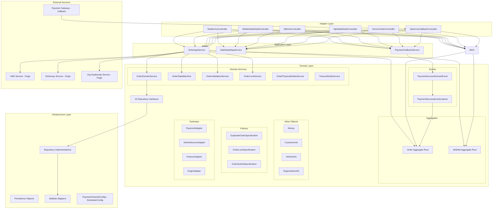

系统采用 DDD 六边形架构，分为四层：Adapter（适配器/控制器）→ Application（应用服务/编排）→ Domain（领域模型/业务规则）→ Infrastructure（基础设施/持久化）。Order 和 Wishlist 作为两个聚合根，通过领域事件实现跨聚合通信。外部系统通过 Feign 客户端（VMD、字典、组织）和回调接口（支付网关）集成。

## 2. Tech Stack & Decisions

| Decision | Choice | Alternatives | Rationale |
|----------|--------|--------------|-----------|
| 语言 & 版本 | Java 17 | Java 11, Kotlin | 项目统一标准，LTS 版本 |
| 框架 | Spring Boot + Spring Cloud | Quarkus, Micronaut | 生态成熟，团队熟悉 |
| 服务注册/配置 | Nacos | Consul, Eureka | 阿里云生态统一，支持配置中心 |
| ORM | MyBatis-Plus | JPA/Hibernate, JOOQ | 灵活 SQL 控制，国内生态好 |
| 数据库 | MySQL 8.0+ | PostgreSQL | 团队熟悉，云服务支持好 |
| 数据库迁移 | Flyway | Liquibase | 轻量，SQL-based 迁移 |
| 服务间调用 | OpenFeign | gRPC, RestTemplate | 声明式 HTTP 客户端，与 Spring Cloud 集成好 |
| 并发控制 | Redis 分布式锁 | 数据库乐观锁 | 高性能，支持超时自动释放 |
| 架构模式 | DDD 分层 + CQRS-lite | 传统三层 | 业务复杂度高，需要清晰的领域边界 |
| 状态管理 | 自定义状态机 | Spring Statemachine | 轻量，业务规则内聚在领域层 |
| ID 生成 | Hutool IdUtil (Snowflake) | UUID, DB Sequence | 有序、高性能、分布式友好 |
| 端口 | 10201 | - | 项目约定 |

## 3. Data Model

### 3.1 聚合根与实体

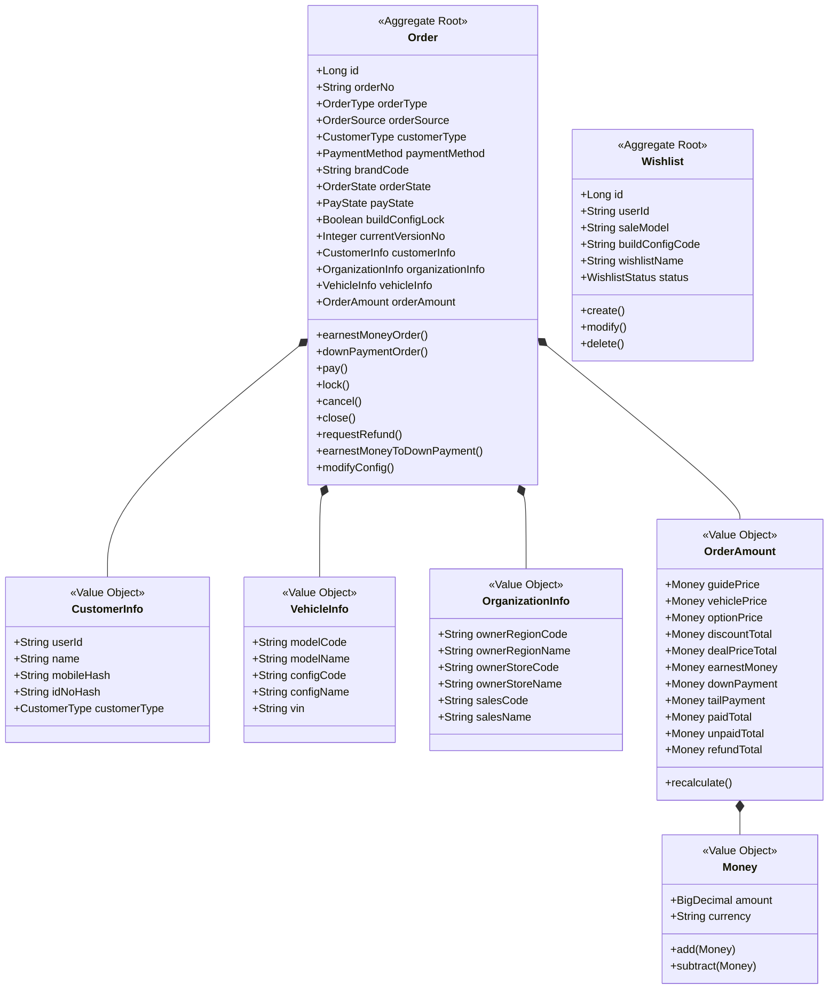

### 3.2 核心数据库表

| 表名 | 用途 | 关联 US |
|------|------|---------|
| `tb_sale_model` | 销售车型主表 | US-001, US-016 |
| `tb_sale_model_config` | 销售车型配置项 | US-001, US-016 |
| `tb_purchase_benefits` | 购车权益 | US-001 |
| `vso_order` | 订单主表 | US-003~US-015 |
| `vso_order_party` | 订单参与方 | US-003, US-004 |
| `vso_order_vehicle_snapshot` | 车辆配置快照（版本化） | US-003, US-004, US-007 |
| `vso_order_amount` | 订单金额 | US-003~US-006 |
| `vso_order_assignment` | 订单归属/转派 | US-011, US-013 |
| `vso_order_status_dimension` | 多维度状态 | US-009~US-014 |
| `vso_payment` | 支付记录 | US-005, US-018 |
| `vso_refund` | 退款记录 | US-008 |
| `vso_vehicle_assignment` | 配车/车辆绑定 | US-011 |
| `vso_approval` | 审批单 | US-010 |
| `vso_approval_record` | 审批流转记录 | US-010 |
| `vso_contract` | 合同/协议 | - |
| `vso_finance_application` | 金融申请 | - |
| `vso_subsidy_application` | 补贴申请 | - |
| `vso_delivery_appointment` | 交付预约 | US-013 |
| `vso_delivery_record` | 交付记录 | US-013 |
| `vso_callback_log` | 回调日志 | US-018 |
| `vso_order_version` | 订单版本历史 | US-007 |
| `vso_order_timeline` | 业务时间线 | US-007 |
| `vso_supplementary_payment` | 补款记录（改配补款 + 意向金转定金差额） | US-006, US-007 |
| `vso_config_change_refund` | 改配退款记录 | US-007 |
| `vso_config_timeout` | 超时配置 | US-019 |
| `vso_order_shadow_delete` | 物理删除影子审计 | US-015 |

**防刷单唯一索引**（US-003, US-004）：

| 索引名 | 表 | 字段 | 说明 |
|--------|------|------|------|
| `uk_user_unpaid_order` | `vso_order` | `user_id` + `order_state` | 同一用户未完成订单唯一性（应用层校验） |
| `uk_mobile_unpaid_order` | `vso_order` | `mobile_hash` + `order_state` | 同一手机号未完成订单唯一性（应用层校验） |

> 注：MySQL 8.0 不支持条件唯一索引（Partial Index），实际实现采用应用层校验 + 分布式锁保证一致性。上述索引为逻辑设计，物理实现需根据数据库能力调整。

### 3.3 订单状态枚举

```
WISHLIST(100), EARNEST_MONEY_UNPAID(200), EARNEST_MONEY_PAID(210),
DOWN_PAYMENT_UNPAID(300), DOWN_PAYMENT_PAID(310),
PENDING_AUDIT(350), AUDIT_PASSED(360), AUDIT_REJECTED(370),
ARRANGE_PRODUCTION(400), ALLOCATION_VEHICLE(450), APPLY_TRANSPORT(470),
PREPARE_TRANSPORT(500), TRANSPORTING(550), PREPARE_DELIVER(600),
FINAL_PAYMENT_PAID(620), INVOICED(630), DELIVERED(650), ACTIVATED(700),
RETURN_APPLY(800), RETURN_STORAGE(820), RETURN_AUDIT(840), RETURN_COMPLETED(860),
COMPLETED(900), REFUND_APPLY(920), REFUND_COMPLETE(925),
CANCEL(950), EXPIRED(960), CLOSED(970)
```

## 4. Core Flows

### 4.1 订单下单与支付流程

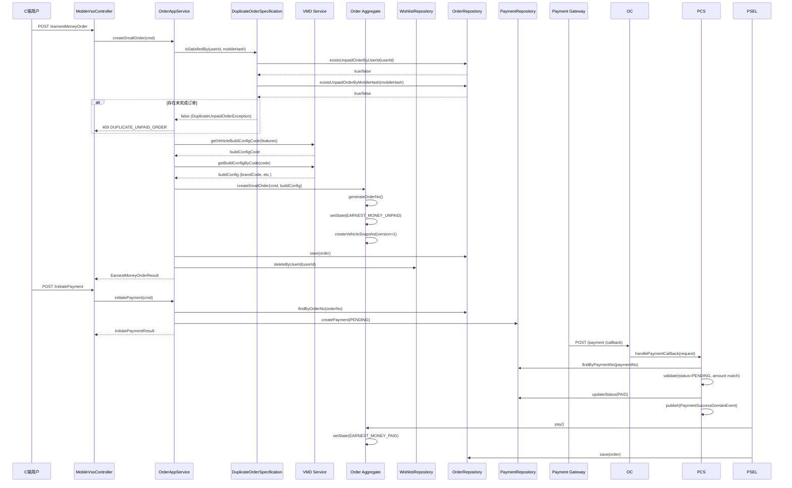

### 4.2 订单状态机流转

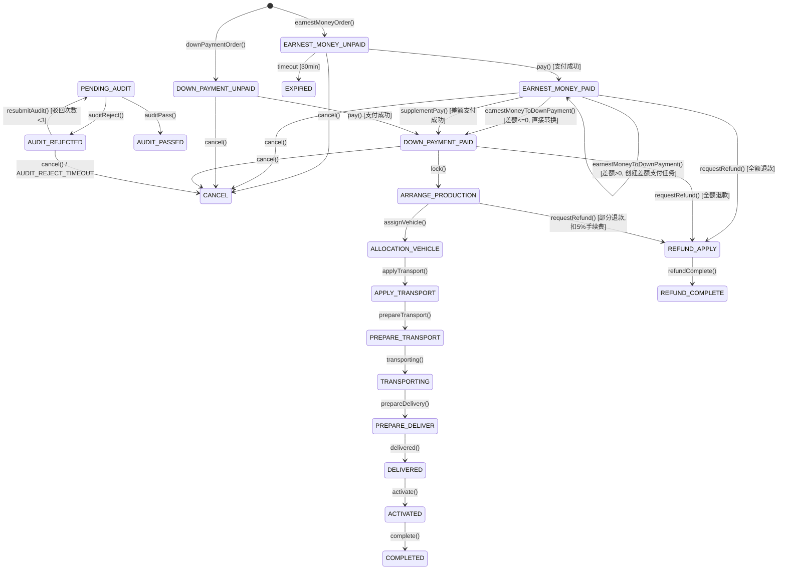

**意向金转定金状态说明**：
- 差额 <= 0：`EARNEST_MONEY_PAID → DOWN_PAYMENT_PAID`（直接转换，无需额外支付）
- 差额 > 0：`EARNEST_MONEY_PAID → EARNEST_MONEY_PAID`（创建差额支付任务，等待用户支付）→ `EARNEST_MONEY_PAID → DOWN_PAYMENT_PAID`（差额支付成功后转换）
- 差额支付超时（30 分钟）：订单保持 `EARNEST_MONEY_PAID` 状态，差额支付任务自动取消

**退款金额计算规则**（详见 §4.7）：

| 订单状态 | 退款规则 | 手续费 |
|---------|---------|--------|
| EARNEST_MONEY_PAID | 全额退款 | 0 |
| DOWN_PAYMENT_PAID | 全额退款 | 0 |
| ARRANGE_PRODUCTION | 部分退款 | max(已支付金额 × 5%, 500 元) |
| ALLOCATION_VEHICLE 及之后 | 不支持退款 | - |

### 4.3 订单改配流程

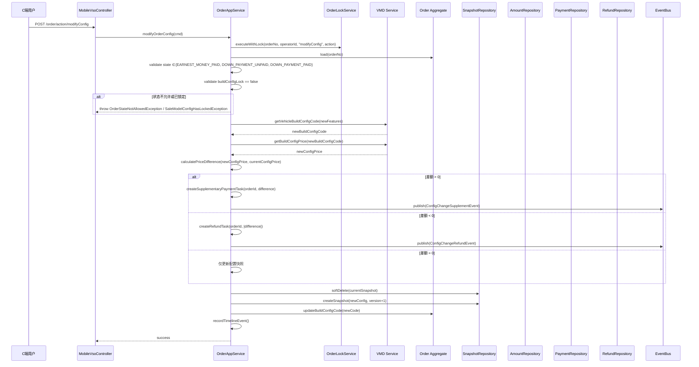

### 4.4 支付回调处理流程

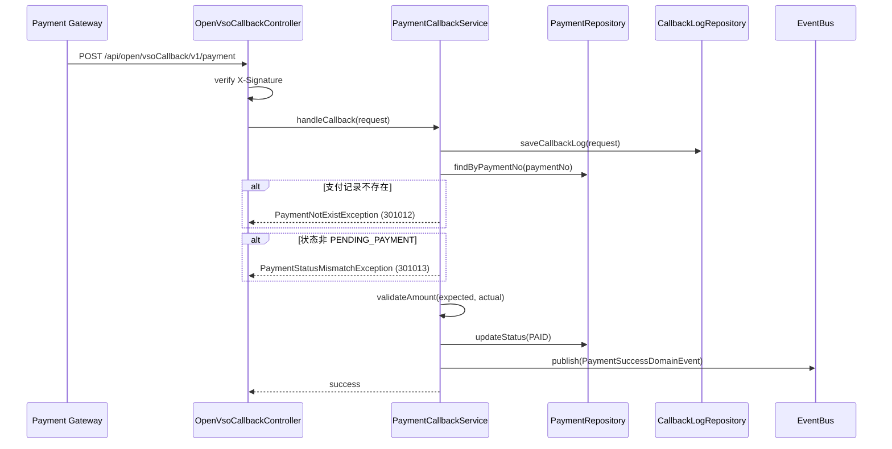

**签名规范**：

| 维度 | 规范 |
|------|------|
| 签名算法 | HMAC-SHA256 |
| 签名内容 | 按字段字典序排列，用 `&` 连接：`amount={金额}&nonce={随机串}&orderId={订单号}&paySeq={支付流水号}&status={支付状态}&timestamp={Unix秒}` |
| 防重放机制 | `timestamp`：与服务器时间差 < 5 分钟；`nonce`：存 Redis SET，TTL 5 分钟 |
| 响应规范 | 验签失败 → 403（不记录支付流水号）；验签通过 → 200 |

### 4.5 超时任务调度流程（US-019）

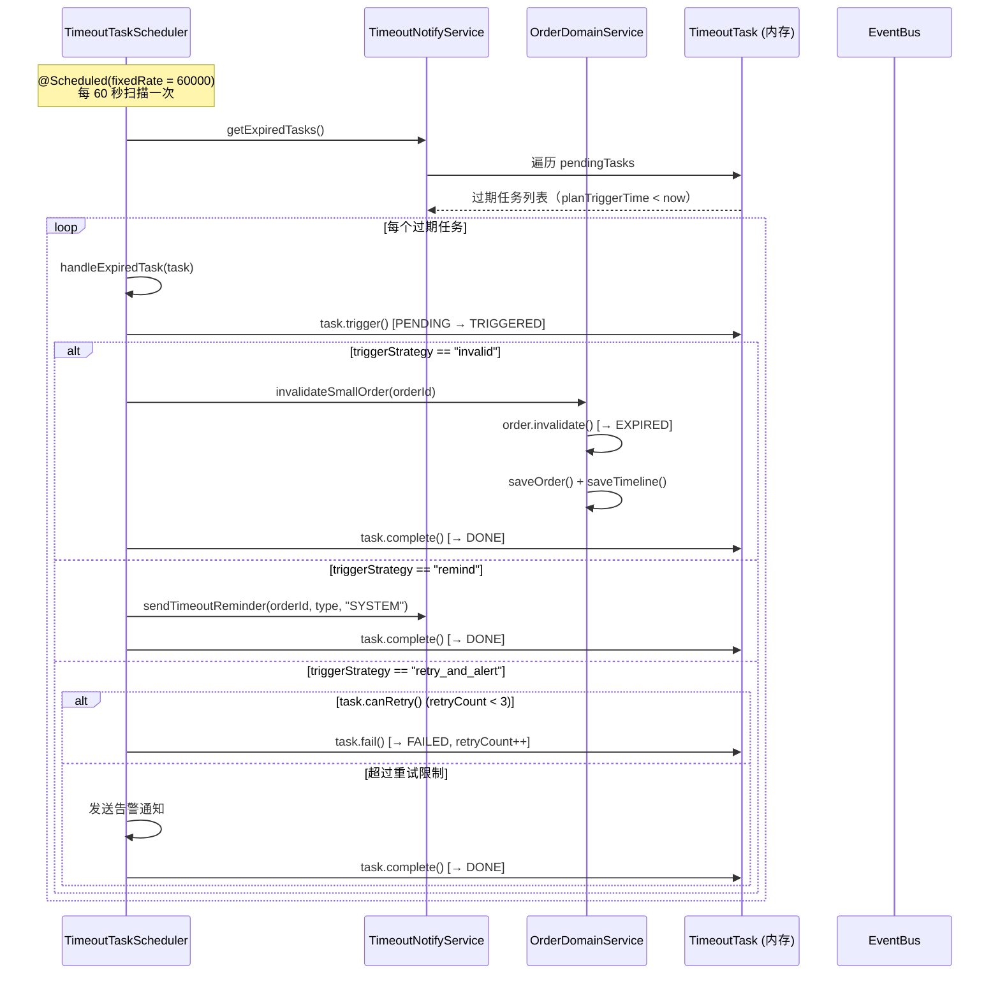

**关键设计决策**：

| 维度 | 决策 | 理由 |
|------|------|------|
| 调度方式 | Spring `@Scheduled(fixedRate)` 定时扫描 | 简单可靠，无需引入延迟队列中间件 |
| 扫描频率 | 60 秒（1 分钟） | 分钟级精度满足业务需求，避免过于频繁的 DB/内存扫描 |
| 最大延迟 | 1 分钟（扫描周期内） | 可接受的精度范围，30 分钟阈值下误差 <3.3% |
| 超时阈值 | 分钟级配置（`thresholdMinutes`） | 来源 `paymentChannelConfig`，支持动态配置 |
| 任务存储 | 内存 `ConcurrentHashMap`（当前） | 当前单实例可用，多实例需迁移至 Redis/DB |
| **⚠️ 多实例警告** | 内存存储 | **生产部署前必须迁移**：方案A（推荐）Redis 存储 + 分布式锁；方案B 数据库任务表 + 行级锁。迁移完成前禁止多副本部署 |
| 补偿策略 | 最多重试 3 次 + 告警 | `retry_and_alert` 策略，超过限制发告警通知 |
| 任务取消 | 支付成功事件触发取消 | `PaymentSuccessEventListener` 调用 `cancelByOrderIdAndType` |

**超时任务类型**：

| 任务类型 | 阈值 | 触发策略 | 关联订单状态 |
|----------|------|----------|-------------|
| `SMALL_ORDER_PAY_TIMEOUT` | 30 min（可配置） | `invalid` → 自动 EXPIRED | EARNEST_MONEY_UNPAID |
| `FORMAL_ORDER_AUDIT_TIMEOUT` | 1440 min（24h，可配置） | `remind` → 发送提醒 | 待审核 |
| `AUDIT_TIMEOUT` | 1440 min（24h，可配置） | `remind` → 发送提醒 | 待审核 |
| `LOCK_TIMEOUT` | 2880 min（48h，可配置） | `remind` → 发送提醒 | ARRANGE_PRODUCTION |

**任务状态机**：

```
PENDING → TRIGGERED → DONE（正常完成）
PENDING → TRIGGERED → FAILED → TRIGGERED → FAILED → ... → DONE（重试后完成/告警）
PENDING → CANCELLED（支付成功等事件触发取消）
```

### 4.6 意向金转定金差额支付流程（US-006）

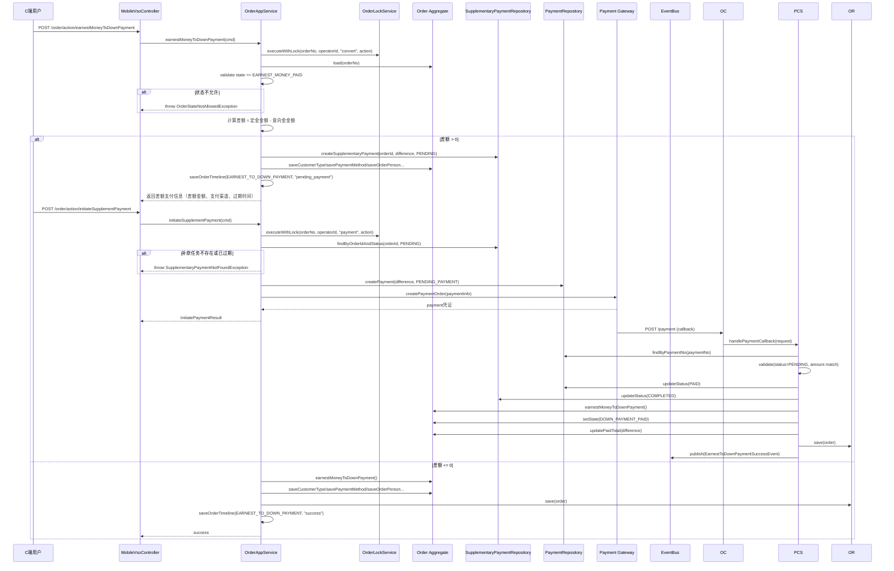

**差额支付任务数据结构**（`vso_supplementary_payment` 表，复用改配补款表）：

| 字段 | 类型 | 说明 |
|------|------|------|
| id | BIGINT | 主键 ID |
| supplementary_no | VARCHAR(64) | 补款单号 |
| order_id | VARCHAR(64) | 关联订单 ID |
| supplementary_amount | DECIMAL(18,2) | 补款金额（定金 - 意向金） |
| supplementary_status | VARCHAR(32) | 补款状态（pending / completed / cancelled / expired） |
| supplementary_scene | VARCHAR(32) | 补款场景（config_change / earnest_to_down） |
| config_version_no | INTEGER | 配置版本号（转定金场景可为 null） |
| payment_id | VARCHAR(64) | 关联支付 ID |
| expire_time | TIMESTAMP | 补款过期时间（30 分钟） |
| create_time | TIMESTAMP | 创建时间 |
| update_time | TIMESTAMP | 更新时间 |

**差额支付状态机**：

```
PENDING → COMPLETED（支付成功，触发订单状态转换）
PENDING → CANCELLED（用户取消）
PENDING → EXPIRED（超时自动取消，30 分钟）
PENDING → FAILED（支付失败）
```

**关键设计决策**：

| 维度 | 决策 | 理由 |
|------|------|------|
| 差额计算时机 | 转定金请求时实时计算 | 基于销售车型配置的定金金额与已支付意向金金额差值 |
| 支付超时 | 30 分钟 | 与 US-005 支付超时一致，避免长期挂起 |
| 幂等性 | 订单号作幂等键 | 同一订单重复提交返回上次结果 |
| 复用补款表 | 复用 vso_supplementary_payment | 新增 supplementary_scene 字段区分场景，减少表数量 |
| 失败处理 | 保持原状态不变 | 用户可重新发起，无需额外恢复操作 |

### 4.7 分布式锁并发控制设计（US-020）

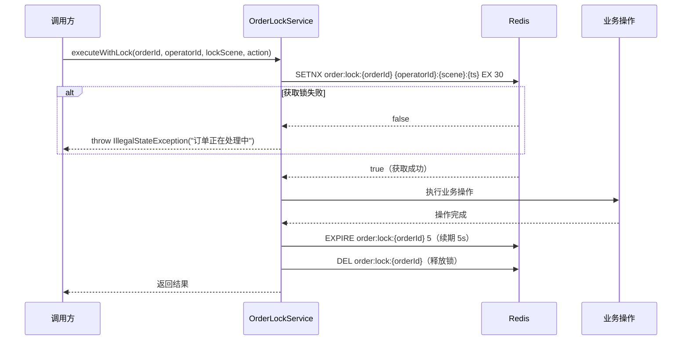

**锁参数**：

| 参数 | 值 | 说明 |
|------|-----|------|
| 锁键格式 | `order:lock:{orderId}` | 每个订单独立锁 |
| 锁值格式 | `{operatorId}:{lockScene}:{timestamp}` | 标识持锁人和场景 |
| 默认 TTL | 30 秒 | `DEFAULT_EXPIRE_SECONDS = 30` |
| 操作后续期 | 5 秒 | `renewLock(orderId, operatorId, 5)` |
| 获取方式 | `setIfAbsent`（SETNX） | 原子操作，无竞态条件 |
| 释放条件 | 锁值前缀匹配 operatorId | 只有持锁人才能释放 |

**锁场景标识**：

| 场景 | lockScene | 关联操作 |
|------|-----------|----------|
| 支付 | `payment` | US-005 |
| 锁单 | `lockOrder` | US-009 |
| 取消 | `cancel` | US-008 |
| 退款 | `refund` | US-008 |
| 绑车 | `bindVehicle` | US-011 |
| 改配 | `modifyConfig` | US-007 |
| 转定金 | `convert` | US-006 |

**锁安全保障**：
- **互斥性**：同一订单同一时刻只有一个操作持有锁
- **防误释放**：释放前校验锁值前缀是否匹配 operatorId
- **防死锁**：TTL 30s 自动过期，即使异常未释放也不会永久阻塞
- **操作续期**：操作完成后续期 5s 再释放，防止操作接近 TTL 边界时锁提前过期

### 4.8 退款金额计算流程（US-008）

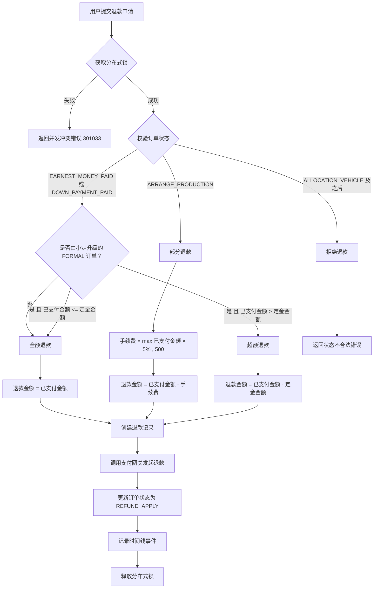

**退款金额计算公式**：

```
退款金额 = 已支付金额 - 手续费

其中：
- 未锁单前（EARNEST_MONEY_PAID、DOWN_PAYMENT_PAID）：
  - 普通 FORMAL 订单：手续费 = 0，退款金额 = 已支付金额
  - 由 SMALL 升级的 FORMAL 订单（已支付金额 > 定金金额）：手续费 = 0，退款金额 = 已支付金额 - 定金金额（超额部分退款，定金不退还）
  - 由 SMALL 升级的 FORMAL 订单（已支付金额 <= 定金金额）：手续费 = 0，退款金额 = 已支付金额（全额退）
- 锁单后（ARRANGE_PRODUCTION）：手续费 = max(已支付金额 × 5%, 500)
- 生产中/已发运（ALLOCATION_VEHICLE 及之后）：不支持退款
```

**退款记录数据结构**（`vso_refund` 表）：

| 字段 | 类型 | 说明 |
|------|------|------|
| refund_id | VARCHAR(64) | 退款业务 ID |
| refund_no | VARCHAR(64) | 退款单号 |
| order_id | VARCHAR(64) | 关联订单 ID |
| payment_id | VARCHAR(64) | 关联支付 ID |
| refund_scene | VARCHAR(32) | 退款场景（full_refund / partial_refund） |
| refund_amount | DECIMAL(18,2) | 退款金额 |
| refund_status | VARCHAR(32) | 退款状态（pending / success / failed） |
| approval_id | VARCHAR(64) | 关联审批 ID（预留） |
| external_refund_no | VARCHAR(64) | 外部退款单号 |
| apply_time | TIMESTAMP | 申请时间 |
| refund_time | TIMESTAMP | 退款完成时间 |
| fail_reason | VARCHAR(255) | 退款失败原因 |

**退款场景枚举**：

| 场景 | refund_scene | 说明 |
|------|--------------|------|
| 全额退款 | `full_refund` | 未锁单前退款，手续费为 0 |
| 部分退款 | `partial_refund` | 锁单后退款，扣除手续费 |
| 超额退款 | `excess_refund` | 由 SMALL 升级的 FORMAL 订单，已支付金额 > 定金金额，退还超额部分，定金不退还 |

**关键设计决策**：

| 维度 | 决策 | 理由 |
|------|------|------|
| 退款审核 | 自动审核 | 系统根据订单状态自动判断，无需人工干预 |
| 手续费计算 | 固定比例 + 最低金额 | 简单明确，避免退款金额过低 |
| 退款发起 | 调用支付网关 | 通过 PaymentAdapter.refund() 接口 |
| 退款回调 | 复用支付回调机制 | 统一处理支付和退款回调 |
| 状态流转 | REFUND_APPLY → REFUND_COMPLETE | 退款申请到退款完成 |

### 4.9 改配补款流程设计（US-007）

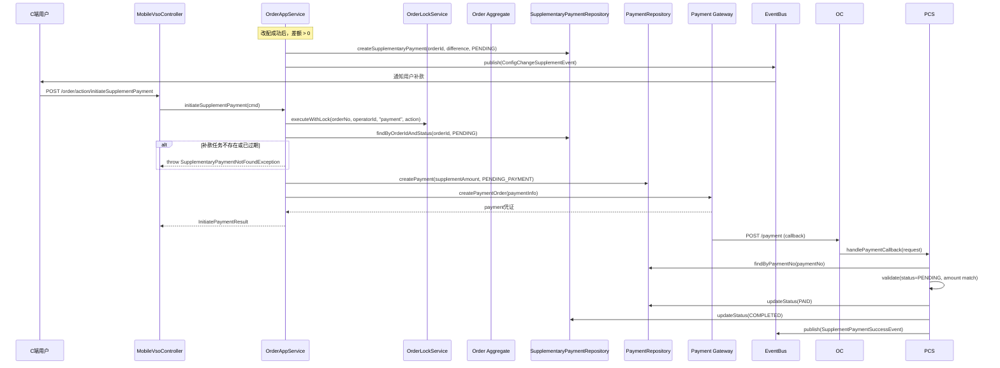

**补款任务数据结构**（`vso_supplementary_payment` 表）：

| 字段 | 类型 | 说明 |
|------|------|------|
| id | BIGINT | 主键 ID |
| supplementary_no | VARCHAR(64) | 补款单号 |
| order_id | VARCHAR(64) | 关联订单 ID |
| supplementary_amount | DECIMAL(18,2) | 补款金额 |
| supplementary_status | VARCHAR(32) | 补款状态（pending / completed / cancelled / expired） |
| config_version_no | INTEGER | 触发补款的配置版本号 |
| payment_id | VARCHAR(64) | 关联支付 ID |
| expire_time | TIMESTAMP | 补款过期时间（30 分钟） |
| create_time | TIMESTAMP | 创建时间 |
| update_time | TIMESTAMP | 更新时间 |

**补款状态机**：

```
PENDING → COMPLETED（支付成功）
PENDING → CANCELLED（用户取消）
PENDING → EXPIRED（超时自动取消，30 分钟）
```

**关键设计决策**：

| 维度 | 决策 | 理由 |
|------|------|------|
| 补款时效 | 30 分钟 | 与 US-005 支付超时一致，避免长期挂起 |
| 超时处理 | 自动取消 | 超时后补款任务失效，需重新改配 |
| 幂等性 | 订单号+配置版本号 | 防止重复创建补款任务 |
| 支付方式 | 复用支付网关 | 统一支付入口，复用现有支付流程 |

### 4.10 改配退款流程设计（US-007）

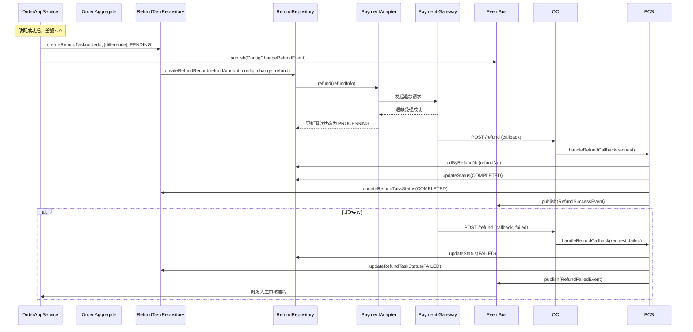

**退款任务数据结构**（`vso_config_change_refund` 表）：

| 字段 | 类型 | 说明 |
|------|------|------|
| id | BIGINT | 主键 ID |
| refund_task_no | VARCHAR(64) | 退款任务单号 |
| order_id | VARCHAR(64) | 关联订单 ID |
| refund_amount | DECIMAL(18,2) | 退款金额 |
| refund_status | VARCHAR(32) | 退款状态（pending / processing / completed / failed） |
| config_version_no | INTEGER | 触发退款的配置版本号 |
| refund_id | VARCHAR(64) | 关联退款记录 ID |
| fail_reason | VARCHAR(255) | 退款失败原因 |
| manual_audit_status | VARCHAR(32) | 人工审核状态（pending / approved / rejected） |
| create_time | TIMESTAMP | 创建时间 |
| update_time | TIMESTAMP | 更新时间 |

**退款状态机**：

```
PENDING → PROCESSING → COMPLETED（退款成功）
PENDING → PROCESSING → FAILED（退款失败，触发人工审核）
FAILED → APPROVED（人工审核通过，重新发起退款）
FAILED → REJECTED（人工审核驳回）
```

**关键设计决策**：

| 维度 | 决策 | 理由 |
|------|------|------|
| 退款发起 | 自动发起 | 改配成功后立即调用退款接口 |
| 失败处理 | 触发人工审核 | 退款失败需人工介入确认 |
| 退款场景 | config_change_refund | 新增退款场景，区别于订单取消退款 |
| 审核流程 | 复用审批模块 | 与 US-010 审核流程保持一致 |

### 4.11 防刷单/黄牛设计（US-003, US-004）

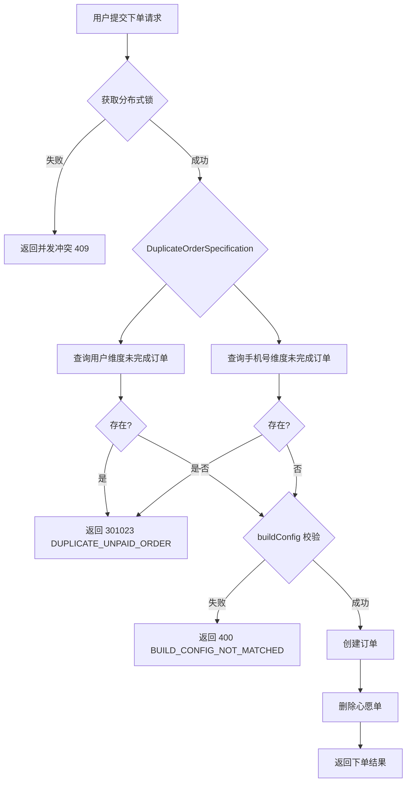

**校验规则**：

| 维度 | 校验逻辑 | 查询条件 |
|------|----------|----------|
| 用户维度 | 同一 userId 未完成订单数 = 0 | `SELECT COUNT(*) FROM vso_order WHERE user_id = ? AND order_state IN (200, 300)` |
| 手机号维度 | 同一 mobileHash 未完成订单数 = 0 | `SELECT COUNT(*) FROM vso_order WHERE mobile_hash = ? AND order_state IN (200, 300)` |

**未完成状态定义**：
- `EARNEST_MONEY_UNPAID(200)` — 小定待支付
- `DOWN_PAYMENT_UNPAID(300)` — 大定待支付

**实现组件**：

| 组件 | 职责 | 位置 |
|------|------|------|
| `DuplicateOrderSpecification` | 领域规约，封装防刷单校验逻辑 | Domain Layer |
| `OrderRepository.existsUnpaidByUserId()` | 查询用户维度未完成订单 | Infrastructure Layer |
| `OrderRepository.existsUnpaidByMobileHash()` | 查询手机号维度未完成订单 | Infrastructure Layer |

**关键设计决策**：

| 维度 | 决策 | 理由 |
|------|------|------|
| 校验时机 | 下单前（创建订单前） | 尽早拦截，减少无效数据库写入 |
| 校验方式 | 规约模式（Specification） | 领域逻辑内聚，可复用、可测试 |
| 手机号存储 | 存储 mobileHash（哈希值） | 隐私保护，避免明文存储敏感信息 |
| 状态范围 | 仅校验未支付状态 | 已支付订单不影响再次下单 |
| 数据库约束 | 应用层校验 + 部分索引 | 应用层灵活校验，DB 层兜底防并发 |

**数据库索引**（防并发兜底）：

```sql
-- 用户维度：同一用户同一时间最多一个未完成订单
CREATE UNIQUE INDEX uk_user_unpaid_order ON vso_order (user_id, order_state)
WHERE order_state IN (200, 300);

-- 手机号维度：同一手机号同一时间最多一个未完成订单
CREATE UNIQUE INDEX uk_mobile_unpaid_order ON vso_order (mobile_hash, order_state)
WHERE order_state IN (200, 300);
```

> 注：MySQL 8.0 不支持条件唯一索引（Partial Index），实际实现采用应用层校验 + 唯一索引组合（user_id + order_state）或应用层分布式锁保证一致性。

### 4.12 心愿单业务规则校验设计（US-002）

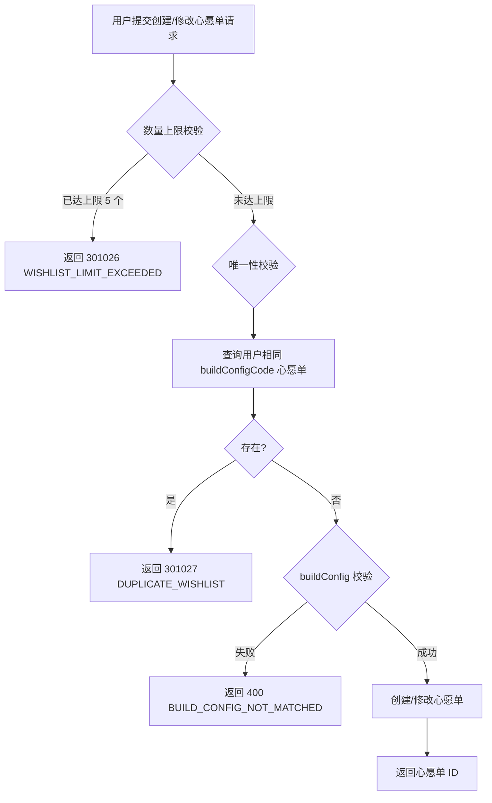

**校验规则**：

| 维度 | 校验逻辑 | 查询条件 |
|------|----------|----------|
| 数量上限 | 用户有效心愿单数 < 5 | `SELECT COUNT(*) FROM vso_wishlist WHERE user_id = ? AND status = 'active'` |
| 配置唯一性 | 同一 buildConfigCode 有效心愿单数 = 0（排除当前心愿单） | `SELECT COUNT(*) FROM vso_wishlist WHERE user_id = ? AND build_config_code = ? AND status = 'active' AND wishlist_id != ?` |

**有效状态定义**：
- `status = 'active'` — 有效心愿单（未删除）

**实现组件**：

| 组件 | 职责 | 位置 |
|------|------|------|
| `WishlistAppService` | 应用服务，封装校验逻辑 | Application Layer |
| `WishlistRepository.countByUserId()` | 查询用户有效心愿单数量 | Infrastructure Layer |
| `WishlistRepository.existsByUserIdAndBuildConfigCode()` | 查询用户相同配置心愿单 | Infrastructure Layer |

**关键设计决策**：

| 维度 | 决策 | 理由 |
|------|------|------|
| 数量上限 | 5 个 | 汽车为大额商品，用户选择有限；避免数据冗余 |
| 校验时机 | 创建/修改前 | 尽早拦截，减少无效数据库写入 |
| 校验方式 | 应用层校验 | 灵活、可扩展 |
| 修改场景唯一性校验 | 排除当前心愿单 | 允许用户修改为已存在的配置（前提是当前心愿单本身就是该配置） |
| 数据库约束 | 应用层校验 + 唯一索引 | 应用层灵活校验，DB 层兜底防并发 |

**数据库索引**（防并发兜底）：

```sql
-- 用户+配置维度：同一用户同一配置最多一个有效心愿单
CREATE UNIQUE INDEX uk_user_build_config_wishlist ON vso_wishlist (user_id, build_config_code)
WHERE status = 'active';
```

> 注：MySQL 8.0 不支持条件唯一索引（Partial Index），实际实现采用应用层校验 + 普通唯一索引或应用层分布式锁保证一致性。

### 4.13 配车流程设计（US-011）

```mermaid
flowchart TD
    subgraph 配车绑定
        A[运营提交配车请求] --> B{获取分布式锁}
        B -->|失败| C[返回并发冲突错误]
        B -->|成功| D{订单状态校验}
        D -->|非 ARRANGE_PRODUCTION| E[返回状态不合法错误]
        D -->|ARRANGE_PRODUCTION| F{VIN 来源校验}
        F -->|VIN 不存在/不可用| G[返回 VIN 无效错误 301031]
        F -->|校验通过| H{VIN 冲突检测}
        H -->|已被占用| I[返回 VIN 冲突错误 301030]
        H -->|可用| J[绑定 VIN]
        J --> K[更新订单状态为 ALLOCATION_VEHICLE]
        K --> L[创建配车记录]
        L --> M[设置占用过期时间]
        M --> N[调用库存服务更新车辆状态]
        N --> O[记录时间线事件]
        O --> P[释放分布式锁]
    end

    subgraph 换绑VIN
        Q[运营提交换绑请求] --> R{获取分布式锁}
        R -->|失败| S[返回并发冲突错误]
        R -->|成功| T{订单状态校验}
        T -->|非 ALLOCATION_VEHICLE| U[返回状态不合法错误]
        T -->|ALLOCATION_VEHICLE| V{新 VIN 校验}
        V -->|VIN 不存在/不可用| W[返回 VIN 无效错误]
        V -->|校验通过| X{新 VIN 冲突检测}
        X -->|已被占用| Y[返回 VIN 冲突错误，旧 VIN 保持绑定]
        X -->|可用| Z[解绑旧 VIN]
        Z --> AA[绑定新 VIN]
        AA --> AB[更新占用过期时间]
        AB --> AC[调用库存服务更新车辆状态]
        AC --> AD[记录时间线事件]
        AD --> AE[释放分布式锁]
    end

    subgraph VIN超时释放
        AF[定时任务扫描超时 VIN] --> AG{扫描条件}
        AG -->|occupy_expire_time < NOW| AH{获取分布式锁}
        AH -->|失败| AF
        AH -->|成功| AI[更新配车状态为 EXPIRED]
        AI --> AJ[订单状态回退至 ARRANGE_PRODUCTION]
        AJ --> AK[调用库存服务释放车辆]
        AK --> AL[记录时间线事件]
        AL --> AM[发送通知给订单归属运营]
        AM --> AN[释放分布式锁]
    end

    subgraph 订单取消释放VIN
        AO[订单取消/退款完成] --> AP{订单是否绑定 VIN}
        AP -->|是| AQ[更新配车状态为 RELEASED]
        AQ --> AR[记录释放时间]
        AR --> AS[调用库存服务释放车辆]
        AS --> AT[记录时间线事件]
        AP -->|否| AU[无操作]
    end

    subgraph 主动解绑
        AV[运营提交解绑请求] --> AW{获取分布式锁}
        AW -->|失败| AX[返回并发冲突错误]
        AW -->|成功| AY{订单状态校验}
        AY -->|非 ALLOCATION_VEHICLE| AZ[返回状态不合法错误]
        AY -->|ALLOCATION_VEHICLE| BA[更新配车状态为 UNBOUND]
        BA --> BB[记录解绑原因]
        BB --> BC[订单状态回退至 ARRANGE_PRODUCTION]
        BC --> BD[调用库存服务释放车辆]
        BD --> BE[记录时间线事件]
        BE --> BF[释放分布式锁]
    end
```

**配车状态机**：

```
ASSIGNED（已分配）→ BOUND（已绑定）→ RELEASED（已释放）
                                    ↘ EXPIRED（已过期）
                                    ↘ UNBOUND（已解绑）
```

| 状态 | 说明 | 触发条件 |
|------|------|----------|
| ASSIGNED | 已分配 | 配车成功，VIN 已绑定 |
| BOUND | 已绑定 | 订单进入发运流程（APPLY_TRANSPORT） |
| RELEASED | 已释放 | 订单取消或退款完成 |
| EXPIRED | 已过期 | VIN 占用超时自动释放 |
| UNBOUND | 已解绑 | 运营主动解绑 |

**VIN 唯一性保障**：

| 层级 | 机制 | 说明 |
|------|------|------|
| 应用层 | 分布式锁 | 防止并发请求同时分配同一 VIN |
| 数据库层 | 唯一索引 | `uk_vin_assign (vin) WHERE assign_status IN ('ASSIGNED', 'BOUND')` |
| 库存服务 | 车辆状态校验 | 配车前校验车辆状态为 IN_STOCK 或 ALLOCATED |

**配车记录数据结构**（`vso_vehicle_assignment` 表）：

| 字段 | 类型 | 说明 |
|------|------|------|
| vehicle_assignment_id | VARCHAR(64) | 配车业务 ID |
| order_id | VARCHAR(64) | 订单业务 ID |
| assignment_type | VARCHAR(32) | 动作类型（ASSIGN/REASSIGN/UNBIND/RELEASE/EXPIRE） |
| vehicle_source_type | VARCHAR(32) | 车源类型 |
| vin | VARCHAR(32) | VIN |
| vehicle_id | VARCHAR(64) | 车辆业务 ID |
| assign_status | VARCHAR(32) | 配车状态（ASSIGNED/BOUND/RELEASED/EXPIRED/UNBOUND） |
| manual_assign_flag | TINYINT | 是否人工指定 |
| manual_assign_reason | VARCHAR(255) | 人工指定原因 |
| unbind_reason | VARCHAR(255) | 解绑原因 |
| occupy_expire_time | TIMESTAMP | 占用到期时间 |
| assign_time | TIMESTAMP | 配车时间 |
| bind_time | TIMESTAMP | 绑车时间（进入发运流程时更新） |
| release_time | TIMESTAMP | 释放车源时间 |

**VIN 占用有效期配置**（`vso_config_vehicle_occupancy` 表）：

| 字段 | 类型 | 说明 |
|------|------|------|
| config_id | VARCHAR(64) | 配置 ID |
| occupancy_hours | INT | 占用有效期（小时），默认 72 |
| enabled | TINYINT | 是否启用 |

**关键设计决策**：

| 维度 | 决策 | 理由 |
|------|------|------|
| VIN 唯一性 | 分布式锁 + 数据库唯一索引 + 库存服务校验三重保障 | 确保同一 VIN 不会被多次分配 |
| 占用过期 | 定时任务扫描 + 自动释放 | 防止 VIN 长期被无效订单占用 |
| 换绑策略 | 先解绑后绑定，失败保持原状 | 保证数据一致性 |
| 订单取消处理 | 自动释放 VIN | 订单取消后释放资源供其他订单使用 |
| 库存服务集成 | 配车前校验 + 配车后更新状态 | 与车辆库存系统保持数据一致 |
| 并发控制 | 分布式锁 TTL 30s | 防止死锁，保证操作原子性 |

**错误码定义**：

| 错误码 | 说明 |
|--------|------|
| 301030 | VIN 冲突，已被其他订单占用 |
| 301031 | VIN 无效，不存在或状态不可用 |

### 4.14 审核驳回可恢复路径设计（US-010）

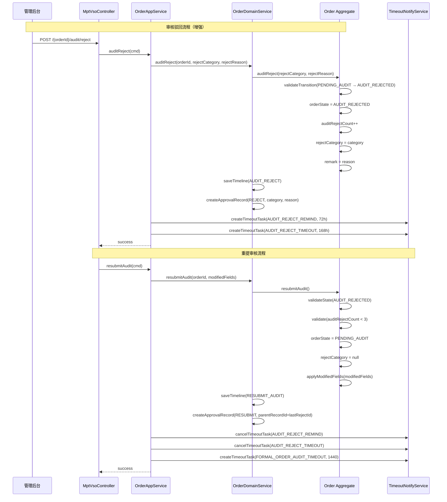

**驳回原因枚举** `AuditRejectReason`：

| 枚举值 | 含义 |
|--------|------|
| INCOMPLETE_INFO | 资料不全 |
| INCORRECT_INFO | 信息有误 |
| RISK_BLOCK | 风险拦截 |
| DUPLICATE_ORDER | 重复订单 |
| OTHER | 其他 |

**Order 聚合根新增字段**：

| 字段 | 类型 | 说明 |
|------|------|------|
| auditRejectCount | Integer | 累计被驳回次数，默认 0，驳回时 +1，重提时校验上限 |
| rejectCategory | String | 最近一次驳回原因分类枚举值，重提时清空 |

**`vso_approval_record` 表扩展字段**：

| 字段 | 类型 | 说明 |
|------|------|------|
| action_type | VARCHAR(32) | 操作类型（APPROVE / REJECT / RESUBMIT） |
| reject_category | VARCHAR(32) | 驳回原因分类枚举值，仅 REJECT 时有值 |
| reject_reason | TEXT | 驳回原因详情，仅 REJECT 时有值 |
| operator_id | VARCHAR(64) | 操作人 ID |
| parent_record_id | BIGINT | 关联上一条记录 ID，RESUBMIT 时指向上次 REJECT 记录 |

**超时策略**：

| 阶段 | 阈值 | 策略 | 任务编码 |
|------|------|------|----------|
| 驳回后提醒 | 72 小时 | remind | AUDIT_REJECT_REMIND |
| 驳回后超时关闭 | 168 小时（7天） | auto_close | AUDIT_REJECT_TIMEOUT |

**驳回超时自动关闭流程**：

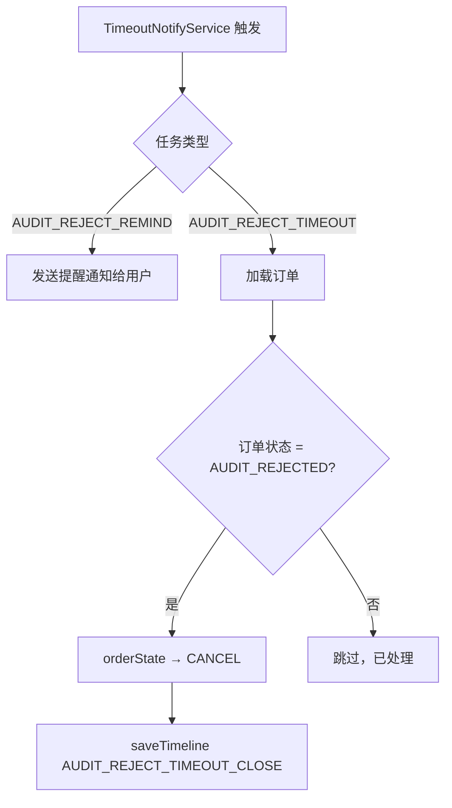

**关键设计决策**：

| 维度 | 决策 | 理由 |
|------|------|------|
| 恢复方式 | 用户修正后重提 | 符合'驳回即修正'的业务语义，行业标准做法 |
| 重提上限 | 3 次 | 足够 2 轮修正 + 1 轮保留，避免无限重提审核绕过 |
| 驳回原因 | 结构化枚举 + 自由文本 | 便于驳回原因统计分析，同时保留详情 |
| 超时策略 | 72h 提醒 + 168h 自动关闭 | 与已有 TimeoutNotifyService 机制一致，避免订单长期挂起 |
| 审批记录 | 扩展 vso_approval_record | 复用已有审批表，RESUBMIT 记录关联上次 REJECT 记录 |

**状态机新增转移**：

```
AUDIT_REJECTED(370) → PENDING_AUDIT(350)   // 用户修正后重提
AUDIT_REJECTED(370) → CANCEL(950)          // 用户主动取消 / 超时自动关闭
```

**错误码定义**：

| 错误码 | 说明 |
|--------|------|
| 301028 | 审核重提次数超限（最多 3 次） |
| 301029 | 审核驳回原因必填（分类和详情均不可为空） |

### 4.15 发运交付倒计时补偿机制（US-012/US-013）

**背景**：US-012（发运）和 US-013（交付）的状态推进完全依赖外部服务回调（物流/交付系统）。若外部服务推送失败或延迟，订单将永远卡在某个中间状态。本机制通过倒计时任务对外部回调进行补偿性监控。

**倒计时任务类型**：

| 任务类型 | 触发时机 | 期望下一个状态 | 阈值 | 触发策略 |
|----------|----------|----------------|------|----------|
| `PREPARE_TRANSPORT_TIMEOUT` | 状态流转为 PREPARE_TRANSPORT | TRANSPORTING | 24h | `remind` → 告警 |
| `TRANSPORTING_TIMEOUT` | 状态流转为 TRANSPORTING | PREPARE_DELIVER | 48h | `remind` → 告警 |
| `PREPARE_DELIVER_TIMEOUT` | 状态流转为 PREPARE_DELIVER | DELIVERED | 24h | `remind` → 告警 |
| `DELIVERED_TIMEOUT` | 状态流转为 DELIVERED | ACTIVATED | 72h | `remind` → 告警 |

**流程说明**：

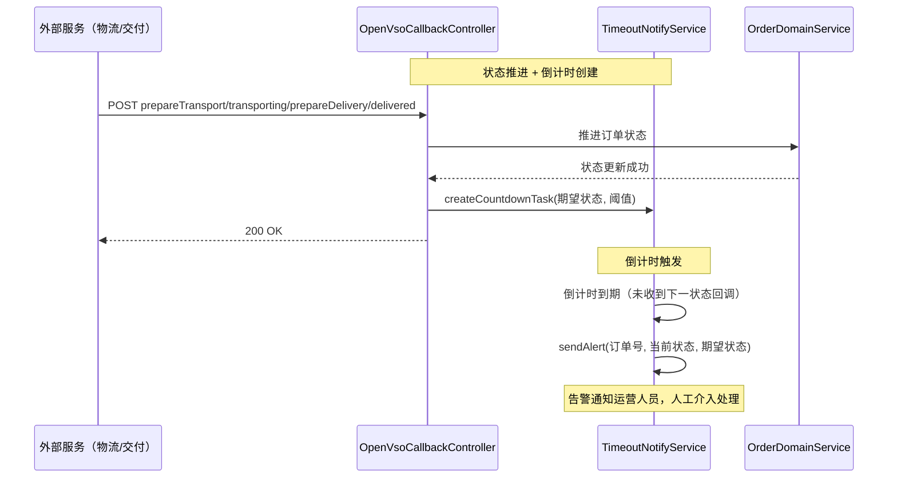

**任务取消**：

| 任务类型 | 取消时机 |
|----------|----------|
| `PREPARE_TRANSPORT_TIMEOUT` | 收到 `transporting` 回调 |
| `TRANSPORTING_TIMEOUT` | 收到 `prepareDelivery` 回调 |
| `PREPARE_DELIVER_TIMEOUT` | 收到 `delivered` 回调 |
| `DELIVERED_TIMEOUT` | 收到 `activate` 回调 |

**关键设计决策**：

| 维度 | 决策 | 理由 |
|------|------|------|
| 补偿策略 | 仅告警，不自动状态回退 | 避免外部服务延迟导致的误回退，保留人工介入窗口 |
| 倒计时阈值 | 24h/48h/72h 分级 | 根据业务阶段合理分配时间，越接近交付越宽松 |
| 任务存储 | 复用 US-019 超时任务机制 | 统一管理，定时扫描触发 |

### 5.1 Mobile Sale Model APIs

**GET** `/api/mobile/saleModel/v1`
- Response: `List<SaleModelMp>` — 销售车型列表

**GET** `/api/mobile/saleModel/v1/{saleModelCode}/config`
- Response: `List<SaleModelConfigMp>` — 车型配置列表

**POST** `/api/mobile/saleModel/v1/selectedSaleModel`
- Request: `{ saleModelCode: String, featureMap: Map<String, String> }`
- Response: `SelectedSaleModel` — 匹配的车型配置快照

### 5.2 Mobile Order APIs

**POST** `/api/mobile/vso/v1/action/earnestMoneyOrder`
- Request: `{ saleModelCode, featureMap, customerInfo, paymentChannel }`
- Response: `{ orderNo, earnestMoneyAmount, paymentChannels[], expireTime }`

**POST** `/api/mobile/vso/v1/action/downPaymentOrder`
- Request: `{ saleModelCode, featureMap, customerInfo, paymentChannel }`
- Response: `{ orderNo, downPaymentAmount, paymentChannels[], expireTime }`

**POST** `/api/mobile/vso/v1/action/initiatePayment`
- Request: `{ orderNo, paymentChannel }`
- Response: `{ paymentNo, paymentChannel, paymentAmount }`

**POST** `/api/mobile/vso/v1/order/action/cancel`
- Request: `{ orderNo }`
- Response: void

**POST** `/api/mobile/vso/v1/order/action/requestRefund`
- Request: `{ orderNo }`
- Response: void

**POST** `/api/mobile/vso/v1/order/action/earnestMoneyToDownPayment`
- Request: `{ orderNo, customerType?, paymentMethod?, orderPersonType?, orderPersonName?, orderPersonIdType?, orderPersonIdNum?, purchasePlan?, licenseCityCode?, orderStoreCode?, deliveryStoreCode? }`
- Response: `{ orderNo, orderType, orderState, supplementaryPayment?: { supplementaryNo, amount, paymentChannels[], expireTime } }`
- 说明：差额>0 时返回 supplementaryPayment 信息，差额<=0 时直接完成转换

**POST** `/api/mobile/vso/v1/order/action/initiateSupplementPayment`
- Request: `{ orderNo, supplementaryNo, paymentChannel }`
- Response: `{ paymentNo, paymentChannel, paymentAmount }`
- 说明：差额支付发起，复用改配补款接口

**POST** `/api/mobile/vso/v1/order/action/lock`
- Request: `{ orderNo }`
- Response: void

**POST** `/api/mobile/vso/v1/order/action/modifyConfig`
- Request: `{ orderNo, saleModelCode, featureMap }`
- Response: void

**GET** `/api/mobile/vso/v1/order/{orderNo}`
- Response: `OrderResponseVo` — 订单详情

### 5.3 MPT Order APIs

**GET** `/api/mpt/vso/v1/list`
- Query: `{ orderNo, orderState, customerName, phone, page, size }`
- Response: `PageResult<VehicleSaleOrderMpt>`

**POST** `/api/mpt/vso/v1/action/assignVehicle`
- Header: `X-Operator-Id`
- Request: `{ orderNo, vin }`
- Response: void

**POST** `/api/mpt/vso/v1/action/reassignVehicle`
- Header: `X-Operator-Id`
- Request: `{ orderNo, newVin }`
- Response: void
- 说明：换绑 VIN，先解绑旧 VIN 后绑定新 VIN

**POST** `/api/mpt/vso/v1/action/unbindVehicle`
- Header: `X-Operator-Id`
- Request: `{ orderNo, unbindReason }`
- Response: void
- 说明：主动解绑 VIN，订单状态回退至 ARRANGE_PRODUCTION

**GET** `/api/mpt/vso/v1/vehicleAssignment/list`
- Query: `{ orderNo, assignStatus, page, size }`
- Response: `PageResult<VehicleAssignmentVo>`
- 说明：查询配车记录列表

**GET** `/api/mpt/vso/v1/vehicleAssignment/{orderNo}`
- Response: `VehicleAssignmentVo`
- 说明：查询订单当前配车信息

**POST** `/api/mpt/vso/v1/action/assignDeliveryPerson`
- Request: `{ orderNo, deliveryPersonId, deliveryPersonName }`
- Response: void

**POST** `/api/mpt/vso/v1/action/applyTransport`
- Request: `{ orderNo, transportInfo }`
- Response: void

**POST** `/api/mpt/vso/v1/{orderId}/audit/pass`
- Header: `X-Operator-Id`
- Response: void

**POST** `/api/mpt/vso/v1/{orderId}/audit/reject`
- Header: `X-Operator-Id`
- Param: `rejectCategory` (枚举，必填，INCOMPLETE_INFO/INCORRECT_INFO/RISK_BLOCK/DUPLICATE_ORDER/OTHER)
- Param: `rejectReason` (String，必填，驳回详情)
- Response: void

**POST** `/api/mpt/vso/v1/{orderId}/audit/resubmit`
- Header: `X-Operator-Id`
- Request: `{ modifiedFields }` (可选修正字段)
- Response: void
- 说明：用户修正信息后重新提交审核，驳回次数 < 3 时允许

**POST** `/api/mpt/vso/v1/{orderId}/lock`
- Header: `X-Operator-Id`
- Response: void

**POST** `/api/mpt/vso/v1/{orderId}/close`
- Header: `X-Operator-Id`
- Param: `reason`
- Response: void

**DELETE** `/api/mpt/vso/v1/physical/{orderId}`
- Request: `DeleteOrderRequestVo`
- Response: `PhysicalDeleteResponseVo`

### 5.4 Service-to-Service APIs

**POST** `/api/service/order/v1/order/action/prepareTransport`
- Request: `{ orderNo, transportNo }`

**POST** `/api/service/order/v1/order/action/transporting`
- Request: `{ orderNo, transportNo }`

**POST** `/api/service/order/v1/order/action/prepareDelivery`
- Request: `{ orderNo }`

**POST** `/api/service/order/v1/order/action/delivered`
- Request: `{ orderNo, deliveryTime }`

**POST** `/api/service/order/v1/order/action/activate`
- Request: `{ orderNo, activateTime }`

### 5.5 Open Callback APIs

**POST** `/api/open/vsoCallback/v1/payment`
- Header: `X-Signature` — 签名校验
- Request: `PaymentCallbackRequest`
- Response: void

### 5.6 响应时间 SLA

| API 类别 | 接口 | SLA | 说明 |
|----------|------|-----|------|
| 车型查询 | 列表/配置/权益 | <500ms | 走缓存，无外部调用 |
| 车型查询 | 特征码范围 | <2s | 依赖 VMD 服务，超时返回降级提示 |
| 车型查询 | 特征码解析 | <1s | 本地计算 |
| 车型查询 | 上牌地区 | <200ms | 字典服务缓存 |
| 心愿单 | CRUD | <500ms | 本地 DB 操作 |
| 下单 | 小定/大定 | <1s | 含 VMD 校验 + 分布式锁 |
| 支付 | 发起支付 | <2s | 含分布式锁获取 |
| 支付 | 回调处理 | <2s | 含签名验证 + 状态流转 |
| 订单操作 | 改配 | <2s | 含 VMD 调用 + 快照创建 |
| 订单操作 | 锁单/取消/退款/转定金 | <1s | 本地状态流转（差额<=0 时） |
| 订单操作 | 审核驳回/重提审核 | <1s | 本地状态流转+审批记录创建 |
| 订单操作 | 转定金（含差额支付） | <2s | 含差额支付任务创建（差额>0 时） |
| 支付 | 差额支付发起 | <2s | 含分布式锁获取 |
| 订单操作 | 物理删除 | <5s | 级联删除多表 |
| 订单查询 | 列表 | <1s | 分页查询 |
| 订单查询 | 详情 | <500ms | 单订单全量数据 |

### 5.7 Error Codes

| Code | Name | Description | HTTP Status |
|------|------|-------------|-------------|
| 301001 | SALE_MODEL_CONFIG_TYPE_CODE_NOT_EXIST | 销售车型配置类型代码不存在 | 400 |
| 301002 | BUILD_CONFIG_CODE_NOT_EXIST | 生产配置代码不存在 | 400 |
| 301003 | SALE_MODEL_NOT_EXIST | 销售车型不存在 | 404 |
| 301004 | ORDER_NOT_EXIST | 订单不存在 | 404 |
| 301005 | ORDER_ILLEGAL_DELETE | 订单非法删除（状态不允许） | 403 |
| 301006 | ORDER_STATE_NOT_ALLOWED | 订单当前状态不支持此操作 | 409 |
| 301007 | ACCOUNT_NOT_EXIST | 账户不存在 | 404 |
| 301008 | SALE_MODEL_CONFIG_HAS_LOCKED | 销售车型配置已锁定，不可修改 | 409 |
| 301009 | WISHLIST_NOT_EXIST | 心愿单不存在 | 404 |
| 301010 | BUILD_CONFIG_NOT_MATCHED | 特征码无法匹配到生产配置 | 400 |
| 301011 | PAYMENT_CHANNEL_NOT_AVAILABLE | 支付渠道不可用 | 400 |
| 301012 | PAYMENT_NOT_EXIST | 支付单不存在 | 404 |
| 301013 | PAYMENT_STATUS_MISMATCH | 支付单状态不匹配 | 409 |
| 301014 | BRAND_CODE_NOT_EXIST | 品牌编码不存在 | 400 |
| 301015 | CONCURRENT_CONFLICT | 并发冲突（通用，分布式锁获取失败） | 409 |
| 301017 | SIGNATURE_INVALID | 回调签名校验失败（timestamp/nonce 校验失败） | 403 |
| 301018 | SUPPLEMENTARY_PAYMENT_NOT_FOUND | 差额支付任务不存在或已失效 | 404 |
| 301019 | SUPPLEMENTARY_PAYMENT_EXPIRED | 差额支付任务已过期（超过 30 分钟） | 409 |
| 301020 | SUPPLEMENTARY_PAYMENT_FAILED | 差额支付失败 | 409 |
| 301021 | CUSTOMER_TYPE_INVALID | 客户类型不合法，仅支持 personal | 400 |
| 301022 | PAYMENT_METHOD_INVALID | 支付方式不合法，仅支持 full_payment、loan | 400 |
| 301023 | CONFIG_CHANGE_REFUND_NOT_EXIST | 改配退款记录不存在 | 404 |
| 301024 | CONFIG_CHANGE_REFUND_FAILED | 改配退款失败 | 409 |
| 301025 | DUPLICATE_UNPAID_ORDER | 同一用户或手机号存在未完成订单，禁止重复下单 | 409 |
| 301026 | WISHLIST_LIMIT_EXCEEDED | 心愿单已达上限（5个），禁止继续创建 | 409 |
| 301027 | DUPLICATE_WISHLIST | 同一用户已存在相同配置的心愿单，禁止重复创建 | 409 |
| 301028 | AUDIT_RESUBMIT_LIMIT_EXCEEDED | 审核重提次数超限（最多 3 次） | 409 |
| 301029 | AUDIT_REJECT_REASON_REQUIRED | 审核驳回原因必填（分类和详情均不可为空） | 400 |
| 301030 | VIN_CONFLICT | VIN 冲突，已被其他订单占用 | 409 |
| 301031 | VIN_INVALID | VIN 无效，不存在或状态不可用 | 400 |
| 301032 | PAYMENT_CONFLICT | 支付操作并发冲突（分布式锁获取失败） | 409 |
| 301033 | LOCK_CONFLICT | 锁单/退款/改配/关单操作并发冲突 | 409 |
| 301034 | BIND_CONFLICT | 配车/换绑/解绑操作并发冲突 | 409 |

## 6. Coverage Mapping

| US-ID | Design Section | Note |
|-------|----------------|------|
| US-001 | §3.2(tb_sale_model/config/benefits), §5.1 | 销售车型浏览，Feign 调用 VMD |
| US-002 | §3.1(Wishlist), §3.2(心愿单唯一索引), §4.12, §5.2(wishlist APIs) | 心愿单 CRUD，含数量上限+唯一性校验 |
| US-003 | §3.1(Order), §3.2(防刷单唯一索引), §4.1, §4.11, §5.2(earnestMoneyOrder) | 小定下单，含 VMD 校验 + 防刷单校验 |
| US-004 | §3.1(Order), §3.2(防刷单唯一索引), §4.1, §4.11, §5.2(downPaymentOrder) | 大定下单，含防刷单校验 |
| US-005 | §4.1, §4.4, §5.2(initiatePayment), §5.5 | 支付发起+回调，领域事件驱动 |
| US-006 | §4.2, §4.6, §5.2(earnestMoneyToDownPayment) | 状态机 EARNEST_MONEY_PAID→DOWN_PAYMENT_PAID，差额支付流程 |
| US-007 | §4.3, §4.9, §4.10, §3.2(vso_order_vehicle_snapshot, vso_supplementary_payment, vso_config_change_refund), §5.2(modifyConfig) | 改配，版本化快照，价格重算与差额补/退 |
| US-008 | §4.2, §4.8, §5.2(cancel/requestRefund) | 取消/退款状态流转，退款金额计算（含超额退款），含 VIN 释放逻辑 |
| US-009 | §4.2, §5.2(lock), §5.3(lock) | 锁单，buildConfigLock=true |
| US-010 | §5.3(audit/pass, audit/reject, audit/resubmit), §4.14 | 审核通过/驳回/重提，驳回可恢复路径 |
| US-011 | §3.2(vso_vehicle_assignment, vso_config_vehicle_occupancy), §4.13, §5.3(assignVehicle/reassignVehicle/unbindVehicle), §7.错误码(301030/301031) | 配车绑定/换绑/解绑 VIN，含超时释放、订单取消释放、库存服务集成 |
| US-012 | §4.2, §4.15, §5.3(applyTransport), §5.4 | 发运状态流转，含倒计时补偿机制 |
| US-013 | §4.2, §4.15, §5.3(assignDeliveryPerson), §5.4 | 交付流程，含倒计时补偿机制 |
| US-014 | §4.2, §5.3(close) | 关闭订单 |
| US-015 | §3.2(vso_order_shadow_delete), §5.3(physical delete) | 物理删除+影子审计 |
| US-016 | §3.2(tb_sale_model*), §5.1 | MPT 车型管理 CRUD |
| US-017 | §5.3(list/detail queries) | MPT 订单查询 |
| US-018 | §4.4(签名规范), §5.5, §3.2(vso_callback_log) | 支付回调处理，含 HMAC-SHA256 + timestamp/nonce 验签 |
| US-019 | §3.2(vso_config_timeout), §4.5(多实例警告), Domain(TimeoutNotifyService) | 超时调度，含多实例部署警告 |
| US-020 | Domain(OrderLockService), §4.3 | 分布式锁并发控制 |

## 7. Impact Analysis

| 模块 | 影响范围 | 说明 |
|------|----------|------|
| VMD Service | 强依赖 | buildConfigCode 解析、车型数据获取 |
| Dictionary Service | 弱依赖 | 省市区域数据，可降级 |
| Org Dealership Service | 弱依赖 | 门店信息，可降级 |
| Payment Gateway | 强依赖 | 支付发起与回调，影响核心下单流程 |
| Redis | 强依赖 | 分布式锁，影响并发控制 |
| MySQL | 强依赖 | 全部数据持久化 |
| Nacos | 强依赖 | 服务注册发现与配置中心 |

## 8. Open Questions

| # | 问题 | 状态 |
|---|------|------|
| 1 | EsignAdapter、FinanceAdapter 接口已定义但未实现，合同签署和金融流程何时接入？ | 待定 |
| 2 | 退款流程的具体金额计算规则（部分退款 vs 全额退款）未在代码中明确 | 已解决 → §4.8 |
| 3 | 订单超时任务的调度频率和补偿机制细节 | 已解决 → §4.5 |
| 4 | 物理删除的权限校验具体实现（当前仅预留权限标识） | 待定 |
| 5 | 多维度状态表(vso_order_status_dimension)与主状态的同步策略 | 待定 |

## 9. Changelog

| Date | Change ID | Type | Description |
|------|-----------|------|-------------|
| 2026-05-23 | CR-001 | Added | 基于现有代码逆向生成初始设计文档 |
| 2026-05-23 | CR-002 | Added | 新增 §4.5 超时任务调度流程、§4.6 分布式锁并发控制设计、§5.6 响应时间 SLA；补充 4 个错误码（301014~301017）；关闭 Open Question #3 |
| 2026-05-23 | CR-003 | Fixed | 代码实现与设计对齐：分布式锁场景统一、超时任务 Redis 持久化、N+1 查询修复、状态机校验接入 |
| 2026-05-25 | CR-004 | Added | 新增 §4.7 退款金额计算流程：按订单状态分层退款规则（未锁单前全额退款、锁单后扣 5% 手续费、生产中/已发运不退款）、退款记录数据结构、退款场景枚举；更新状态机图添加退款注释；关闭 Open Question #2 |
| 2026-05-25 | CR-005 | Added | 新增 §4.9 改配补款流程设计、§4.10 改配退款流程设计：改配成功后实时结算差额，差额>0 创建补款任务（30 分钟超时自动取消），差额<0 自动发起退款（失败触发人工审核）；新增 vso_supplementary_payment、vso_config_change_refund 两张表；更新 §4.3 改配流程增加价格重算逻辑；更新 §6 Coverage Mapping |
| 2026-05-25 | CR-006 | Added | 新增 §4.6 意向金转定金差额支付流程：差额>0 时创建差额支付任务（复用 vso_supplementary_payment 表，新增 supplementary_scene 字段区分场景），用户完成差额支付后触发订单状态转换；差额<=0 时直接转换；更新 §4.2 状态机图增加差额支付分支；更新 §5.2 API 定义补充转定金请求参数和差额支付接口；新增 5 个错误码（301018~301022）；更新 §5.6 SLA 补充差额支付接口；更新 §6 Coverage Mapping 补充 US-006 设计章节引用 |
| 2026-05-25 | CR-007 | Added | US-003/US-004 防刷单设计：新增 §4.11 防刷单/黄牛设计（DuplicateOrderSpecification 规约模式、用户/手机号维度校验、校验流程图）；更新 §4.1 下单流程增加 DuplicateOrderSpecification 校验步骤；更新 §3.2 补充防刷单唯一索引说明；新增错误码 301025 DUPLICATE_UNPAID_ORDER；更新 §6 Coverage Mapping 补充 US-003/US-004 防刷单设计引用 |
| 2026-05-25 | CR-008 | Added | US-002 心愿单数量上限与唯一性约束：新增 §4.12 心愿单业务规则校验设计（数量上限 5 个、buildConfigCode 维度唯一性校验）；更新 §3.2 补充心愿单唯一索引说明；新增错误码 301026 WISHLIST_LIMIT_EXCEEDED、301027 DUPLICATE_WISHLIST；更新 §6 Coverage Mapping 补充 US-002 设计章节引用 |
| 2026-05-25 | CR-009 | Added | US-011 配车业务规则补全：新增 §4.13 配车流程设计（配车绑定、换绑 VIN、VIN 超时释放、订单取消释放 VIN、主动解绑、配车状态机、VIN 唯一性保障）；新增 4 个 MPT API（reassignVehicle、unbindVehicle、vehicleAssignment/list、vehicleAssignment/{orderNo}）；新增 vso_config_vehicle_occupancy 配置表；新增错误码 301030 VIN_CONFLICT、301031 VIN_INVALID；更新 §6 Coverage Mapping 补充 US-008/US-011 设计章节引用；更新 requirements.md US-011 补全 Acceptance Criteria |
| 2026-05-25 | CR-010 | Added | US-010 审核驳回可恢复路径：新增 §4.14 审核驳回可恢复路径设计（重提审核规则、驳回原因枚举、超时策略、审批记录扩展）；更新 §4.2 状态机图增加 AUDIT_REJECTED→PENDING_AUDIT/CANCEL 转移；更新 §5.3 API 定义增加 rejectCategory 参数和 audit/resubmit 接口；更新 §5.7 错误码增加 301028/301029；更新 §6 Coverage Mapping；更新 requirements.md US-010 补全 Acceptance Criteria |
| 2026-05-25 | CR-011 | Fixed | 需求问题修复与设计同步：①错误码优化：301015 CONCURRENT_CONFLICT 描述更新，301016 VIN_ALREADY_ASSIGNED 删除（合并至 301030），新增 301032 PAYMENT_CONFLICT、301033 LOCK_CONFLICT、301034 BIND_CONFLICT；②VIN 占用有效期默认值修正为 72 小时（§4.13）；③US-008 §4.8 补充超额退款场景（由 SMALL 升级的 FORMAL 订单，已支付金额 > 定金金额时退超额部分）；④US-012/US-013 新增 §4.15 倒计时补偿机制设计（PREPARE_TRANSPORT→24h、TRANSPORTING→48h、PREPARE_DELIVER→24h、DELIVERED→72h 告警）；⑤US-018 §4.4 补充支付回调签名规范（HMAC-SHA256 + timestamp ±5min + nonce Redis SET TTL 5min）；⑥US-019 §4.5 增加多实例部署警告（生产前必须迁移至 Redis/DB）；更新 §6 Coverage Mapping；同步更新 requirements.md CR-009 |
